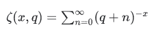

# Python–tensorflow . math . zeta()

> 哎哎哎:# t0]https://www . geeksforgeeks . org/python-tensoflow-math-zeta/

TensorFlow 是谷歌设计的开源 Python 库，用于开发机器学习模型和深度学习神经网络。

**zeta()** 用于计算 Hurwitz zeta 函数。其定义为:



> **语法:** tensorflow.math.zeta( x，q，name)
> 
> **参数:**
> 
> *   **x:** 是张量。允许的数据类型是 float32 和 float64。
> *   **q:** 是一个与 x 相同数据类型的张量。
> *   **名称(可选):**定义操作的名称。
> 
> **返回:**
> 
> 它返回一个与 x 相同数据类型的张量。

**例 1:**

## 蟒蛇 3

```py
# importing the library
import tensorflow as tf

# Initializing the input tensor
a = tf.constant([ -5, -7, 2, 0, 7], dtype = tf.float64)
b = tf.constant([ 1, 3, 9, 4, 7], dtype = tf.float64)

# Printing the input tensor
print('a: ', a)
print('b: ', b)

# Calculating result
res = tf.math.zeta(a, b)

# Printing the result
print('Result: ', res)
```

**输出:**

```py
a:  tf.Tensor([-5\. -7\.  2\.  0\.  7.], shape=(5, ), dtype=float64)
b:  tf.Tensor([1\. 3\. 9\. 4\. 7.], shape=(5, ), dtype=float64)
Result:  tf.Tensor(
[           nan            nan 1.17512015e-01            nan
 2.12260976e-06], shape=(5, ), dtype=float64)

```

**例 2:**

## 蟒蛇 3

```py
# importing the library
import tensorflow as tf

# Initializing the input tensor
a = tf.constant([ [-5, -7], [ 2, 0]], dtype = tf.float64)
b = tf.constant([ [1, 3], [9, 4]], dtype = tf.float64)

# Printing the input tensor
print('a: ', a)
print('b: ', b)

# Calculating result
res = tf.math.zeta(a, b)

# Printing the result
print('Result: ', res)
```

**输出:**

```py
a:  tf.Tensor(
[[-5\. -7.]
 [ 2\.  0.]], shape=(2, 2), dtype=float64)
b:  tf.Tensor(
[[1\. 3.]
 [9\. 4.]], shape=(2, 2), dtype=float64)
Result:  tf.Tensor(
[[       nan        nan]
 [0.11751201        nan]], shape=(2, 2), dtype=float64)
```