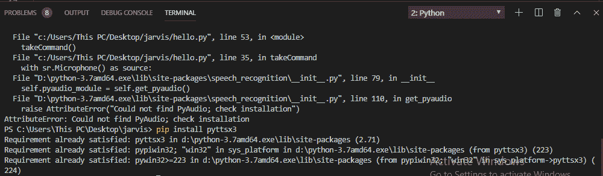

# Python |通过使用 pyttsx3 将文本转换为语音

> 原文:[https://www . geesforgeks . org/python-text-to-voice-by-pyttsx 3/](https://www.geeksforgeeks.org/python-text-to-speech-by-using-pyttsx3/)

**pyttsx3** 是 Python 中的文本到语音转换库。与替代库不同，它脱机工作，并且兼容 Python 2 和 3。应用程序调用 pyttsx3.init()工厂函数来获取对 pyttsx3 的引用。引擎实例。这是一个非常容易使用的工具，可以将输入的文本转换成语音。
pyttsx3 模块支持两种声音第一种是女性，第二种是男性，由 windows 的“sapi5”提供。
支持三个 TTS 引擎:

*   *sapi5* – Windows 上的 SAPI5
*   *nsss*–Mac OS X 上的 NSSpeechSynthesizer
*   *espeak*–每隔一个平台上的 eSpeak

**安装**
要安装 pyttsx3 模块，首先你要打开终端写

```py
pip install pyttsx3
```


如果收到“没有名为 win32com.client 的模块”、“没有名为 win32 的模块”或“没有名为 win32api 的模块”等错误，则需要额外安装 pypiwin32。
它可以在任何平台上工作。现在我们都准备写一个把文本转换成语音的程序。

**代码:将文字转换为语音的 Python 程序**

```py
# Import the required module for text  
# to speech conversion
import pyttsx3

# init function to get an engine instance for the speech synthesis 
engine = pyttsx3.init()

# say method on the engine that passing input text to be spoken
engine.say('Hello sir, how may I help you, sir.')

# run and wait method, it processes the voice commands. 
engine.runAndWait()
```

**输出:**
上述程序的输出将是一个声音，

```py
'Hello sir, how may I help you, sir.'
```