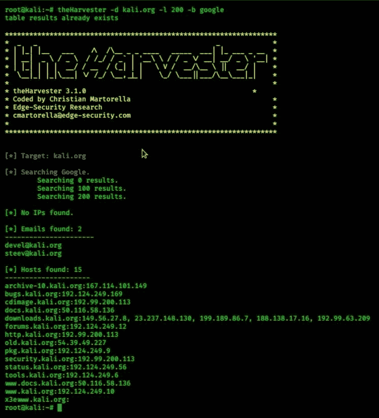

# Python 服务器——如何使用？

> 原文:[https://www . geesforgeks . org/python-服务器使用方法/](https://www.geeksforgeeks.org/python-theharvester-how-to-use-it/)

**服务器**是另一个类似 sublist3r 的工具，它是使用 [Python](https://www.geeksforgeeks.org/python-programming-language/) 开发的。渗透测试人员可以使用该工具从搜索引擎、PGP 关键服务器和 SHODAN 计算机数据库等不同公共来源收集电子邮件、子域、主机、员工姓名、开放端口和横幅的信息。该工具可用于被动侦察，任何需要了解攻击者对组织的了解的人都可以使用。

### 如何安装服务器

如果您使用的是 Kali Linux 机器，那么这个工具已经安装在其中了，只需键入命令

```
theharvester

```

或者

```
theHarvester

```

它将生成一个帮助菜单并列出所有可用选项，如下所示:

```
root@kali:~# theharvester

*******************************************************************
*                                                                 *
* | |_| |__   ___    /\  /\__ _ _ ____   _____  ___| |_ ___ _ __  *
* | __| '_ \ / _ \  / /_/ / _` | '__\ \ / / _ \/ __| __/ _ \ '__| *
* | |_| | | |  __/ / __  / (_| | |   \ V /  __/\__ \ ||  __/ |    *
*  \__|_| |_|\___| \/ /_/ \__, _|_|    \_/ \___||___/\__\___|_|    *
*                                                                 *
* TheHarvester Ver. 3.0.0                                         *
* Coded by Christian Martorella                                   *
* Edge-Security Research                                          *
* cmartorella@edge-security.com                                   *
*******************************************************************

Usage: theharvester options 

       -d: Domain to search or company name
       -b: data source: baidu, bing, bingapi, dogpile, google, googleCSE,
                        googleplus, google-profiles, linkedin, pgp, twitter, vhost, 
                        virustotal, threatcrowd, crtsh, netcraft, yahoo, all

       -s: start in result number X (default: 0)
       -v: verify host name via dns resolution and search for virtual hosts
       -f: save the results into an HTML and XML file (both)
       -n: perform a DNS reverse query on all ranges discovered
       -c: perform a DNS brute force for the domain name
       -t: perform a DNS TLD expansion discovery
       -e: use this DNS server
       -p: port scan the detected hosts and check for Takeovers (80, 443, 22, 21, 8080)
       -l: limit the number of results to work with(bing goes from 50 to 50 results,
            google 100 to 100, and pgp doesn't use this option)
       -h: use SHODAN database to query discovered hosts

Examples:
        theharvester -d microsoft.com -l 500 -b google -h myresults.html
        theharvester -d microsoft.com -b pgp
        theharvester -d microsoft -l 200 -b linkedin
        theharvester -d apple.com -b googleCSE -l 500 -s 300

```

要在其他 Linux 操作系统中安装它，您可以使用命令

```
 sudo apt-get theharvester

```

如果这不起作用，您可以克隆 Git 中心存储库，并使用命令来使用它

```
git clone https://github.com/laramies/theHarvester.git
cd theHarvester
sudo python ./theHarvester.py
```

**例**

从域名 kali.org 搜索电子邮件地址，结果为 200，使用 **Bing** 作为数据源。

```
theharvester -d kali.org -l 200 -b bing
```

