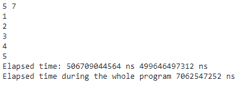
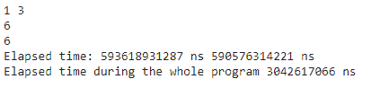

# Python time.perf_counter_ns()函数

> 原文:[https://www . geesforgeks . org/python-time-perf _ counter _ ns-function/](https://www.geeksforgeeks.org/python-time-perf_counter_ns-function/)

**Python time.perf_counter_ns()函数**给出以纳秒为单位的时间整数值。

**语法**:

```
from time import perf_counter_ns
```

我们可以通过使用启动和停止功能来找到经过的时间。我们还可以通过减去停止时间和开始时间来计算整个程序中经过的时间

**例 1:**

## 蟒蛇 3

```
# import  perf_counter_ns()
from time import perf_counter_ns

# integer input from user, 2 input in single line
n, m = map(int, input().split())

# Start the stopwatch / counter
start = perf_counter_ns()

for i in range(n):
    t = int(input())  # user gave input n times
    if t % m == 0:
        print(t)

# Stop the stopwatch / counter
stop = perf_counter_ns()

print("Elapsed time:", stop, 'ns', start, 'ns')

print("Elapsed time during the whole program",
      stop-start, 'ns')
```

**输出**:



**例 2:**

## 蟒蛇 3

```
# import  perf_counter_ns()
from time import perf_counter_ns

# integer input from user, 2 input in single line
n, m = map(int, input().split())

# Start the stopwatch / counter
start = perf_counter_ns()

for i in range(n):
    t = int(input())  # user gave input n times
    if t % m == 0:
        print(t)

# Stop the stopwatch / counter
stop = perf_counter_ns()

print("Elapsed time:", stop, 'ns', start, 'ns')

print("Elapsed time during the whole program",
      stop-start, 'ns')
```

**输出:**

