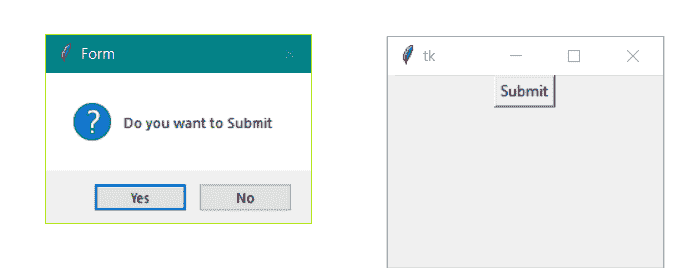
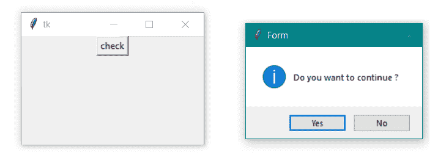
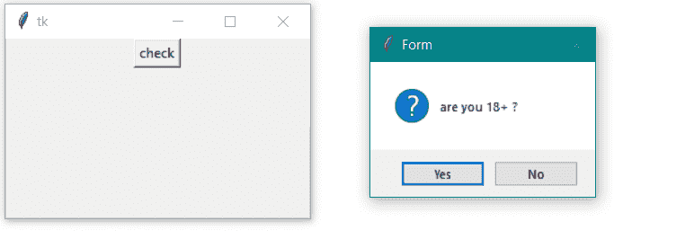
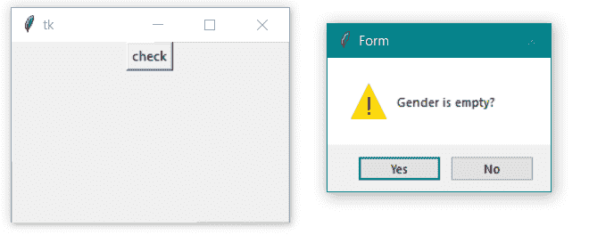

# Python–Tkinter 提问对话框

> 原文:[https://www . geesforgeks . org/python-tkinter-ask question-dialog/](https://www.geeksforgeeks.org/python-tkinter-askquestion-dialog/)

在 Python 中，有用于图形用户界面的 Serval 库。 [Tkinter](http://geeksforgeeks.org/python-gui-tkinter/) 是其中最有用的一个。这是一个标准接口。Tkinter 易于使用，并为构建高效的应用程序提供了一些功能。在每个应用程序中，我们需要一些消息来显示，如“您想关闭”或显示任何警告或其他信息。为此，Tkinter 提供了一个类似**消息框**的库。通过使用消息框库，我们可以以消息框的形式显示服务信息、错误、警告、取消等。它有一个不同的消息框，用于不同的目的。

1.  **showinfo()–**显示一些重要信息。
2.  **显示警告()–**显示某种类型的警告。
3.  **显示错误()–**显示一些错误信息。
4.  **询问问题()–**显示一个对话框，询问两个选项是或否
5.  **询问取消()–**显示一个对话框，询问两个选项“确定”或“取消”。
6.  **askretrycancel()–**显示一个对话框，询问两个选项“重试”或“取消”。
7.  **askysnocancel()–**显示一个对话框，询问三个选项是或否或取消。

**消息框函数的语法:**

```py
  messagebox.name_of_function(Title, Message, [, options])
```

1.  **函数名—**我们要使用的函数名。
2.  **标题–**消息框的标题。
3.  **消息–**要在对话框中显示的消息。
4.  **选项–**配置选项。

## Askquestion()

该功能用于向用户提问。只有两个选项“是”或“否”。
该功能的应用:

1.  我们可以用它来询问用户是否想要继续。
2.  我们可以用它来询问用户是否想要提交。

**语法:**

```py
messagebox.askfunction((Title, Message, [, options])
```

**示例:**

## 蟒蛇 3

```py
from tkinter import *
from tkinter import messagebox

# object of TK()
main = Tk()

# function to use the
# askquestion() function
def Submit():
    messagebox.askquestion("Form",
                           "Do you want to Submit")

# setting geometry of window
# instance
main.geometry("100x100")

# creating Window
B1 = Button(main, text = "Submit", command = Submit)

# Button positioning
B1.pack()  

# infinite loop till close
main.mainloop() 
```

**输出:**



**1。导入库**
要使用 python 中的图形用户界面功能，我们必须导入库。第一行我们导入 Tkinter，第二行我们导入 messagebox 库

```py
from tkinter import *
from tkinter import messagebox
```

**2。主窗口实例**
我们要为窗口创建一个实例或者对象来 TK()；Tk()是 Tkinter 的一个函数，它创建了一个可以从主变量引用的窗口

```py
main = Tk()  
```

**3。设置尺寸**
我们设置窗口的尺寸我们可以通过各种方式进行设置，在这里我们设置的是通过几何()函数的尺寸“100X100”。

```py
top.geometry("100x100")  
```

**4。应用其他小部件和函数**
在我们的示例中，我们创建了一个名为提交的方法，并调用 askquestion()和 Creating Button，并通过 Pack()函数对其进行设置

```py
def Submit():
   messagebox.askquestion("Form", "Do you want to Submit")

main.geometry("100x100")  
B1 = Button(main, text = "Submit", command = Submit) 
B1.pack()  
```

**5。mainloop()**
这个方法可以在所有代码都准备好执行的时候使用。它运行用于运行应用程序的无限循环。按下关闭按钮之前，窗口将一直打开。

**我们可以在选项**中使用的图标

1.  错误
2.  信息
3.  警告
4.  问题

我们可以更改对话框的图标。我们想要使用的图标类型取决于应用程序的需要。我们有四个图标。

**错误**

```py
 messagebox.function_name(Title, Message, icon='error')
```

**示例-**

## 蟒蛇 3

```py
# illustration of icon - Error
from tkinter import *
from tkinter import messagebox

main = Tk()

def check():
   messagebox.askquestion("Form",
                          "Is your name correct?",
                          icon ='error')

main.geometry("100x100")
B1 = Button(main, text = "check", command = check)
B1.pack()

main.mainloop()
```

**输出:**


**信息**

```py
 messagebox.function_name(Title, Message, icon='info')
```

示例-

## 蟒蛇 3

```py
# illustration of icon - Info
from tkinter import *
from tkinter import messagebox

main = Tk()

def check():
   messagebox.askquestion("Form",
                          "do you want to continue",
                          icon ='info')

main.geometry("100x100")
B1 = Button(main, text = "check", command = check)
B1.pack()

main.mainloop()
```

**输出:**



**问题**

```py
 messagebox.function_name(Title, Message, icon='question')
```

示例-

## 蟒蛇 3

```py
# illustration of icon - question
from tkinter import *
from tkinter import messagebox

main = Tk()

def check():
   messagebox.askquestion("Form",
                          "are you 18+",
                          icon ='question')

main.geometry("100x100")
B1 = Button(main, text = "check", command = check)
B1.pack()

main.mainloop()
```

**输出:**



**警告**

```py
messagebox.function_name(Title, Message, icon='warning')
```

示例-

## 蟒蛇 3

```py
# illustration of icon - Warning
from tkinter import *
from tkinter import messagebox

main = Tk()

def check():
   messagebox.askquestion("Form",
                          "Gender is empty?",
                          icon ='warning')

main.geometry("100x100")
B1 = Button(main, text = "check", command = check)
B1.pack()

main.mainloop()
```

**输出:**

