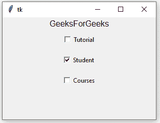

# python tkinter–check button widget

> 原文:[https://www . geeksforgeeks . org/python-tkinter-check button-widget/](https://www.geeksforgeeks.org/python-tkinter-checkbutton-widget/)

Python 为开发图形用户界面提供了多种选择。在所有的 GUI 方法中，Tkinter 是最常用的方法。它是 Python 附带的 Tk 图形用户界面工具包的标准 Python 接口。Python 搭配 Tkinter 是创建 GUI 应用程序最快最简单的方法。使用 Tkinter 创建图形用户界面是一项简单的任务。

**注意:**更多信息请参考[Python GUI–tkinter](https://www.geeksforgeeks.org/python-gui-tkinter/)

## 检查按钮小部件

Checkbutton 小部件是一个标准的 Tkinter 小部件，用于实现开/关选择。检查按钮可以包含文本或图像。当按钮被按下时，Tkinter 调用该函数或方法。

**语法:**
使用 checkbutton 的语法如下。

```
w = Checkbutton ( master, options)
```

**参数:**

*   **主**:此参数用于表示父窗口。
*   **选项**:有很多可用的选项，可以作为键值对使用，用逗号分隔。

**选项:**
以下是常用选项，可用于此小部件:-

*   **活动背景:**该选项用于表示检查按钮位于光标下方时的背景颜色。
*   **活动前景:**该选项用于表示检查按钮位于光标下方时的前景色。
*   **bg:** 此选项用于表示标签和指示器后面显示的正常背景颜色。
*   **位图:**该选项用于在按钮上显示单色图像。
*   **bd:** 该选项用于表示指标周围边框的大小，默认值为 2 像素。
*   **命令:**该选项与 checkbutton 状态改变时要调用的函数相关联。
*   **光标:**通过使用该选项，当鼠标光标位于 checkbutton 上方时，它将变为该模式。
*   **禁用的前景:**用于渲染禁用的复选按钮的文本的前景颜色。默认为默认前景色的点画版本。
*   **字体:**该选项用于表示文本使用的字体。
*   **fg:** 此选项用于表示渲染文本所用的颜色。
*   **高度:**该选项用于表示勾选按钮上的文本行数，默认值为 1。
*   **highlightcolor:** 该选项用于表示检查按钮有焦点时焦点高亮的颜色。
*   **图像:**该选项用于在按钮上显示图形图像。
*   **对齐:**此选项用于控制文本的对齐方式:居中、向左或向右。
*   **关闭值:**如果按钮未被选中，关联的控制变量默认设置为 0。我们可以将一个未检查变量的状态更改为另一个。
*   **onvalue:** 如果选中该按钮，关联的控制变量默认设置为 1。我们可以将选中变量的状态更改为其他状态。
*   **padx:** 这个选项用来表示要在 checkbutton 和文本的左右留出多少空间。它的默认值是 1 像素。
*   **pady:** 这个选项用来表示在 checkbutton 和文本的上方和下方要留出多少空间。它的默认值是 1 像素。
*   **浮雕:**复选按钮的边框类型。它的默认值设置为“平面”。
*   **选择颜色:**该选项用于表示设置时检查按钮的颜色。默认值为 selectcolor=“红色”。
*   **选择图像:**设置后，图像显示在检查按钮上。
*   **状态:**代表检查按钮的状态。默认情况下，它设置为正常。我们可以将其更改为 DISABLED，使 checkbutton 无响应。当处于焦点下时，checkbutton 的状态为“活动”。
*   **文本:**此选项用于使用换行符(" \n ")显示多行文本。
*   **下划线:**此选项用于表示文本中要加下划线的字符的索引。文本中的索引从零开始。
*   **变量:**该选项用于表示跟踪检查按钮状态的相关变量。
*   **宽度:**该选项用于表示检查按钮的宽度。并且还以文本形式表示的字符数量来表示。
*   **包裹长度:**该选项将文本分成若干段。

**方法:**
本小工具使用的方法如下:

*   **取消选择():**调用此方法关闭 checkbutton。
*   **闪烁():**检查按钮在活动颜色和正常颜色之间闪烁。
*   **invoke():** 该方法将调用与 checkbutton 关联的方法。
*   **选择():**调用此方法打开 checkbutton。
*   **切换():**此方法用于在不同的检查按钮之间切换。

**示例:**

```
from tkinter import * 

root = Tk()
root.geometry("300x200")

w = Label(root, text ='GeeksForGeeks', font = "50") 
w.pack()

Checkbutton1 = IntVar()  
Checkbutton2 = IntVar()  
Checkbutton3 = IntVar()

Button1 = Checkbutton(root, text = "Tutorial", 
                      variable = Checkbutton1,
                      onvalue = 1,
                      offvalue = 0,
                      height = 2,
                      width = 10)

Button2 = Checkbutton(root, text = "Student",
                      variable = Checkbutton2,
                      onvalue = 1,
                      offvalue = 0,
                      height = 2,
                      width = 10)

Button3 = Checkbutton(root, text = "Courses",
                      variable = Checkbutton3,
                      onvalue = 1,
                      offvalue = 0,
                      height = 2,
                      width = 10)  

Button1.pack()  
Button2.pack()  
Button3.pack()

mainloop() 
```

**输出:**

