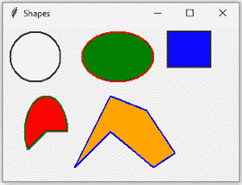

# Python Tkinter |使用 Canvas 类创建不同的形状

> 原文:[https://www . geesforgeks . org/python-tkinter-create-differential-shapes-use-canvas-class/](https://www.geeksforgeeks.org/python-tkinter-create-different-shapes-using-canvas-class/)

在 Tkinter 中， **Canvas 类**是借助 Canvas 类下定义的一些函数来创建不同的形状。canvas 类创建的任何形状都需要一个 Canvas，因此在创建任何形状之前，Canvas 对象是必需的，并且需要打包到主窗口中。

> **形状的 Canvas 方法:**
> **Canvas . create _ oval(x1，y1，x2，y2，options = …):** 用于创建一个椭圆形、片头和和弦。
> **canvas . create _ rectangle(x1，y1，x2，y2，options = …):** 用于创建矩形和正方形。
> **Canvas.create_arc(x1，y1，x2，y2，options = …)** 这是用来创建弧的。
> **Canvas.create_polygon(坐标，选项= …)** 这用于创建任何有效的形状。

我们正在使用一个类来展示函数的工作，这有助于创建不同的形状。
**类参数–**

> **使用的数据成员:**主，画布
> **使用的成员函数:** create()方法
> **使用的小部件:**画布
> **使用的 Tkinter 方法:**
> Canvas . create _ oval()
> Canvas . create _ rectangle()
> Canvas . create _ arc()
> Canvas . create _ polygon()
> pack()
> title()
> 几何()

下面是 Python 代码–

## 蟒蛇 3

```
# Imports each and every method and class
# of module tkinter and tkinter.ttk
from tkinter import * from tkinter.ttk import * class Shape:
    def __init__(self, master = None):
        self.master = master

        # Calls create method of class Shape
        self.create()

    def create(self):

        # Creates a object of class canvas
        # with the help of this we can create different shapes
        self.canvas = Canvas(self.master)

        # Creates a circle of diameter 80
        self.canvas.create_oval(10, 10, 80, 80,
                            outline = "black", fill = "white",
                            width = 2)

        # Creates an ellipse with horizontal diameter
        # of 210 and vertical diameter of 80
        self.canvas.create_oval(110, 10, 210, 80,
                            outline = "red", fill = "green",
                            width = 2)

        # Creates a rectangle of 50x60 (heightxwidth)
        self.canvas.create_rectangle(230, 10, 290, 60,
                                outline = "black", fill = "blue",
                                width = 2)

        # Creates an arc of 210 deg
        self.canvas.create_arc(30, 200, 90, 100, start = 0,
                          extent = 210, outline = "green",
                          fill = "red", width = 2)

        points = [150, 100, 200, 120, 240, 180,
                  210, 200, 150, 150, 100, 200]

        # Creates a polygon
        self.canvas.create_polygon(points, outline = "blue",
                              fill = "orange", width = 2)
        # Pack the canvas to the main window and make it expandable
        self.canvas.pack(fill = BOTH, expand = 1)

if __name__ == "__main__":

    # object of class Tk, responsible for creating
    # a tkinter toplevel window
    master = Tk()
    shape = Shape(master)

    # Sets the title to Shapes
    master.title("Shapes")

    # Sets the geometry and position
    # of window on the screen
    master.geometry("330x220 + 300 + 300")

    # Infinite loop breaks only by interrupt
    mainloop()
```

**输出:**

