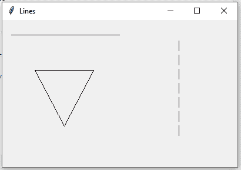
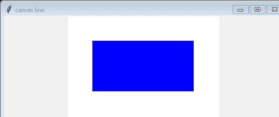

# Python Tkinter |使用 Canvas 类创建不同类型的线条

> 原文:[https://www . geesforgeks . org/python-tkinter-create-不同类型的行-使用-canvas-class/](https://www.geeksforgeeks.org/python-tkinter-create-different-type-of-lines-using-canvas-class/)

在 Tkinter 中，Canvas.create_line()方法用于在任何画布中创建线条。这些线只能在画布上看到，所以首先，您需要创建一个画布对象，然后将其打包到主窗口中。

**语法:**

```
Canvas.create_line(x1, y1, x2, y2, ...., options = ...)
```

**注意:**创建一条线至少需要 4 个点，但也可以添加多个点来创建不同的图形。
**类参数:**

> **使用的数据成员:**
> 主
> 画布
> **给定类使用的成员函数:** create()方法
> **使用的小部件:**画布
> **使用的 Tkinter 方法:**
> 画布. create _ line()
> pack()
> title()
> geometry()

下面是 Python 代码–

## 蟒蛇 3

```
# Imports each and every method and class
# of module tkinter and tkinter.ttk
from tkinter import *
from tkinter.ttk import *

class GFG:
    def __init__(self, master = None):
        self.master = master

        # Calls create method of class GFG
        self.create()

    def create(self):

        # This creates a object of class canvas
        self.canvas = Canvas(self.master)

        # This creates a line of length 200 (straight horizontal line)
        self.canvas.create_line(15, 25, 200, 25)

        # This creates a lines of 300 (straight vertical dashed line)
        self.canvas.create_line(300, 35, 300, 200, dash = (5, 2))

        # This creates a triangle (triangle can be created by other methods also)
        self.canvas.create_line(55, 85, 155, 85, 105, 180, 55, 85)

        # This pack the canvas to the main window and make it expandable
        self.canvas.pack(fill = BOTH, expand = True)

if __name__ == "__main__":

    # object of class Tk, responsible for creating
    # a tkinter toplevel window
    master = Tk()
    geeks = GFG(master)

    # This sets the title to Lines
    master.title("Lines")

    # This sets the geometry and position of window
    # on the screen
    master.geometry("400x250 + 300 + 300")

    # Infinite loop breaks only by interrupt
    master.mainloop()
```

**输出:**



**示例 2:** 用于在形状中填充颜色。

## 蟒蛇 3

```
from tkinter import *
root=Tk()
root.title("canvas line")
root.geometry("555x555")
our_canvas=Canvas(root,width=300,height=200,bg="white")
our_canvas.pack()
#creating rectangle
our_canvas.create_rectangle(50,150,250,50,fill="blue")
root.mainloop()
```

**输出:**

