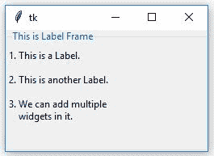
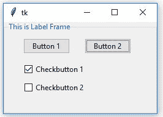

# Python Tkinter |创建标签框架并向其中添加小部件

> 原文:[https://www . geesforgeks . org/python-tkinter-create-label frame-and-add-widgets-it/](https://www.geeksforgeeks.org/python-tkinter-create-labelframe-and-add-widgets-to-it/)

 是一个 Python 模块，用于创建 GUI(图形用户界面)应用程序。这是 Python 附带的一个广泛使用的模块。它由各种类型的小部件组成，这些小部件可以用来使图形用户界面更加友好和吸引人，并且可以增加功能。

标签框架可以如下创建:

```py
-> import tkinter
-> create root
-> create LabelFrame as child of root

```

```py
label_frame = ttk.LabelFrame(parent, value = options, ...)
```

**代码#1:** 创建标签框架并向其添加消息。

```py
# Import only those methods
# which are mentioned below, this way of
# importing methods is efficient
from tkinter import Tk, mainloop, LEFT, TOP
from tkinter.ttk import *

# Creating tkinter window with fixed geometry
root = Tk()
root.geometry('250x150')

# This will create a LabelFrame
label_frame = LabelFrame(root, text = 'This is Label Frame')
label_frame.pack(expand = 'yes', fill = 'both')

label1 = Label(label_frame, text = '1\. This is a Label.')
label1.place(x = 0, y = 5)

label2 = Label(label_frame, text = '2\. This is another Label.')
label2.place(x = 0, y = 35)

label3 = Label(label_frame,
           text = '3\. We can add multiple\n    widgets in it.')

label3.place(x = 0, y = 65)

# This creates an infinite loop which generally
# waits for any interrupt (like keyboard or
# mouse) to terminate
mainloop()
```

**输出:**


**代码#2:** 在标签框架内添加[按钮](https://www.geeksforgeeks.org/python-creating-a-button-in-tkinter/)和[检查按钮](https://www.geeksforgeeks.org/python-tkinter-ttk-checkbutton-and-comparison-with-simple-checkbutton/)小部件。

```py
# Import only those methods
# which are mentioned below, this way of
# importing methods is efficient
from tkinter import Tk, mainloop, LEFT, TOP
from tkinter.ttk import *

# Creating tkinter window with fixed geometry
root = Tk()
root.geometry('250x150')

# This will create a LabelFrame
label_frame = LabelFrame(root, text = 'This is Label Frame')
label_frame.pack(expand = 'yes', fill = 'both')

# Buttons
btn1 = Button(label_frame, text = 'Button 1')
btn1.place(x = 30, y = 10)
btn2 = Button(label_frame, text = 'Button 2')
btn2.place(x = 130, y = 10)

# Checkbuttons
chkbtn1 = Checkbutton(label_frame, text = 'Checkbutton 1')
chkbtn1.place(x = 30, y = 50)
chkbtn2 = Checkbutton(label_frame, text = 'Checkbutton 2')
chkbtn2.place(x = 30, y = 80)

# This creates infinite loop which generally
# waits for any interrupt (like keyboard or
# mouse) to terminate
mainloop()
```

**输出:**


**注意:**你也可以在另一个*标签框架*中添加另一个*标签框架*，也可以像我们对其他小部件进行造型一样，对任何一个*标签框架*进行造型。