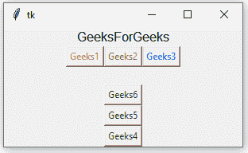

# python tkinter–框架小部件

> 哎哎哎:# t0]https://www . geeksforgeeks . org/python-tkinter frame widget/

Python 为开发图形用户界面提供了多个选项。在所有的 GUI 方法中，tkinter 是最常用的方法。它是 Python 附带的 Tk 图形用户界面工具包的标准 Python 接口。Python 和 tkinter 是创建图形用户界面应用程序最快最简单的方法。使用 tkinter 创建图形用户界面是一项简单的任务。

**注意:**更多信息请参考[Python GUI–tkinter](https://www.geeksforgeeks.org/python-gui-tkinter/)

## 基本框架

框架是屏幕上的矩形区域。框架也可以用作实现复杂小部件的基础类。它用于组织一组小部件。

**语法:**
使用框架小部件的语法如下。

```
w = frame( master, options)
```

**参数:**

*   **主**:此参数用于表示父窗口。
*   **选项**:有很多可用的选项，可以作为键值对使用，用逗号分隔。

**选项:**
以下是常用选项，可用于此小部件:-

*   **bg:** 此选项用于表示标签和指示器后面显示的正常背景颜色。
*   **bd:** 该选项用于表示指标周围边框的大小，默认值为 2 像素。
*   **光标:**使用此选项，当鼠标光标在框架上时，它将变为该模式。
*   **高度:**新框架的垂直尺寸。
*   **highlightcolor:** 该选项用于表示帧有焦点时焦点高亮的颜色。
*   **highlightthickness:** 该选项用于表示帧没有焦点时焦点高亮的颜色。
*   **高亮背景:**该选项用于表示聚焦高光的厚度..
*   **浮雕:**边框的类型。它的默认值设置为“平面”。
*   **宽度:**此选项用于表示框架的宽度。

**示例:**

```
from tkinter import * root = Tk()
root.geometry("300x150")

w = Label(root, text ='GeeksForGeeks', font = "50") 
w.pack()

frame = Frame(root)
frame.pack()

bottomframe = Frame(root)
bottomframe.pack( side = BOTTOM )

b1_button = Button(frame, text ="Geeks1", fg ="red")
b1_button.pack( side = LEFT)

b2_button = Button(frame, text ="Geeks2", fg ="brown")
b2_button.pack( side = LEFT )

b3_button = Button(frame, text ="Geeks3", fg ="blue")
b3_button.pack( side = LEFT )

b4_button = Button(bottomframe, text ="Geeks4", fg ="green")
b4_button.pack( side = BOTTOM)

b5_button = Button(bottomframe, text ="Geeks5", fg ="green")
b5_button.pack( side = BOTTOM)

b6_button = Button(bottomframe, text ="Geeks6", fg ="green")
b6_button.pack( side = BOTTOM)

root.mainloop()
```

**输出:**
