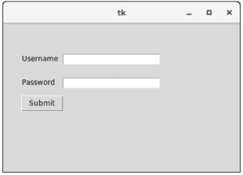

# python tkinter—标签

> 哎哎哎:# t0]https://www . geeksforgeeks . org/python-tkinter-label/

Python 为开发图形用户界面提供了多个选项。在所有的 GUI 方法中，Tkinter 是最常用的方法。它是 Python 附带的 Tk 图形用户界面工具包的标准 Python 接口。Python 搭配 Tkinter 是创建 GUI 应用程序最快最简单的方法。使用 Tkinter 创建一个图形用户界面是一项使用小部件的简单任务。小部件是标准的图形用户界面元素，就像按钮和菜单一样。

**注意:**更多信息请参考[Python GUI–tkinter](https://www.geeksforgeeks.org/python-gui-tkinter/)

## 标签小部件

Tkinter Label 是一个小部件，用于实现可以放置文本或图像的显示框。开发人员可以随时更改此小部件显示的文本。它还用于执行任务，例如给文本的一部分加下划线，以及将文本跨多行。需要注意的是，一个标签一次只能使用一种字体来显示文本。要使用标签，您只需指定要在其中显示的内容(可以是文本、位图或图像)。

**语法:**

> w =标签(主标签、选项标签等)

**参数:**

*   **主窗口:**代表父窗口
*   **选项:**下面是这个小部件最常用的选项列表。这些选项可以用作由逗号分隔的键值对:

各种选项包括:

*   **锚点:**如果小部件的空间超过了文本所需的空间，该选项用于控制文本的定位。默认值为 anchor=CENTER，它将文本置于可用空间的中心。
*   **bg:** 该选项用于设置标签和指示灯后面显示的正常背景颜色。
*   **高度:**此选项用于设置新框架的垂直尺寸。
*   **宽度:**标签的宽度，单位为字符(不是像素！).如果未设置此选项，标签的大小将适合其内容。
*   **bd:** 此选项用于设置指示器周围边框的大小。默认 bd 值设置为 2 像素。
*   **字体:**如果您正在标签中显示文本(带有 text 或 textvariable 选项)，字体选项用于指定标签中的文本将以何种字体显示。
*   **光标:**用于指定鼠标在标签上移动时显示什么光标。默认使用标准光标。
*   **textvariable:** 顾名思义，它与带有标签的 Tkinter 变量(通常是 StringVar)相关联。如果变量被更改，标签文本将被更新。
*   **位图:**用于将位图设置为指定的图形对象，这样，标签可以表示图形而不是文本。
*   **fg:** 标签 clior，用于文本和位图标签。默认值是系统特定的。如果您正在显示位图，这是将出现在位图中 1 位位置的 clior。
*   **图像:**此选项用于在标签小部件中显示静态图像。
*   **padx:** 此选项用于在标签内文本的左右之间添加额外的空格。此选项的默认值为 1。
*   **pady:** 此选项用于在标签内的文本顶部和底部之间添加额外的空格。此选项的默认值为 1。
*   **对齐:**此选项用于定义如何对齐多行文本。使用左、右或中心作为其值。请注意，要将文本放置在小部件内部，请使用锚点选项。对齐的默认值是中心。
*   **浮雕:**该选项用于指定标签周围装饰边框的外观。该选项的默认值为“平面”。
*   **下划线:**这
*   **包装长度:**不是只有一行作为标签文本，而是可以根据行数来拆分，每行都有为此选项指定的字符数。

**示例:**

```
from tkinter import * 

top = Tk()   
top.geometry("450x300")  

# the label for user_name 
user_name = Label(top, 
                  text = "Username").place(x = 40,
                                           y = 60)  

# the label for user_password  
user_password = Label(top, 
                      text = "Password").place(x = 40,
                                               y = 100)  

submit_button = Button(top, 
                       text = "Submit").place(x = 40,
                                              y = 130)

user_name_input_area = Entry(top,
                             width = 30).place(x = 110,
                                               y = 60)  

user_password_entry_area = Entry(top,
                                 width = 30).place(x = 110,
                                                   y = 100)  

top.mainloop() 
```

**输出:**
