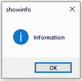
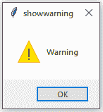
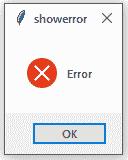
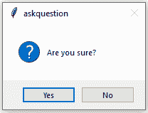
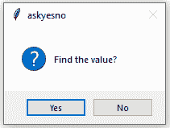
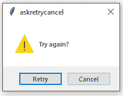

# python tkinter–消息框构件

> 哎哎哎:# t0]https://www . geeksforgeeks . org/python-tkinter-messagebox 小部件/

Python 为开发图形用户界面提供了多个选项。在所有的 GUI 方法中，tkinter 是最常用的方法。它是 Python 附带的 Tk 图形用户界面工具包的标准 Python 接口。Python 和 tkinter 是创建图形用户界面应用程序最快最简单的方法。使用 tkinter 创建图形用户界面是一项简单的任务。

**注意:**更多信息请参考[Python GUI–tkinter](https://www.geeksforgeeks.org/python-gui-tkinter/)

## 消息框小部件

Python Tinter–消息框小部件用于显示 python 应用程序中的消息框。该模块用于显示消息，提供了许多功能。

**语法:**

```
messagebox.Function_Name(title, message [, options]) 
```

**参数:**
有各种参数:

*   **功能 _ 名称:**该参数用于表示一个合适的消息框功能。
*   **标题:**该参数是一个字符串，显示为消息框的标题。
*   **消息:**此参数是要在消息框上显示为消息的字符串。
*   **选项:**可以使用的选项有两个:
    1.  **默认值:**该选项用于在消息框中指定默认按钮，如 ABORT、RETRY 或 IGNORE。
    2.  **父项:**该选项用于指定消息框显示的窗口。

**函数名:**
消息框小部件中有可用的函数或方法。

1.  **showinfo():** 向用户展示一些相关信息。
2.  **显示警告():**向用户显示警告。
3.  **showerror():** 向用户显示错误信息。
4.  **askquestion():** 提出问题，用户必须回答是或否。
5.  **askokcancel():** 确认用户关于某个应用活动的动作。
6.  **askysno():**用户可以回答是或否进行某些操作。
7.  **askretrycancel():** 询问用户是否再次执行特定任务。

**示例:**

```
from tkinter import * 
from tkinter import messagebox

root = Tk()
root.geometry("300x200")

w = Label(root, text ='GeeksForGeeks', font = "50") 
w.pack()

messagebox.showinfo("showinfo", "Information")

messagebox.showwarning("showwarning", "Warning")

messagebox.showerror("showerror", "Error")

messagebox.askquestion("askquestion", "Are you sure?")

messagebox.askokcancel("askokcancel", "Want to continue?")

messagebox.askyesno("askyesno", "Find the value?")

messagebox.askretrycancel("askretrycancel", "Try again?")  

root.mainloop() 
```

**输出:**






