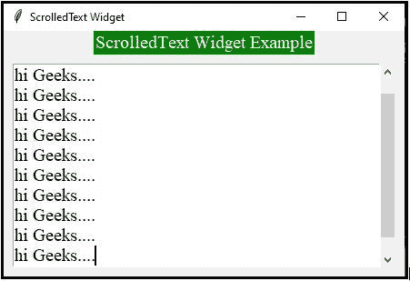
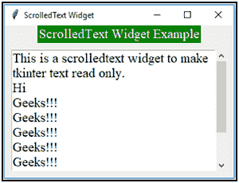

# python tkinter–滚动文本小部件

> 哎哎哎:# t0]https://www . geeksforgeeks . org/python-tkinter-scroll edtext 小部件/

**[Tkinter](https://www.geeksforgeeks.org/python-gui-tkinter/)** 是一个内置的标准 python 库。在 Tkinter 的帮助下，可以轻松创建许多 GUI 应用程序。Tkinter 中有各种类型的小部件，如按钮、框架、标签、菜单、滚动条、画布等等。小部件是提供各种控件的元素。ScrolledText 小部件是一个带有滚动条的文本小部件。tk `inter.scrolledtext`模块提供了文本小部件和滚动条。这个小部件帮助用户方便地输入多行文本。我们可以使用 scrolledtext 小部件来帮助输入任意数量的文本行，而不是向文本小部件添加滚动条。

**示例 1 :** 显示 scrolledText 小部件的 Python 代码。

```
# Python program demonstrating
# ScrolledText widget in tkinter

import tkinter as tk
from tkinter import ttk
from tkinter import scrolledtext

# Creating tkinter main window
win = tk.Tk()
win.title("ScrolledText Widget")

# Title Label
ttk.Label(win, 
          text = "ScrolledText Widget Example",
          font = ("Times New Roman", 15), 
          background = 'green', 
          foreground = "white").grid(column = 0,
                                     row = 0)

# Creating scrolled text 
# area widget
text_area = scrolledtext.ScrolledText(win, 
                                      wrap = tk.WORD, 
                                      width = 40, 
                                      height = 10, 
                                      font = ("Times New Roman",
                                              15))

text_area.grid(column = 0, pady = 10, padx = 10)

# Placing cursor in the text area
text_area.focus()
win.mainloop()
```

**输出:**


**示例 2 :** 将 tkinter 文本设为只读的 ScrolledText 小部件。

```
# Importing required modules

import tkinter as tk
import tkinter.scrolledtext as st

# Creating tkinter window
win = tk.Tk()
win.title("ScrolledText Widget")

# Title Label
tk.Label(win, 
         text = "ScrolledText Widget Example", 
         font = ("Times New Roman", 15), 
         background = 'green', 
         foreground = "white").grid(column = 0,
                                    row = 0)

# Creating scrolled text area
# widget with Read only by
# disabling the state
text_area = st.ScrolledText(win,
                            width = 30, 
                            height = 8, 
                            font = ("Times New Roman",
                                    15))

text_area.grid(column = 0, pady = 10, padx = 10)

# Inserting Text which is read only
text_area.insert(tk.INSERT,
"""\
This is a scrolledtext widget to make tkinter text read only.
Hi
Geeks !!!
Geeks !!!
Geeks !!! 
Geeks !!!
Geeks !!!
Geeks !!!
Geeks !!!
""")

# Making the text read only
text_area.configure(state ='disabled')
win.mainloop()
```

**输出:**


在第一个示例中，您可以看到光标，用户可以输入任意数量的文本行。在第二个示例中，用户只能阅读文本框中显示的文本，不能编辑/输入任何文本行。我们可能会观察到，如果用户输入的文本小于小部件的大小，滚动条会自动消失。