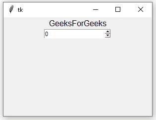

# python tkinter–spinbox

> 哎哎哎:# t0]https://www . geeksforgeeks . org/python-tkinter-spinbox/

Python 为开发图形用户界面提供了多个选项。在所有的 GUI 方法中，tkinter 是最常用的方法。它是 Python 附带的 Tk 图形用户界面工具包的标准 Python 接口。Python 和 tkinter 是创建图形用户界面应用程序最快最简单的方法。使用 tkinter 创建图形用户界面是一项简单的任务。

**注意:**更多信息请参考[Python GUI–tkinter](https://www.geeksforgeeks.org/python-gui-tkinter/)

## 旋转框小部件

Spinbox 小部件用于从固定数量的值中进行选择。它是一个可选的条目小部件，向用户提供值的范围。

**语法:**
使用自旋盒的语法如下。

```
w = Spinbox ( master, options)
```

**参数:**

*   **主**:此参数用于表示父窗口。
*   **选项**:有很多可用的选项，可以作为键值对使用，用逗号分隔。

**选项:**
以下是常用选项，可用于此小部件:-

*   **活动背景:**此选项用于表示滑块和箭头位于光标下方时的背景颜色。
*   **bg:** 此选项用于表示标签和指示器后面显示的正常背景颜色。
*   **bd:** 该选项用于表示指标周围边框的大小，默认值为 2 像素。
*   **命令:**该选项与状态改变时要调用的函数相关联。
*   **光标:**使用该选项，当鼠标光标在类型上时，它将变为该模式。
*   **禁用前景:**该选项用于表示小部件禁用时的前景色..
*   **禁用背景:**该选项用于表示小部件禁用时的背景颜色..
*   **字体:**该选项用于表示文本使用的字体。
*   **fg:** 此选项用于表示渲染文本所用的颜色。
*   **格式:**该选项用于格式化字符串，没有默认值。
*   **from_:** 此选项用于表示最小值。
*   **对齐:**此选项用于控制文本的对齐方式:居中、向左或向右。
*   **浮雕:**该选项用于表示边框的类型，其默认值设置为“下沉”。
*   **repeatdelay:** 此选项用于控制按钮自动重复，其默认值为毫秒。
*   **repeat server:**此选项类似于 repeatdelay。
*   **状态:**此选项用于表示代表小部件的状态，其默认值为 NORMAL。
*   **textvariable:** 此选项用于控制小部件文本的行为。
*   **到:**指定小部件值的最大限制。另一个由 from 选项指定。
*   **验证:**此选项用于控制如何验证小部件值。
*   **validatecommand:** 此选项与用于验证小部件内容的函数回调相关联。
*   **值:**该选项用于表示包含该小部件值的元组。
*   **vcmd:** 该选项与验证命令相同。
*   **宽度:**此选项用于表示小部件的宽度。
*   **包装:**该选项包装旋转框的上下按钮。
*   **xscrollcommand:** 该选项设置为 scrollbar 的 set()方法，使这个小部件可以水平滚动。

**方法:**
本小工具使用的方法如下:

*   **删除(startindex，endindex):** 此方法用于删除指定范围内存在的字符。
*   **get(startindex，endindex):** 此方法用于获取指定范围内存在的字符。
*   **识别(x，y):** 此方法用于识别指定范围内的小部件元素。
*   **指标(index):** 该方法用于获取给定指标的绝对值。
*   **insert(index，string):** 此方法用于在指定的索引处插入字符串。
*   **invoke(元素):**该方法用于调用与小部件关联的回调。

**示例:**

```
from tkinter import *

root = Tk()
root.geometry("300x200")

w = Label(root, text ='GeeksForGeeks', font = "50") 
w.pack()

sp = Spinbox(root, from_= 0, to = 20)
sp.pack()

root.mainloop() 
```

**输出:**
