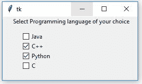
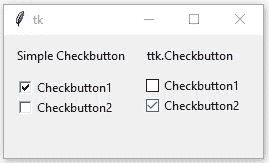

# Python | Tkinter ttk。检查按钮以及与简单检查按钮的比较

> 原文:[https://www . geeksforgeeks . org/python-tkinter-ttk-check button-and-comparison-simple-check button/](https://www.geeksforgeeks.org/python-tkinter-ttk-checkbutton-and-comparison-with-simple-checkbutton/)

[Tkinter](https://www.geeksforgeeks.org/python-gui-tkinter/) 是一个图形用户界面(GUI)模块，它和 Python 本身一起出现。该模块广泛用于创建图形用户界面应用程序。 **`tkinter.ttk`** 用于创建具有现代图形效果的图形用户界面应用程序，这是仅使用*TKIT*无法实现的。Checkbutton 用于选择多个选项。

可以使用以下代码片段创建检查按钮。

```
chkbtn = ttk.Checkbutton(master, option=value, ...)
```

**代码#1:**

```
# importing tkinter.ttk
from tkinter import *
from tkinter.ttk import * 

# creating root
root = Tk()

# label text
Label(root, text ='Select Programming language of your choice').place(x = 20, y = 0)

# check buttons
java = Checkbutton(root, text ='Java',
                   takefocus = 0).place(x = 40, y = 30)

cpp = Checkbutton(root, text ='C++',
                  takefocus = 0).place(x = 40, y = 50)

python = Checkbutton(root, text ='Python',
                     takefocus = 0).place(x = 40, y = 70)

c = Checkbutton(root, text ='C',
                takefocus = 0).place(x = 40, y = 90)

root.mainloop()
```

**输出:**


**代码#2:** 简单`Checkbutton`和`ttk.Checkbutton`的区别

```
# importing tkinter and ttk
from tkinter import * 
from tkinter import ttk

# root
root = Tk()

# This will depict the features of Simple Checkbutton
Label(root, text ='Simple Checkbutton').place(x = 10, y = 10)
chkbtn1 = Checkbutton(root, text ='Checkbutton1',
             takefocus = 0).place(x = 10, y = 40)
chkbtn2 = Checkbutton(root, text ='Checkbutton2',
             takefocus = 0).place(x = 10, y = 60)

# This will depict the features of ttk.Checkbutton
Label(root, text ='ttk.Checkbutton').place(x = 140, y = 10)
chkbtn1 = ttk.Checkbutton(root, text ='Checkbutton1',
                takefocus = 0).place(x = 140, y = 40)
chkbtn2 = ttk.Checkbutton(root, text ='Checkbutton2', 
                takefocus = 0).place(x = 140, y = 60)

root.mainloop()
```

**输出:**


请注意两个检查按钮的外观差异，这都是由于现代图形。在上述代码中，当鼠标悬停在`ttk.Checkbutton`上时，您可能会看到蓝色效果(效果可能会因操作系统而异)。当我们将鼠标悬停在简单检查按钮上时，您可能不会体验到任何此类效果。