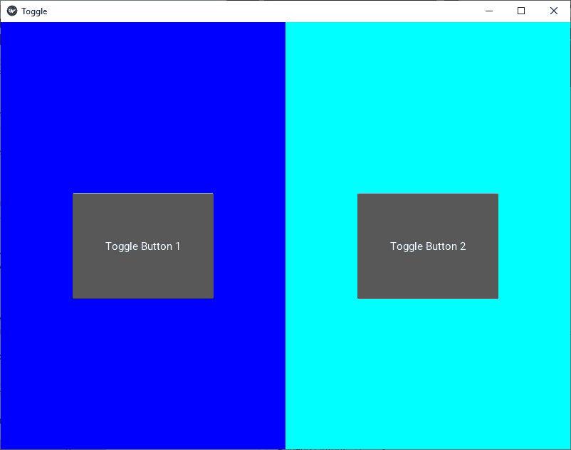

# Python |使用 kivy 切换按钮。kv 文件

> 原文:[https://www . geesforgeks . org/python-toggle-button-in-kivy-using-kv-file/](https://www.geeksforgeeks.org/python-toggle-button-in-kivy-using-kv-file/)

Kivy 是 Python 中独立于平台的 GUI 工具。因为它可以在安卓、IOS、linux 和 Windows 等平台上运行。它基本上是用来开发安卓应用程序的，但并不意味着它不能在桌面应用程序上使用。

> ？？？？？？？？ [Kivy 教程–通过示例学习 Kivy](https://www.geeksforgeeks.org/kivy-tutorial/)。

## 切换按钮:

ToggleButton 小部件就像一个复选框。当您触摸或点按它时，状态会在“正常”和“向下”之间切换(与只要按下就只能“向下”的按钮相反)。
切换按钮也可以分组成为单选按钮——一个组中只有一个按钮可以处于“向下”状态。组名可以是字符串或任何其他可散列的 Python 对象:

```py
btn1 = ToggleButton(text='Male', group='sex', )
btn2 = ToggleButton(text='Female', group='sex', state='down')
btn3 = ToggleButton(text='Mixed', group='sex')
```

同时只能“按下”其中一个按钮。要配置 ToggleButton，可以使用与按钮类相同的属性。

```py
Basic Approach:

1) import kivy
2) import kivyApp
3) import toggle button
4) import Gridlayout
5) Set minimum version(optional)
6) create layout class
7) create App class
8) create the, kv file
9) return Layout/widget/Class(according to requirement)
10) Run an instance of the class
```

**实施办法:**
**。py 代码:**

## 蟒蛇 3

```py
# Program to explain how to use Toggle button in kivy 

# import kivy module    
import kivy  

# base Class of your App inherits from the App class.    
# app:always refers to the instance of your application   
from kivy.app import App 

# this restrict the kivy version i.e  
# below this kivy version you cannot  
# use the app or software  
kivy.require('1.9.0')

# The ToggleButton widget acts like a checkbox.
# To use this you must have to import it.
from kivy.uix.togglebutton import ToggleButton

# The GridLayout arranges children in a matrix.
# It takes the available space and divides it
# into columns and rows, then adds
# widgets to the resulting “cells”.
from kivy.uix.gridlayout import GridLayout

# Create the Layout Class
class Toggle_btn(GridLayout):
    pass

# Create the App Class
class ToggleApp(App):
    def build(self):
        return Toggle_btn()

# Run the App
if __name__=='__main__':
   ToggleApp().run()
```

**。千伏代码:**

## 蟒蛇 3

```py
# .kv file implementation of the code

<Toggle_btn>:

    # Columns divides screen in two parts
    cols:2

    # Create Toggle button 1
    RelativeLayout:
        canvas:
            Color:
                rgb: 0, 0, 1
            Rectangle:
                size: root.width, root.height
        ToggleButton:
            size_hint: None, None
            size: 0.25 * root.width, 0.25 * root.height
            pos: 0.125 * root.width, 0.350 * root.height
            text: 'Toggle Button 1'
            group: 'geometry'

   # Create Toggle button 2
    RelativeLayout:
        canvas:
            Color:
                rgb: 0, 1, 1
            Rectangle:
                size: root.width, root.height
        ToggleButton:
            size_hint: None, None
            size: 0.25 * root.width, 0.25 * root.height
            pos: 0.125 * root.width, 0.350 * root.height
            text: 'Toggle Button 2'
            group: 'geometry'
```

**输出:**

