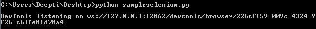

# Python |网页抓取世界中的工具

> 原文:[https://www . geesforgeks . org/python-tools-world-web-scratch/](https://www.geeksforgeeks.org/python-tools-world-web-scraping/)

网页抓取可以使用多种工具或者使用 Python 中的不同框架来完成。从网页上抓取数据有多种选择，每一种都适合不同的需要。

首先，让我们了解一下网页抓取和网页抓取的区别。网页抓取是用来索引网页上的信息使用机器人也称为爬虫。另一方面，网页抓取是一种使用机器人(也称为抓取器)提取信息/内容的自动化方式。

让我们看看 Python3 最常用的网页抓取工具:

1.  Urllib2
2.  要求
3.  美丽的组合
4.  xml 格式
5.  硒
6.  机械汤

在所有可用的框架/工具中，只有`urllib2` 预装了 Python。因此，如果需要，需要安装所有其他工具。让我们详细讨论所有这些工具。

1.  **Urllib2 :** `Urllib2` is a python module used for fetching URL’s. It offers a very simple interface, in the form of urlopen function, which is capable of fetching URL’s using different protocols like HTTP, FTP etc.

    ```
    # Using urllib2 module
    from urllib.request import urlopen

    html = urlopen("http://geeksforgeeks.org")

    print(html.read())
    ```

    **输出:**
    

2.  **Requests :** `Requests` does not come pre-installed with Python. Requests allows to send HTTP/1.1 requests. One can add headers, form data, multipart files and parameters with simple Python dictionaries and access the response data in the same way.

    安装请求可以使用 pip 完成。

    ```
    pip install requests
    ```

    ```
    # Using requests module
    import requests

    # get URL
    req = requests.get('https://www.geeksforgeeks.org/')

    print(req.encoding)     
    print(req.status_code) 
    print(req.elapsed)     
    print(req.url)         
    print(req.history)     
    print(req.headers['Content-Type'])
    ```

    **输出:**
    

3.  **BeautifulSoup :** `Beautiful soup` is a parsing library that can use different parsers. Beautiful Soup’s default parser comes from Python’s standard library. It creates a parse tree that can be used to extract data from HTML; a toolkit for dissecting a document and extracting what you need. It automatically converts incoming documents to Unicode and outgoing documents to UTF-8.

    `pip` 可用于安装美化套件:

    ```
    pip install beautifulsoup4
    ```

    ```
    # importing BeautifulSoup form
    # bs4 module
    from bs4 import BeautifulSoup

    # importing requests
    import requests

    # get URL
    r = requests.get("https://www.geeksforgeeks.org")

    data = r.text
    soup = BeautifulSoup(data)

    for link in soup.find_all('a'):
        print(link.get('href'))
    ```

    **输出:**
    

4.  **Lxml :** `Lxml` is a high-performance, production-quality HTML and XML parsing library. If the user need speed, then go for Lxml. Lxml has many modules and one of the module is `etree` , which is responsible for creating elements and structure using these elements.

    您可以通过使用`pip` 工具将其安装为 python 包来开始使用 lxml:

    ```
    pip install lxml
    ```

    ```
    # importing etree from lxml module
    from lxml import etree

    root_elem = etree.Element('html')
    etree.SubElement(root_elem, 'head')
    etree.SubElement(root_elem, 'title')
    etree.SubElement(root_elem, 'body')

    print(etree.tostring(root_elem, pretty_print = True).decode("utf-8"))
    ```

    **输出:**
    

5.  **Selenium :** Some websites use javascript to serve content. For example, they might wait until you scroll down on the page or click a button before loading certain content. For these websites, selenium is needed. Selenium is a tool that automates browsers, also known as web-drivers. It also comes with Python bindings for controlling it right from your application.

    `pip` 包装用于安装硒:

    ```
    pip install selenium
    ```

    ```
    # importing webdriver from selenium module
    from selenium import webdriver

    # path for chromedriver
    path_to_chromedriver ='/Users/Admin/Desktop/chromedriver'

    browser = webdriver.Chrome(executable_path = path_to_chromedriver)

    url = 'https://www.geeksforgeeks.org'
    browser.get(url)
    ```

    **输出:**
    
    

6.  **MechanicalSoup :** `MechanicalSoup` is a Python library for automating interaction with websites. It automatically stores and sends cookies, follows redirects, and can follow links and submit forms. It doesn’t do JavaScript.

    可以使用以下命令安装机械汤:

    ```
    pip install MechanicalSoup
    ```

    ```
    # importing mechanicalsoup
    import mechanicalsoup

    browser = mechanicalsoup.StatefulBrowser()
    value = browser.open("http://geeksforgeeks.org/")
    print(value)

    value1 = browser.get_url()
    print(value1)

    value2 = browser.follow_link("forms")
    print(value2)

    value = browser.get_url()
    print(value)
    ```

7.  **Scrapy :** `Scrapy` is an open source and collaborative web crawling framework for extracting the data needed from websites. It was originally designed for web scraping. It can be used to manage requests, preserve user sessions follow redirects and handle output pipelines.

    安装 scrapy 有两种方法:

    1.  使用 pip :

        ```
        pip install scrapy
        ```

    2.  使用蟒蛇:首先安装**蟒蛇**或**迷你蟒蛇**，然后使用以下命令安装 scrapy :

        ```
        conda install -c conda-forge scrapy
        ```

    ```
    # importing scrapy module
    import scrapy

    class GeeksSpider(scrapy.Spider):

        name = "geeks_spider"

        start_urls = ['https://www.geeksforgeeks.org']

        # Parse function
        def parse(self, response):

            SET_SELECTOR = 'geeks'
            for geek in response.css(SET_SELECTOR):
                pass
    ```

    使用以下命令运行一个报废代码:

    ```
    scrapy runspider samplescapy.py
    ```

    **输出:** 

上面讨论的模块是 Python3 最常用的剪贴器。虽然已经很少了，但不再与像 Mechanize、Scrapemark 这样的 Python3 兼容。

**参考文献:**

1.  https://elitedatascience.com/python-web-scraping-libraries
2.  https://python.gotrained.com/python-web-scraping-libraries/
3.  http://blog.datahut.co/beginners-guide-to-web-scraping-with-python-lxml/