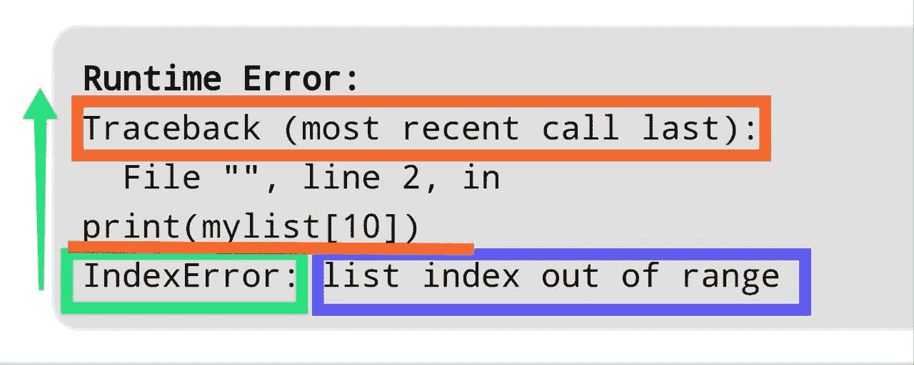

# Python 回溯

> 原文:[https://www.geeksforgeeks.org/python-traceback/](https://www.geeksforgeeks.org/python-traceback/)

在 Python 中，回溯是一个报告，包含了在特定时间点代码中进行的函数调用，也就是说，当您得到一个错误时，建议您对它进行回溯(回溯)。每当代码出现异常时，回溯将给出代码中出错的信息。Python 回溯包含大量信息，可以帮助您发现代码中的错误。这些回溯看起来可能有点令人厌烦，但是一旦你把它分解，看看它想向你展示什么，它们就会非常有帮助。

考虑以下示例…

```
# Python program to demonstrate
# traceback

mylist = [1, 2, 3]
print(mylist[10])
```

在这个例子中，我们试图访问列表的第 10 个元素。列表中只有 3 个元素，它会给出运行时错误。当这个程序被执行时，你会得到如下的回溯。

```
Traceback (most recent call last):
  File "", line 2, in 
print(mylist[10])
IndexError: list index out of range

```

此回溯错误包含了有关此运行时错误发生原因的所有信息。追溯的最后一行告诉您发生了什么类型的错误以及相关信息。前几行回溯指向发生错误的代码。在上面的例子中，最后一行表示索引发生，前两行表示异常发生的确切位置。现在让我们看看，如何阅读回溯..

#### 如何阅读回溯

Python 回溯包含许多关于引发什么异常的有用信息。逐行浏览一些回溯将使您更好地理解它们包含的信息，并帮助您充分利用它们，在本节中，我们将看到如何阅读特定的异常。



在 python 中，最好是**从下往上读回溯**。

*   **绿框**显示发生了什么类型的错误。
*   **蓝框**显示错误的相关信息
*   **ORANGE BOX** 显示最近调用的回溯语句，在第一个**运行时错误:**
    回溯(最近一次调用的最后一次):
    File " "，第 1 行，在
    ModuleNotFoundError 中:每个调用的名为“asdf”的行中没有模块包含文件名、行号和模块名等信息

*   **RED** underlined part shows exact line where exception occurred.

    **一些常见的回溯错误有:**

    *   名称错误
    *   索引错误
    *   键错误
    *   类型埃罗尔
    *   值错误
    *   import error/module NotFound-汇入错误/模组 not found

    让我们逐一检查每个错误:

    1.  **NameError:** NameError occurs when you try to reference some variable which hasn’t been defined in the code.

        **示例:**

        ```
        number = 1 

        # since no numb variable is
        # defined it will give NameError.
        print(numb)  
        ```

        **输出:**

        ```
        Traceback (most recent call last):
          File "gfg.py", line 5, in 
            print(numb)  
        NameError: name 'numb' is not defined

        ```

    2.  **IndexError:** An IndexError is raised when a sequence is referenced which is out of range.

        **示例:**

        ```
        mylist = [1, 2, 3]

        # Accessing the index out
        # of range will raise IndexError
        print(mylist[10])
        ```

        **输出:**

        ```
        Traceback (most recent call last):
          File "gfg.py", line 5, in 
            print(mylist[10])
        IndexError: list index out of range

        ```

    3.  **KeyError:** Similar to the IndexError, the KeyError is raised when you attempt to access a key that isn’t in the mapping, usually in the case of Python dict. Think of this as the IndexError but for dictionaries.

        **示例:**

        ```
        DICT ={ "a" :25, "b" :65 }

        # A is not mapped in dict
        # will raise KeyError
        print(DICT["A"])
        ```

        **输出:**

        ```
        Traceback (most recent call last):
          File "gfg.py", line 5, in 
            print(DICT["A"])
        KeyError: 'A'

        ```

    4.  **TypeError:** TypeError is raised when an operation or function is applied to an object of inappropriate type. This exception returns a string giving details about the type mismatch.

        **示例:**

        ```
        c = 'b'+3
        print(c)
        ```

        **输出:**

        ```
        Traceback (most recent call last):
          File "gfg.py", line 1, in 
            c = 'b'+3
        TypeError: must be str, not int

        ```

    5.  **ValueError:** A ValueError is raised when a built-in operation or function receives an argument that has the right type but an invalid value.

        **示例:**

        ```
        print(int('xyz'))
        ```

        ```
        Traceback (most recent call last):
          File "gfg.py", line 1, in 
            print(int('xyz'))
        ValueError: invalid literal for int() with base 10: 'xyz'

        ```

    6.  **ImportError:** The ImportError is raised when something goes wrong with an import statement. You’ll get this exception, or its subclass `ModuleNotFoundError`, if the module you are trying to import can’t be found or if you try to import something from a module that doesn’t exist in the module.

        **示例:**

        ```
        import module_does_not_exist

        ```

        ```
        Traceback (most recent call last):
          File "gfg.py", line 1, in 
            import module_does_not_exist
        ModuleNotFoundError: No module named 'module_does_not_exist'

        ```