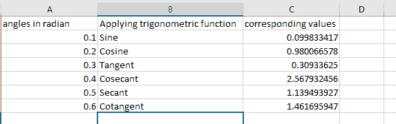
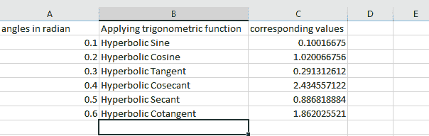

# Python |使用 openpyxl 在 excel 文件中进行三角运算

> 原文:[https://www . geesforgeks . org/python-三角运算-in-excel-file-use-openpyxl/](https://www.geeksforgeeks.org/python-trigonometric-operations-in-excel-file-using-openpyxl/)

**先决条件:** [使用 openpyxl 调整 excel 工作表的行和列](https://www.geeksforgeeks.org/python-adjusting-rows-and-columns-of-an-excel-file-using-openpyxl-module/)。

`**Openpyxl**`是一个 Python 库，使用它可以对 excel 文件执行多种操作，如[读取](https://www.geeksforgeeks.org/python-reading-excel-file-using-openpyxl-module/)、[写入](https://www.geeksforgeeks.org/python-writing-excel-file-using-openpyxl-module/)、[数学](https://www.geeksforgeeks.org/python-arithmetic-operations-in-excel-file-using-openpyxl/)运算和[绘制图形](https://www.geeksforgeeks.org/python-plotting-charts-in-excel-sheet-using-openpyxl-module-set-1/)。让我们看看如何使用 openpyxl 执行不同的三角运算。

**简单三角函数:**

**代码#1 :** 在程序中使用简单的三角函数。

*   **=SIN(数字):**返回一个角度的正弦值。Number 是需要正弦值的角度，单位为弧度。
*   **=COS(数字):**返回角度的余弦值。
*   **=TAN(数字):**返回一个角度的正切值。
*   **=CSC(数字):**返回一个角度的余角。
*   **=秒(数):**返回一个角度的割线。
*   **=COT(数字):**返回一个角度的余切。

```py
# import openpyxl module
import openpyxl

# Call a Workbook() function of openpyxl 
# to create a new blank Workbook object
wb = openpyxl.Workbook()

# Get workbook active sheet  
# from the active attribute.
sheet = wb.active

# set the width of the column
sheet.column_dimensions['A'].width = 20
sheet.column_dimensions['B'].width = 30
sheet.column_dimensions['C'].width = 20

# writing to the cell of an excel sheet
sheet['A1'] = "angles in radian"
sheet['A2'] = 0.1
sheet['A3'] = 0.2
sheet['A4'] = 0.3
sheet['A5'] = 0.4
sheet['A6'] = 0.5
sheet['A7'] = 0.6

# mention performing trigonometric operations
sheet['B1'] = "Applying trigonometric function"
sheet['B2'] = "Sine"
sheet['B3'] = "Cosine"
sheet['B4'] = "Tangent"
sheet['B5'] = "Cosecant"
sheet['B6'] = "Secant"
sheet['B7'] = "Cotangent"

# The value in cell C1 to C7 is set to a formula 
# that calculates values for particular radian.
sheet['C1'] = 'corresponding values'
sheet['C2'] = '= SIN(0.1)'
sheet['C3'] = '= COS(0.2)'
sheet['C4'] = '= TAN(0.3)'
sheet['C5'] = '= CSC(0.4)'
sheet['C6'] = '= SEC(0.5)'
sheet['C7'] = '= COT(0.6)'

# save the file
wb.save("simple_trigonometric.xlsx")
```

**输出:**


**代码#2 :** 在程序中使用双曲三角函数。

*   **=SINH(数字):**返回数字的双曲正弦值。
*   **=COSH(Number) :** 返回一个数的双曲余弦值。
*   **=TANH(数字):**返回数字的双曲正切值。
*   **=CSCH(数字):**返回数字的双曲余切。
*   **=SECH(数字):**返回数字的双曲割线。
*   **=COTH(Number) :** 返回一个数的双曲余切。

```py
# import openpyxl module
import openpyxl

# Call a Workbook() function of openpyxl 
# to create a new blank Workbook object
wb = openpyxl.Workbook()

# Get workbook active sheet  
# from the active attribute.
sheet = wb.active

# set the width of the column
sheet.column_dimensions['A'].width = 20
sheet.column_dimensions['B'].width = 30
sheet.column_dimensions['C'].width = 20

# writing to the cell of an excel sheet
sheet['A1'] = "angles in radian"
sheet['A2'] = 0.1
sheet['A3'] = 0.2
sheet['A4'] = 0.3
sheet['A5'] = 0.4
sheet['A6'] = 0.5
sheet['A7'] = 0.6

# mention performing trigonometric operations
sheet['B1'] = "Applying trigonometric function"
sheet['B2'] = "Hyperbolic Sine"
sheet['B3'] = "Hyperbolic Cosine"
sheet['B4'] = "Hyperbolic Tangent"
sheet['B5'] = "Hyperbolic Cosecant"
sheet['B6'] = "Hyperbolic Secant"
sheet['B7'] = "Hyperbolic Cotangent"

# The value in cell C1 to C7 is set to a formula 
# that calculates values for particular radian.
sheet['C1'] = 'corresponding values'
sheet['C2'] = '= SINH(0.1)'
sheet['C3'] = '= COSH(0.2)'
sheet['C4'] = '= TANH(0.3)'
sheet['C5'] = '= CSCH(0.4)'
sheet['C6'] = '= SECH(0.5)'
sheet['C7'] = '= COTH(0.6)'

# save the file
wb.save("Hyperbolic_trigonometric.xlsx")
```

**输出:**
