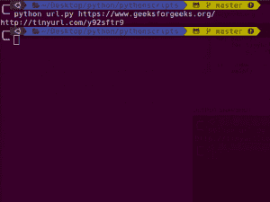

# Python |使用 tinyurl API 的 URL 缩写器

> 原文:[https://www . geesforgeks . org/python-URL-short ener-using-tinyurl-API/](https://www.geeksforgeeks.org/python-url-shortener-using-tinyurl-api/)

有多个应用程序接口(例如，bitly 应用程序接口等)。)可用于 url 缩短服务，但在本文中，我们将使用 Tinyurl API 来缩短 URL。

虽然 *tinyURL* 还没有正式发布它的 API，但是我们会非正式地使用它。在这里，我们可以一次输入任意数量的网址，一次得到缩短的网址。

例如，如果在命令行中我们写

```
$ python filename URL1 URL2 URL3 
```

那么输出将是:

```
 ['shortened url1', 'shortened url2', 'shortened url3'] 
```

**Step #1:**

*   首先我们要导入 7 个库。
*   我们本可以只使用一个库来工作，但是为了做出好的 url 缩写，我们必须使用 7 个库。

代码片段如下:

```
from __future__ import with_statement                                                        

import contextlib

try:
    from urllib.parse import urlencode          

except ImportError:
    from urllib import urlencode

try:
    from urllib.request import urlopen

except ImportError:
    from urllib2 import urlopen

import sys
```

**第二步:**

这里完成了 url 的编码并将其附加到 API，然后我们使用 urlopen 打开 request_url。然后我们将响应转换为 UTF-8，因为`urlopen()`返回的是字节流而不是字符串。

代码片段如下:

```
def make_tiny(url):
    request_url = ('http://tinyurl.com/api-create.php?' + urlencode({'url':url}))   
    with contextlib.closing(urlopen(request_url)) as response:                      
        return response.read().decode('utf-8 ')       
```

**第三步:**
在最后一步我们调用`main()`，我们通过使用`sys.argv`
获得用户输入。我们没有限制自己只输入一个网址，相反，我们说给我们你想要的任意多个网址，我们会让它们变得很小。`map()`是一种简单的循环遍历列表并将其逐个传递给函数的方法。

代码片段如下:

```
def main():                                                                
    for tinyurl in map(make_tiny, sys.argv[1:]):                    
        print(tinyurl)

if __name__ == '__main__':
    main()

```

**最后，完整代码如下:**

```
#!/usr/bin/env python 3
from __future__ import with_statement                                                           

import contextlib

try:
    from urllib.parse import urlencode          

except ImportError:
    from urllib import urlencode
try:
    from urllib.request import urlopen

except ImportError:
    from urllib2 import urlopen

import sys

def make_tiny(url):
    request_url = ('http://tinyurl.com/api-create.php?' + urlencode({'url':url}))    
    with contextlib.closing(urlopen(request_url)) as response:                      
        return response.read().decode('utf-8 ')                                      

def main():                                                                
    for tinyurl in map(make_tiny, sys.argv[1:]):                   
        print(tinyurl)

if __name__ == '__main__':
    main()
```

**输出:**
