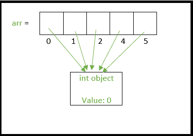
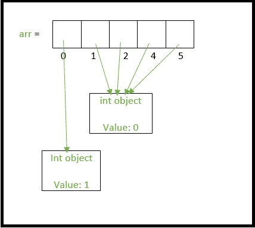
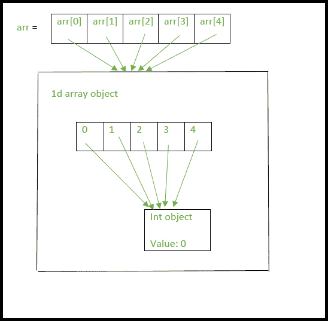
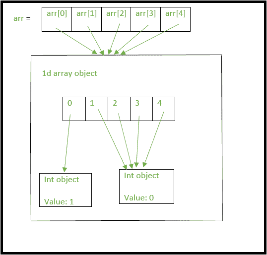

# Python |使用 2D 数组/列表的正确方式

> 原文:[https://www . geesforgeks . org/python-using-2d-arrays-list-the-right-way/](https://www.geeksforgeeks.org/python-using-2d-arrays-lists-the-right-way/)

Python 提供了许多创建二维列表/数组的方法。然而，人们必须知道这些方法之间的区别，因为它们会在代码中产生复杂的东西，很难追踪出来。让我们从创建用 0 初始化的一维数组开始。
**法 1a**

## 蟒蛇 3

```
# First method to create a 1 D array
N = 5
arr = [0]*N
print(arr)
```

**Output:** 

```
[0, 0, 0, 0, 0]
```

**方法 1b**T2】

## 蟒蛇 3

```
# Second method to create a 1 D array
N = 5
arr = [0 for i in range(N)]
print(arr)
```

**Output:** 

```
[0, 0, 0, 0, 0]
```

扩展以上内容，我们可以通过以下方式定义二维数组。
**法 2a**

## 蟒蛇 3

```
# Using above first method to create a
# 2D array
rows, cols = (5, 5)
arr = [[0]*cols]*rows
print(arr)
```

**Output:** 

```
[[0, 0, 0, 0, 0], [0, 0, 0, 0, 0], [0, 0, 0, 0, 0], [0, 0, 0, 0, 0], [0, 0, 0, 0, 0]]
```

**方法 2b**T2】

## 蟒蛇 3

```
# Using above second method to create a
# 2D array
rows, cols = (5, 5)
arr = [[0 for i in range(cols)] for j in range(rows)]
print(arr)
```

**Output:** 

```
[[0, 0, 0, 0, 0], [0, 0, 0, 0, 0], [0, 0, 0, 0, 0], [0, 0, 0, 0, 0], [0, 0, 0, 0, 0]]
```

**方法 2c**T2】

## 蟒蛇 3

```
# Using above second method to create a
# 2D array
rows, cols = (5, 5)
arr=[]
for i in range(rows):
    col = []
    for j in range(cols):
        col.append(0)
    arr.append(col)
print(arr)
```

**Output:** 

```
[[0, 0, 0, 0, 0], [0, 0, 0, 0, 0], [0, 0, 0, 0, 0], [0, 0, 0, 0, 0], [0, 0, 0, 0, 0]]
```

到目前为止，这两种方法给出的输出看似相同。让我们更改方法 2a 和方法 2b 数组中的一个元素。

## 蟒蛇 3

```
# Python 3 program to demonstrate working
# of method 1 and method 2.

rows, cols = (5, 5)

# method 2a
arr = [[0]*cols]*rows

# lets change the first element of the
# first row to 1 and print the array
arr[0][0] = 1

for row in arr:
    print(row)
# outputs the following
#[1, 0, 0, 0, 0]
#[1, 0, 0, 0, 0]
#[1, 0, 0, 0, 0]
#[1, 0, 0, 0, 0]
#[1, 0, 0, 0, 0]

# method 2b
arr = [[0 for i in range(cols)] for j in range(rows)]

# again in this new array lets change
# the first element of the first row
# to 1 and print the array
arr[0][0] = 1
for row in arr:
    print(row)

# outputs the following as expected
#[1, 0, 0, 0, 0]
#[0, 0, 0, 0, 0]
#[0, 0, 0, 0, 0]
#[0, 0, 0, 0, 0]
#[0, 0, 0, 0, 0]
```

**Output:** 

```
[1, 0, 0, 0, 0]
[1, 0, 0, 0, 0]
[1, 0, 0, 0, 0]
[1, 0, 0, 0, 0]
[1, 0, 0, 0, 0]
[1, 0, 0, 0, 0]
[0, 0, 0, 0, 0]
[0, 0, 0, 0, 0]
[0, 0, 0, 0, 0]
[0, 0, 0, 0, 0]
```

我们只希望第一行的第一个元素变为 1，但是在方法 2a 中，每行的第一个元素变为 1。这种特殊的功能是因为 Python 使用了浅层列表，我们将尝试理解这一点。
在方法 1a 中，Python 没有创建 5 个整数对象，而是只创建了一个整数对象，数组 arr 的所有索引都指向同一个 int 对象，如图所示。



如果我们将第 0 个索引分配给另一个整数，比如 1，那么将创建一个新的整数对象，其值为 1，然后第 0 个索引指向这个新的 int 对象，如下所示



类似地，当我们创建一个 2d 数组为“arr =[[0]* cols]* row”时，我们实际上是在扩展上面的类比。
1。仅创建一个整数对象。
2。创建一个 1d 列表，其所有索引指向点 1 中的同一个 int 对象。
3。现在，arr[0]，arr[1]，arr[2] …。arr[n-1]都指向上面第 2 点中的同一列表对象。
以上设置可以在下图中可视化。



现在让我们将第一行“arr”中的第一个元素更改为
arr[0][0] = 1
= > arr[0]指向我们在上面创建的单个列表对象 we。(记住 arr[1]，arr[2]……arr[n-1]也都指向同一个列表对象)
=>arr[0][0]的分配将创建一个值为 1 的新 int 对象，而 arr[0][0]现在将指向这个新 int 对象。(arr[1][0]，arr[2][0]……arr[n-1][0])也是如此。
下图清晰可见。



因此，当像这样创建 2d 数组时，更改某一行的值将影响所有行，因为数组的所有行实际上只引用了一个整数对象和一个列表对象。
如你所料，追踪由浅列表的这种使用引起的错误是困难的。因此，声明 2d 数组的更好方法是

## 蟒蛇 3

```
rows, cols = (5, 5)
arr = [[0 for i in range(cols)] for j in range(rows)]
```

**Output:** 

与方法 2a 不同，该方法创建了 5 个单独的列表对象。一种检查方法是使用“is”运算符，该运算符检查两个操作数是否引用同一个对象。

## 蟒蛇 3

```
rows, cols = (5, 5)
# method 2b
arr = [[0 for i in range(cols)] for j in range(rows)]

# check if arr[0] and arr[1] refer to
# the same object
print(arr[0] is arr[1]) # prints False

# method 2a
arr = [[0]*cols]*rows

# check if arr[0] and arr[1] refer to
# the same object
# prints True because there is only one
# list object being created.
print(arr[0] is arr[1])
```

**Output:** 

```
False
True
```