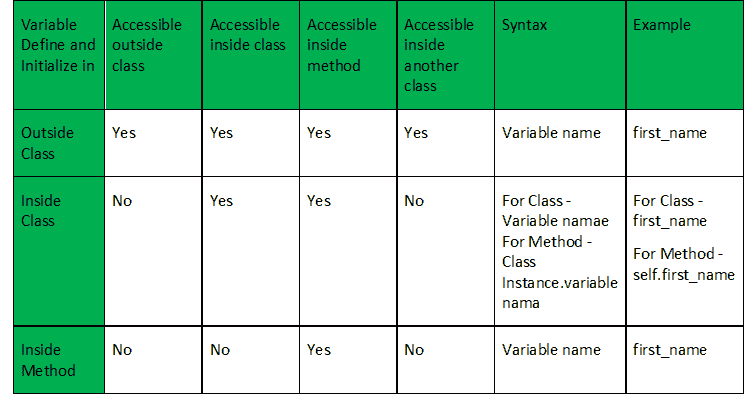

# Python |使用类内外变量和方法

> 原文:[https://www . geesforgeks . org/python-使用类内外变量和方法/](https://www.geeksforgeeks.org/python-using-variable-outside-and-inside-the-class-and-method/)

在 Python 中，我们可以在类外部、类内部甚至方法内部定义变量。让我们看看，如何在整个程序中使用和访问这些变量。

**类外定义的变量:**

定义在类外部的变量可以由类中的任何类或任何方法通过只写变量名来访问。

```py
# Program to demonstrate 'Variable 
# defined outside the class'

# Variable defined outside the class.
outVar = 'outside_class'    
print("Outside_class1", outVar)

''' Class one '''
class Geek:
    print("Outside_class2", outVar)

    def access_method(self):
        print("Outside_class3", outVar)

# Calling method by creating object
uac = Geek()
uac.access_method()

''' Class two '''
class Another_Geek_class:
    print("Outside_class4", outVar) 

    def another_access_method(self):
        print("Outside_class5", outVar)

# Calling method by creating object
uaac = Another_Geek_class()
uaac.another_access_method()
```

**Output:**

```py
Outside_class1 outside_class
Outside_class2 outside_class
Outside_class3 outside_class
Outside_class4 outside_class
Outside_class5 outside_class

```

**类内定义的变量:**

使用类的实例，可以在类内(包括所有方法)访问在类内但在方法外定义的变量。例如–self . var _ name。
如果你想在类外使用该变量，你必须声明该变量为[全局](https://www.geeksforgeeks.org/global-local-variables-python/)。然后，可以使用变量在类内部和外部的名称来访问变量，而不使用类的实例。

```py
# Program to demonstrate 'Variable 
# defined inside the class'

# print("Inside_class1", inVar) # Error

''' Class one'''
class Geek:

    # Variable defined inside the class.
    inVar = 'inside_class'
    print("Inside_class2", inVar)

    def access_method(self):
        print("Inside_class3", self.inVar)

uac = Geek()
uac.access_method()

''' Class two '''
class another_Geek_class:
    print()
# print("Inside_class4", inVar) # Error

    def another_access_method(self):
        print()
# print("Inside_class5", inVar) # Error

uaac = another_Geek_class()
uaac.another_access_method()
```

**Output:**

```py
Inside_class2 inside_class
Inside_class3 inside_class

```

标记为*错误*的语句将在执行时产生错误，因为变量在那里不可访问。

**方法内部定义的变量:**

方法中定义的变量只能通过简单地使用变量名来访问。示例–var _ name。
如果你想在方法或类之外使用那个变量，你必须声明那个变量为[全局](https://www.geeksforgeeks.org/global-local-variables-python/)。

```py
# Program to demonstrate 'Variable 
# defined inside the method'

# print("Inside_method1", inVar) # Error

'''class one'''
class Geek:
    print()
# print("Inside_method2", inVar) # Error

    def access_method(self):

        # Variable defined inside the method.
        inVar = 'inside_method'
        print("Inside_method3", inVar)

uac = Geek()
uac.access_method()

'''class two'''
class AnotherGeek:
    print()
# print("Inside_method4", inVar) # Error

    def access_method(self):
        print()
# print("Inside_method5", inVar) # Error

uaac = AnotherGeek()
uaac.access_method()
```

**Output:**

```py
Inside_method3 inside_method

```

标记为错误的语句在执行时会产生错误，因为变量在那里是不可访问的。

**总结:**
