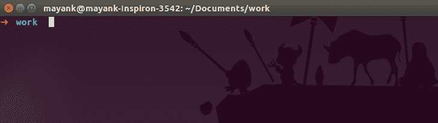
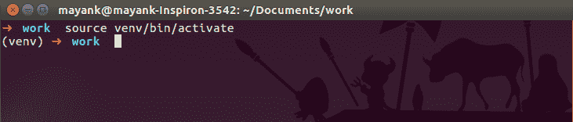
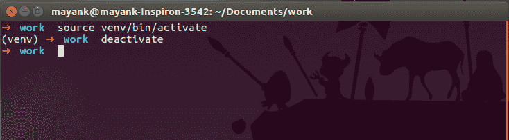

# Python 虚拟环境|简介

> 原文:[https://www.geeksforgeeks.org/python-virtual-environment/](https://www.geeksforgeeks.org/python-virtual-environment/)

虚拟环境是一种工具，它通过为不同的项目创建独立的 python 虚拟环境来帮助将它们所需的依赖关系分开。这是大多数 Python 开发人员使用的最重要的工具之一。

**我们为什么需要虚拟环境？**

想象一个场景，您正在处理两个基于 web 的 python 项目，其中一个使用 Django 1.9，另一个使用 Django 1.10 等等。在这种情况下，虚拟环境对于维护两个项目的依赖关系非常有用。

**何时何地使用虚拟环境？**

默认情况下，系统上的每个项目都将使用这些相同的目录来存储和检索站点包(第三方库)。这有什么关系？现在，在上面两个项目的例子中，您有两个版本的 Django。这对于 Python 来说是一个真正的问题，因为它无法区分“站点包”目录中的版本。因此 v1.9 和 v1.10 将驻留在同名的目录中。这就是虚拟环境发挥作用的地方。为了解决这个问题，我们只需要为两个项目创建两个独立的虚拟环境。这样做的好处是，您可以拥有的环境数量没有限制，因为它们只是包含一些脚本的目录。

虚拟环境应该在任何基于 Python 的项目中使用。通常情况下，为您正在处理的每个基于 Python 的项目创建一个新的虚拟环境是很好的。因此，每个项目的依赖关系都是与系统和彼此隔离的。

**虚拟环境是如何工作的？**

我们使用名为 **virtualenv** 的模块，这是一个创建隔离 Python 环境的工具。virtualenv 创建一个文件夹，其中包含使用 Python 项目所需的包所需的所有可执行文件。

**安装 virtualenv**

```py
$ pip install virtualenv

```

测试您的安装:

```py
$ virtualenv --version

```

**使用 virtualenv**

您可以使用以下命令创建 virtualenv:

```py
$ virtualenv my_name

```

运行此命令后，将创建一个名为 my_name 的目录。这个目录包含了使用 Python 项目所需的包的所有必要的可执行文件。这里将安装 Python 包。
如果要指定自己选择的 Python 解释器，例如 Python 3，可以使用以下命令完成:

```py
$ virtualenv -p /usr/bin/python3 virtualenv_name

```

要创建 Python 2.7 虚拟环境，请使用以下命令:

```py
$ virtualenv -p /usr/bin/python2.7 virtualenv_name

```

现在创建虚拟环境后，您需要激活它。记得每次做项目的时候激活相关的虚拟环境。这可以使用以下命令来完成:

```py
$ source virtualenv_name/bin/activate

```



一旦虚拟环境被激活，您的虚拟环境的名称将出现在终端的左侧。这将让您知道虚拟环境当前处于活动状态。在下图中，名为虚拟环境的 venv 处于活动状态。
现在可以在这个虚拟环境中安装与项目相关的依赖项。例如，如果您将 Django 1.9 用于一个项目，您可以像安装其他软件包一样安装它。



```py
(virtualenv_name)$ pip install Django==1.9

```

Django 1.9 包将放在 virtualenv_name 文件夹中，并将与整个系统隔离。
完成工作后，可以通过以下命令停用虚拟环境:

```py
(virtualenv_name)$ deactivate

```


现在你将回到系统默认的 Python 安装。

本文由 **Mayank Agrawal** 供稿。如果你喜欢 GeeksforGeeks 并想投稿，你也可以使用[contribute.geeksforgeeks.org](http://contribute.geeksforgeeks.org)写一篇文章或者把你的文章邮寄到 contribute@geeksforgeeks.org。看到你的文章出现在极客博客主页上，帮助其他极客。

如果你发现任何不正确的地方，或者你想分享更多关于上面讨论的话题的信息，请写评论。