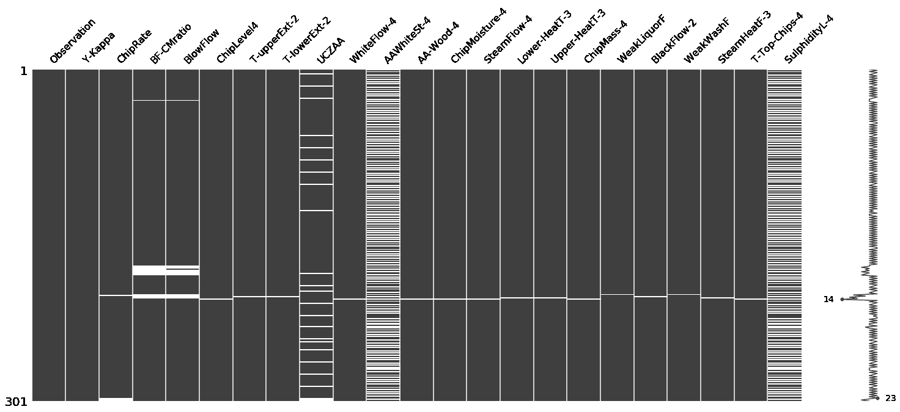
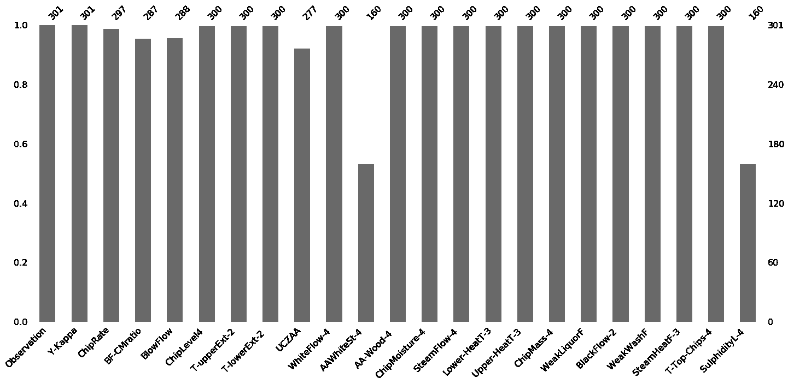
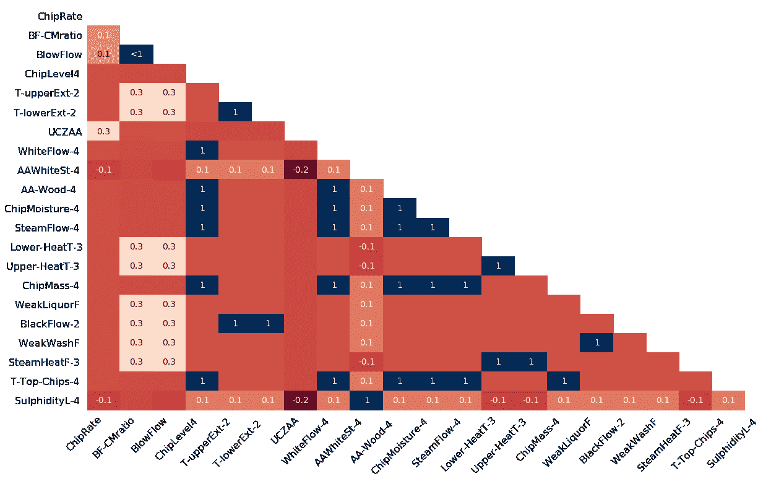

# Python |使用 Missingno 库可视化缺失值(NaN)值

> 原文:[https://www . geesforgeks . org/python-visualize-missing-values-nan-values-use-missingno-library/](https://www.geeksforgeeks.org/python-visualize-missing-values-nan-values-using-missingno-library/)

在真实数据集的情况下，数据集中的一些值丢失是非常常见的。我们将这些缺失的值表示为 NaN(非数字)值。但是要建立一个好的机器学习模型，我们的数据集应该是完整的。这就是为什么我们使用一些插补技术来用一些可能的值替换 NaN 值。但是在此之前，我们需要很好地理解 NaN 值在我们的数据集中是如何分布的。

**Missingno** 库提供了一种非常好的方法来可视化 NaN 值的分布。Missingno 是一个 Python 库，与 Pandas 兼容。

**安装库–**

```
pip install missingno

```

要获取代码中使用的数据集，请单击此处的。

## 矩阵:

使用这个矩阵，您可以非常快速地找到数据集中缺失的模式。在我们的示例中，列`AAWhiteSt-4`和`SulphidityL-4`具有相似的缺失值模式，而 UCZAA 显示了不同的模式。

```
# Program to visualize missing values in dataset

# Importing the libraries
import pandas as pd
import missingno as msno

# Loading the dataset
df = pd.read_csv("kamyr-digester.csv")

# Visualize missing values as a matrix
msno.matrix(df)
```

**输出:**


## 条形图:

这个条形图让您了解每列中有多少缺失值。在我们的示例中，`AAWhiteSt-4`和`SulphidityL-4`包含的缺失值最多，其次是 UCZAA。

```
# Program to visualize missing values in dataset

# Importing the libraries
import pandas as pd
import missingno as msno

# Loading the dataset
df = pd.read_csv("kamyr-digester.csv")

# Visualize the number of missing
# values as a bar chart
msno.bar(df)
```

**输出:**


## 热图:

热图显示了每两列之间缺失的相关性。在我们的例子中，AAWhiteSt-4 和亚硫酸盐-4 之间的相关性是 1，这意味着如果它们中的一个存在，那么另一个必须存在。

> 接近 **-1** 的值意味着如果一个变量出现，那么另一个变量很可能是**缺失**。
> 接近 **0** 的值表示两个变量的缺失值之间不存在**相关性**。
> 靠近 **1** 的值表示如果一个变量出现，那么另一个变量很可能是**现在的**。

```
# Program to visualize missing values in dataset

# Importing the libraries
import pandas as pd
import missingno as msno

# Loading the dataset
df = pd.read_csv("kamyr-digester.csv")

# Visualize the correlation between the number of
# missing values in different columns as a heatmap
msno.heatmap(df)
```

**输出:**


参考资料:https://github . com/resident Mario/missingno