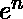
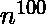
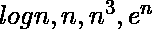
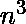
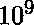
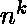
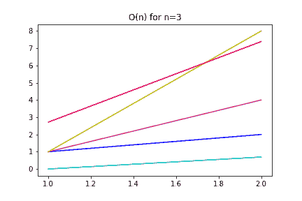
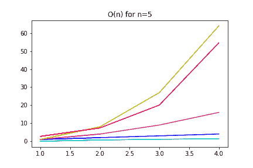
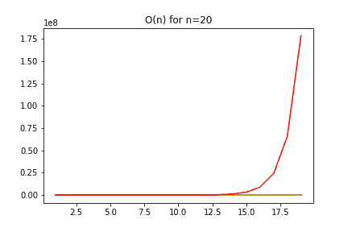

# Python |使用 Python 可视化 O(n)

> 原文:[https://www . geesforgeks . org/python-使用 python 可视化/](https://www.geeksforgeeks.org/python-visualizing-on-using-python/)

## 介绍

算法复杂性可能是一个难以理解的概念，即使有令人信服的数学论据。本文介绍了一个小型 Python 程序，它展示了几个典型函数的相对复杂性。它可以很容易地适应其他功能。

## 复杂性。为什么重要？

计算复杂性是计算机科学中一门古老的学科。它可以被定义为算法解决一个问题实例所需的时间和空间量。

计算复杂性的基础是数学，但它的含义非常实际。有些问题是“棘手的”。它们不是不可能的(即不可判定的)，但是没有有效的算法为它们所知。那就是:用今天的技术，甚至用可预见的技术，都很难解决它们。

## 通常，最坏的情况是最好的

计算复杂性中最流行的分析是最坏的情况。尽管悲观，但这是非常合理的:愿意解决的问题的规模随着时间的推移而增加。我们想处理千兆字节的数据，而不是兆字节。因此，大小是算法复杂度中至关重要的因素。

考虑输入规模为自变量，增长率为因变量，并尝试分析其在输入规模增长到无穷大时的表现。这个分析叫做 **big-Oh** ，有很多规则，你可以在任何一本好的算法教科书上查阅。最重要的一点是常数不会影响大输入的算法性能。原因还是输入的大小是最重要的因素，常数不依赖于输入的大小。

## 比较 Python 中的函数增长

刚接触计算理论的人经常会被这样一个事实所迷惑:像这样的指数函数比像这样的多项式函数更糟糕。这一点从 Big-Oh 函数的数学定义中就很清楚了，但这并不容易看出，除非我们认为我们占了非常大的。

下面的 Python 代码将增长可视化为几个函数的问题实例(N)的增加:。注意被认为是一个糟糕的表现，因为它需要操作来处理 1000 个输入。总的来说，被认为对 k > =2 不利。

代码使用库 NumPy 和 MatPlotLib，并采用一种叫做 currying 的函数式编程技术来计算常数 *k* 的。通过修改函数列表，很容易计算出其他函数。

**代码:解释几个函数渐近行为的 Python 代码。**

```
# Python code that compares the 
# asymptotic behaviour of several functions

import numpy as np
import matplotlib.pyplot as plt

# Returns a function that computes x ^ n for a given n
def poly(n):
    def polyXN(x):
        return x**n
    return polyXN

# Functions to compare and colors to use in the graph
FUNCTIONS = [np.log, poly(1), poly(2), poly(3), np.exp]
COLORS = ['c', 'b', 'm', 'y', 'r']

# Plot the graphs 
def compareAsymptotic(n):
    x = np.arange(1, n, 1)
    plt.title('O(n) for n ='+str(n))
    for f, c in zip(FUNCTIONS, COLORS):
        plt.plot(x, f(x), c)
    plt.show()

compareAsymptotic(3)
compareAsymptotic(5)
compareAsymptotic(10)
compareAsymptotic(20)
```

结果并不令人惊讶:指数函数的性能最差，因为它在给定输入大小的情况下增长非常快。对于 N=20，其他函数与指数函数相比微不足道。

对数以青色显示，多项式以蓝色、品红色和黄色显示，指数以红色显示。






