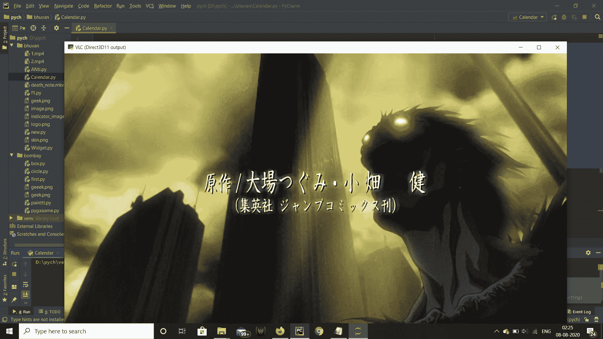
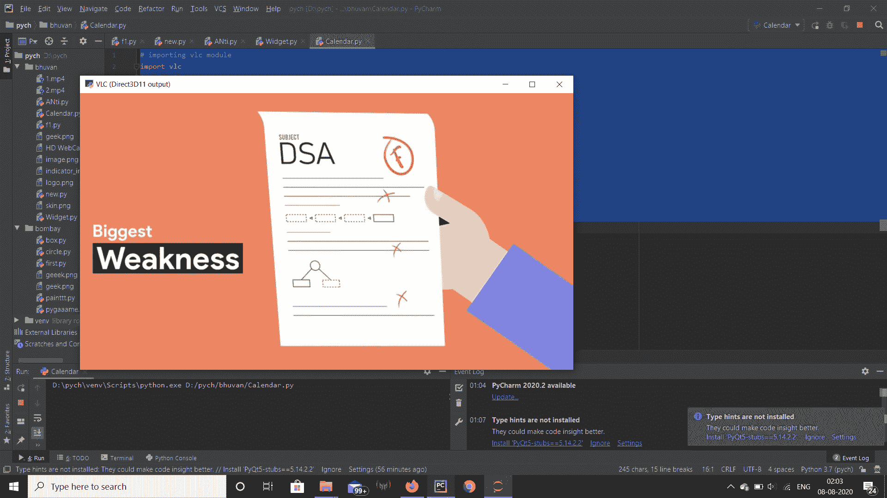

# Python VLC 媒体播放器–推出 FPS

> 原文:[https://www . geesforgeks . org/python-VLC-media player-get-fps/](https://www.geeksforgeeks.org/python-vlc-mediaplayer-getting-fps/)

在本文中，我们将看到如何在 python vlc 模块的 MediaPlayer 对象中获得 fps，即每秒的帧速率。VLC 媒体播放器是 VideoLAN 项目开发的一款免费开源的便携式跨平台媒体播放器软件和流媒体服务器。媒体播放器对象是 vlc 模块中播放视频的基本对象。我们可以借助`MediaPlayer`方法创建一个 MediaPlayer 对象。帧速率是连续图像(称为帧)出现在显示器上的频率。该术语同样适用于电影和摄像机、计算机图形和动作捕捉系统。帧率也可以称为帧频，用赫兹表示。

> 为此，我们将对 MediaPlayer 对象使用`get_fps`方法
> 
> **语法:** media_player.get_fps()
> 
> **论证:**不需要论证
> 
> **返回:**返回浮动

下面是实现

```py
# importing vlc module
import vlc

# importing time module
import time

# creating vlc media player object
media_player = vlc.MediaPlayer()

# media resource locator
mrl = "death_note.mkv"

# setting mrl to the media player
media_player.set_mrl(mrl)

# start playing video
media_player.play()

# wait so the video can be played for 5 seconds
# irrespective for length of video
time.sleep(5)

# getting fps
value = media_player.get_fps()

# printing fps
print("Frame Rate per Second : ")
print(value)
```

**输出:**


```py
Frame Rate per Second : 
23.976215362548828

```

下面是另一个例子
的实现

```py
# importing vlc module
import vlc

# importing time module
import time

# creating vlc media player object
media_player = vlc.MediaPlayer()

# media resource locator
mrl = "1.mp4"

# setting mrl to the media player
media_player.set_mrl(mrl)

# start playing video
media_player.play()

# wait so the video can be played for 5 seconds
# irrespective for length of video
time.sleep(5)

# getting cursor co-ordinates
value = media_player.video_get_cursor()

# getting fps
value = media_player.get_fps()

# printing fps
print("Frame Rate per Second : ")
print(value)
```

**输出:**


```py
Frame Rate per Second : 
29.969999313354492
```