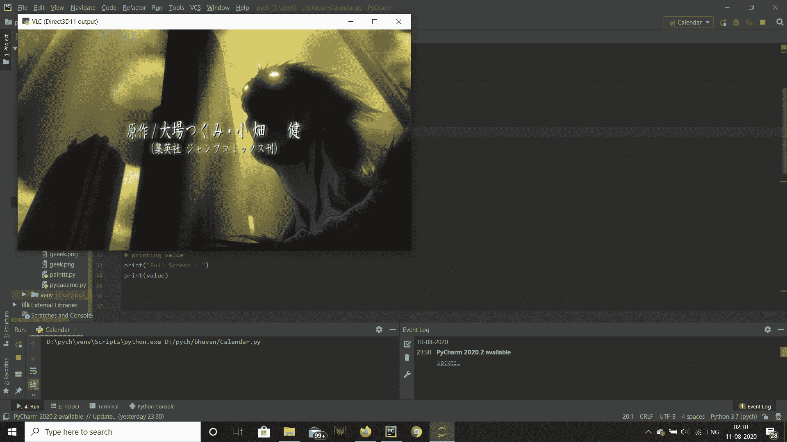
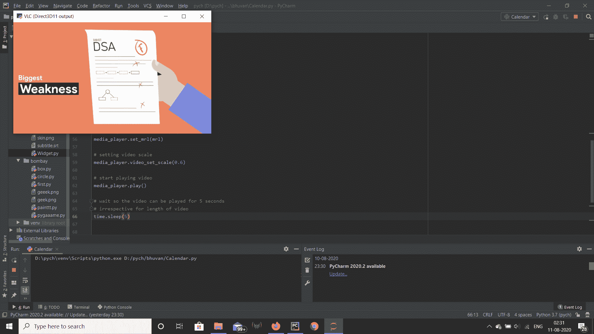

# Python VLC MediaPlayer–获得字幕延迟

> 原文:[https://www . geesforgeks . org/python-VLC-media player-get-subtitle-delay/](https://www.geeksforgeeks.org/python-vlc-mediaplayer-getting-subtitle-delay/)

在本文中，我们将看到如何在 python vlc 模块中获得 MediaPlayer 对象的字幕延迟。VLC 媒体播放器是 VideoLAN 项目开发的一款免费开源的便携式跨平台媒体播放器软件和流媒体服务器。媒体播放器对象是 vlc 模块中播放视频的基本对象。字幕是从电影、电视节目、电子游戏等中的对话或评论的抄本或剧本中导出的文本，通常显示在屏幕底部，但是如果屏幕底部已经有文本，也可以在屏幕顶部。字幕延迟会影响字幕显示的时间。正值会导致字幕显示较晚，负值会导致字幕显示较早。每次媒体更改时，字幕延迟将重置为零。可以借助`video_set_spu_delay`方法进行设置。

> 为此，我们将对 MediaPlayer 对象使用`video_get_spu_delay`方法
> 
> **语法:**media _ player . video _ get _ spu _ delay()
> 
> **论证:**不需要论证
> 
> **返回:**返回整数

下面是实现

```py
# importing vlc module
import vlc

# importing time module
import time

# creating vlc media player object
media_player = vlc.MediaPlayer()

# media object
media = vlc.Media("death_note.mkv")

# setting media to the media player
media_player.set_media(media)

# setting subtitle delay
media_player.video_set_spu_delay(100)

# setting video scale
media_player.video_set_scale(0.6)

# start playing video
media_player.play()

# wait so the video can be played for 5 seconds
# irrespective for length of video
time.sleep(5)

# getting subtitle delay
value = media_player.video_get_spu_delay()

# printing value
print("Subtitle delay : ")
print(value)
```

**输出:**


```py
Subtitle delay : 
100

```

下面是另一个例子
的实现

```py
# importing vlc module
import vlc

# importing time module
import time

# creating vlc media player object
media_player = vlc.MediaPlayer()

# media object
media = vlc.Media("1mp4.mkv")

# setting media to the media player
media_player.set_media(media)

# setting video scale
media_player.video_set_scale(0.6)

# setting subtitle delay
media_player.video_set_spu_delay(100)

# start playing video
media_player.play()

# wait so the video can be played for 5 seconds
# irrespective for length of video
time.sleep(5)

# getting subtitle delay
value = media_player.video_get_spu_delay()

# printing value
print("Subtitle delay : ")
print(value)
```

**输出:**


```py
Subtitle delay : 
100

```