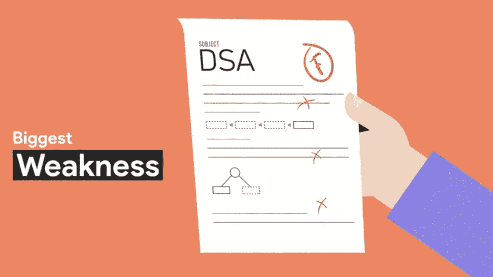

# Python VLC MediaPlayer–设置全屏状态

> 原文:[https://www . geesforgeks . org/python-VLC-media player-设置-全屏-状态/](https://www.geeksforgeeks.org/python-vlc-mediaplayer-setting-full-screen-status/)

在本文中，我们将看到如何在 python vlc 模块中设置 MediaPlayer 对象的全屏状态。VLC 媒体播放器是 VideoLAN 项目开发的一款免费开源的便携式跨平台媒体播放器软件和流媒体服务器。媒体播放器对象是 vlc 模块中播放视频的基本对象。我们可以借助`MediaPlayer`方法创建一个 MediaPlayer 对象。启用全屏状态使其全屏这类似于切换全屏，但在这种状态下，我们可以撤销全屏。

> 为此，我们将对 MediaPlayer 对象使用`set_fullscreen`方法
> 
> **语法:**媒体播放器. set _ 全屏(真)
> 
> **自变量:**它以布尔为自变量
> 
> **返回:**返回无

下面是实现

```py
# importing vlc module
import vlc

# importing time module
import time

# creating vlc media player object
media_player = vlc.MediaPlayer()

# setting full screen status
media_player.media_player.set_fullscreen(True)

# media object
media = vlc.Media("death_note.mkv")

# setting media to the media player
media_player.set_media(media)

# start playing video
media_player.play()

# wait so the video can be played for 5 seconds
# irrespective for length of video
time.sleep(5)
```

**输出:**


下面是另一个例子
的实现

```py
# importing vlc module
import vlc

# importing time module
import time

# creating vlc media player object
media_player = vlc.MediaPlayer()

# media object
media = vlc.Media("1mp4.mkv")

# setting media to the media player
media_player.set_media(media)

# setting full screen status
media_player.media_player.set_fullscreen(True)

# start playing video
media_player.play()

# wait so the video can be played for 5 seconds
# irrespective for length of video
time.sleep(5)
```

