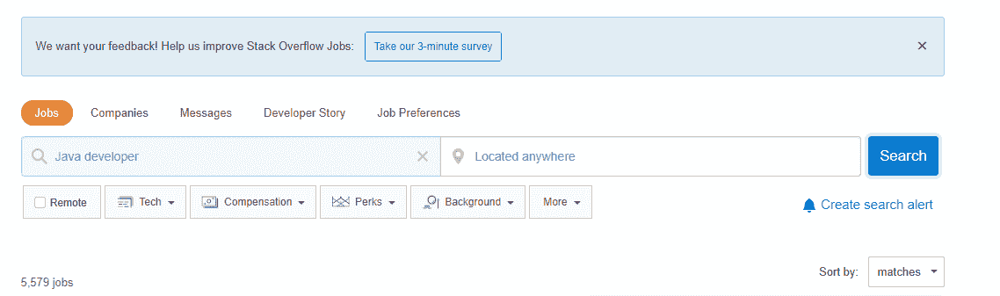

# Python vs Java——2020 年谁将赢得这场战役？

> 原文:[https://www . geesforgeks . org/python-vs-Java-谁将赢得 2020 年的战斗/](https://www.geeksforgeeks.org/python-vs-java-who-will-win-the-battle-in-2020/)

先别管编程了，先说说车吧……**特斯拉和兰博基尼哪个最好？**有些人喜欢特斯拉，有些人对兰博基尼很满意对有些人来说没有一个有用(*因为他们没有预算……。开玩笑的！*)对于其他人来说，两者比较不公平。现在来看编程语言。

**爪哇和蟒蛇哪个最好？**


如果你是其中一个完全喜欢一种语言并寻找正确答案的人，那么当你阅读这篇博客时，你会感到失望。

计算机语言有时被视为一种宗教(通常是新手用户)，所以人们可能会用 Python、Java、C#、JavaScript 或其他语言来发誓。现实是，在主要的编程语言中，每一种似乎都找到了“最佳位置”——与其他语言相比，它在某个领域或领域大放异彩。所以与其在**哪个最好的问题上争论不休——Java 还是 Python？**我们会帮你弄清楚**我应该选择哪一个——Java 还是 Python？**

许多程序员对做出影响将是长期的决定感到困惑，这将在许多方面塑造他们的职业生涯。如果他们选择 java，后来 Python 上升了，或者如果他们选择 Python，后来 java 变得更流行了，会怎么样。现在，为了消除最初的困惑，让我们从一些调查开始…

**重要统计数据:**

*   根据 [Tiobe 指数](https://www.tiobe.com/tiobe-index//)，基于性能、编码能力和受欢迎程度，Java 以 16.61%获得了更多的偏好，Python 以 9.874%成功抢占了第三名。
*   根据统计数据，2019 年，谷歌搜索最受欢迎的编程语言中，大约五分之一是 Java，仅次于 Python。
*   如果我们在全球范围内查看这两种语言的谷歌趋势，那么 Java 和 Python 之间就有很小的区别。

我们知道，在检查调查后，您仍然对做出决定感到困惑，因此我们将考虑一些可能有助于您做出决定的因素，再采取一步。首先要记住，所有的语言本质上都是一样的，所有的语言或多或少都可以以某种方式做同样的事情。如果 Python 有一些优点，那么它也有一些缺点，Java 也是如此。让我们看看这两种语言的一些因素和主要区别…

### 1.学习曲线和代码可读性

首先，让我们看一下 Java 语法来添加两个数字…

```py
class AddNums
()
{
    public static void main(String args[])
    {
        int first = 1;
        int second = 2;
        int sum = first + second;
        System.out.println(sum);
    }
}
```

现在让我们看看如何用 Python 编写相同的代码…

```py
first = 1
second = 2
sum = first + second
print(sum)
```

Python 是一种动态类型的编程语言，这意味着没有必要声明变量，而 java 是一种静态类型的编程语言，这意味着您需要显式声明变量。从上面的代码中，您可以看到 Python 语法相当容易学习，对新手程序员来说非常好，但是我们需要提到的是，与 Java 相比，Python 对程序员隐藏了许多内部细节。例如，在 Python 的上述代码中，没有提到变量第一和第二是整数，因此您将无法知道引擎盖下发生了什么。
好吧，如果你不是计算机科学专业的学生，或者对计算机科学基础不感兴趣，但是需要一种编程语言来完成一些事情，那就选择 Python。另一面如果你是其中一个关心核心 CS 概念的人(或者计算机科学专业的学生)，那就去学 Java。最后，我们能说的就是 ***巨蟒办事。Java 在此期间为您提供指导。***

### 2.表演

在开发中，雇主真正关心的是应用程序的性能或速度。Java 自带 Java 虚拟机(JVM)，因此它是一种编译语言，代码执行时间更短。另一方面，Python 是一种解释语言，它在运行时决定数据的类型，这使得它相对较慢。因此，对于重应用程序的开发，首选当然是 Java。这里我们还需要提到的是，开发人员可以使用 PyPy、CPython 或 Cython 来加快 Python 代码的执行速度。他们可以用 Jython 把 Python 代码编译成 Java 字节码，用 Cython 把 Python 代码编译成 C/C++代码。

### 3.社区支持

在开发中，对一种语言拥有巨大的社区支持是非常重要的。您可以构建一些工具，并允许其他人使用。您还可以从程序员社区获得编码相关问题的解决方案或建议。Java 和 Python 都享有很好的社区支持。你会遇到大量的资源、论坛和书籍来帮助你学习这两种语言。你也可以得到 GitHub 和 StackOverflow 的巨大支持。

Java 是甲骨文的产品，因此它的惯例甲骨文代码一、JavaWorld 和 JavaRanch 促成了它在软件开发中的广泛流行。全球有几个 [Java 用户组(JUGs)](https://community.oracle.com/community/groundbreakers/java/jug?customTheme=java) 。此外，各种高知名度的活动，如 Java 程序员组织的 JavaOne。

Python 在大约 37 个国家和 191 个城市拥有超过 **1，637 个 Python 用户组**的强大社区。 **PySlacker** s、 **PyCon 大会**、 **PyLadies** 和 **FreeNode IRC Python** 频道为其受欢迎程度和程序员多样性做出了贡献。从链接 [Python 社区](https://www.python.org/community/)查看他们的社区支持。

### 4.用例

你可能听说过 **Java 无处不在**。该语言用于**安卓应用程序**和**网络应用程序**。大多数复杂的程序通常是用 Java 编写的，这就是构建大规模应用程序的好处。Java 适用于桌面应用程序、嵌入式应用程序、数据处理应用程序、移动和网络应用程序以及企业级解决方案。大量的库和框架也可以为你的应用或程序增加新的功能。

Python 在**数学家**和**物理学家**中特别受欢迎。它广泛应用于机器学习、深度学习和一般的人工智能领域。这种语言在数据分析和可视化方面非常有用。Python 也用于网络开发或后端开发，使用一些流行的框架，如 Django、Tornado、Flask 或 CherryPy，用于网络应用程序。Python 还被用于物联网、游戏、原型、图形设计应用程序，并且它经常被系统管理员用来自动化任务。Python 库在研究和计算中非常有用。Python 中的移动开发不太受欢迎。

### 5.工作和薪水

许多大公司正在将 Java 用于大型应用程序或企业级解决方案。Java 在 Android 应用中也有广泛的应用，因此在就业市场上需求量很大。像优步、Airbnb、推特、亚马逊、易贝、领英等顶级公司以及许多其他公司都在他们的技术堆栈中使用 Java。这意味着找到一份 Java 开发人员的工作相对容易。看看面向 Java 开发人员工作的 StackOverflow。


[玻璃门](https://www.glassdoor.co.in/Salaries/india-java-developer-salary-SRCH_IL.0, 5_IN115_KO6, 20.htm)上 Java 开发者平均工资为 **4，40，049 卢比。/Yr** 在印度。

iOS 的 Instagram 前端用 Objective-C 编写，后端用 Python 编写。其他一些大公司，如谷歌、Spotify、网飞、优步、Dropbox、Reddit 和 Pinterest，在其技术堆栈中使用 Python。然而，我们需要提到的是，Python 在大公司的企业软件开发中并没有大量使用。
Python 被很多初创公司广泛用于构建 web 应用程序，在数据科学家中也很受欢迎。在 Python 的各个应用领域，你都有大量的工作机会可以进入。
来看看针对 Python 开发人员工作的 StackOverflow。


[玻璃门](https://www.glassdoor.co.in/Salaries/india-python-developer-salary-SRCH_IL.0, 5_IN115_KO6, 22.htm?countryRedirect=true)上 Python 开发者的平均工资是**400，000 卢比。/Yr** 在印度。

### 结论

根据计算机械协会(ACM)最近发布的一项调查，Python 已经超过 Java，成为向美国学生介绍编程和计算机科学的顶级语言。现在，前 10 名计算机科学系中有 8 个使用 Python 教授编码，前 39 名学校中有 27 所使用 Python，这表明 Python 是教授计算机科学入门课程最受欢迎的语言。Java 在高中高级课程中使用频繁，所以大学向 Java 的过渡对学生来说是很自然的。然而，许多大学已经从 Java 转而使用 Python，还有一些大学同时提供这两种课程——面向计算机科学专业学生的 Java 和面向非计算机科学专业学生的教授编程技能的 Python。

我们已经讨论了所有的统计数据，我们也讨论了主要的因素，如果你感到困惑，问自己… **我实际上应该选择什么？**那么你需要再问自己一个问题……***“我的最终目标是什么？”*** 或 ***“根据我目前的要求，我需要哪种语言？”*** 是的……不要仅仅为了一门语言的流行或某些程序员向你建议而去学习它。明白没有最好的编程语言。每种语言都适合特定的领域，每种语言都有自己的优缺点，Python 和 Java 也是如此。

首先，决定**你的语言实际上想做什么？**。您想构建移动应用程序还是 web 应用程序？你想进入数据科学还是机器学习，或者你有一些进入游戏开发的计划？。您的应用程序的可扩展性如何？你期望你的应用程序有多快？公司的预算是多少？你需要考虑很多类似的因素。选择一种语言并不在于它是容易还是难，而在于你如何看待编码作为一个整体。如果你喜欢编码，你会积极地看待它，不会害怕尝试新事物。