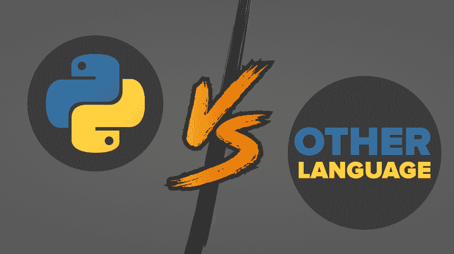

# Python vs 其他编程语言

> 原文:[https://www . geesforgeks . org/python-vs-other-programming-languages/](https://www.geeksforgeeks.org/python-vs-other-programming-languages/)

[**Python**](https://www.geeksforgeeks.org/python-tutorial/?ref=lbp) 是吉多·范·罗苏姆在 1991 年开发的通用高级编程语言。它的结构强调代码的可理解性，它的语法允许程序员用更少的代码行来表达他们的概念，这使得它成为当今发展最快的编程语言。



### Python 的特性

*   **易于编码:** Python 是一种高级编程语言，因为与 c、c#、Java 脚本、Java 等其他语言相比，它很容易理解，人们几乎可以在几个小时内毫不费力地用 Python 学习和编码。此外，它还是一种开发人员友好的语言。
*   **平台无关:** Python 程序可以在众多操作系统框架上开发和执行。Python 可以在 Linux、Windows、Macintosh、Solaris 和其他一些平台上使用。
*   **面向对象语言:** Python 支持面向对象语言以及类、对象封装等概念。
*   **免费开源:** Python 语言在官网免费提供。因为它是开源的，对公众开放。所以人们可以下载、使用和分享它。
*   **GUI 编程支持:**可以使用 Python 中的 PyQt5、PyQt4、wxPython 或 Tk 等模块制作图形用户界面。
*   **高级语言:** Python 是高级语言。当一个人用 python 开发程序时，他/她不需要记住系统架构或管理内存。
*   **可移植语言:** Python 是一种可移植语言，例如，用 Python 为 windows 编写的代码极有可能也能在不同的其他平台上运行，如 Linux、Unix 和 Mac 等。
*   **集成和解释语言:** Python 是一种解释语言，因为 Python 代码一次一行地执行。Python 另外是一种集成语言，因为人们可以不用太多的扩展就可以将 python 与另一种语言集成在一起，如[](https://www.geeksforgeeks.org/c-language-set-1-introduction/)**[**c++**](https://www.geeksforgeeks.org/c-plus-plus/)等等。**

****Python 示例:****

```
print("GEEKSFORGEEKS")
print('My first Python program') 
```

****输出:****

```
GEEKSFORGEEKS
My first Python program 
```

### **Python 和其他编程语言的区别**

****蟒蛇** ***vs*** [**红宝石**](https://www.geeksforgeeks.org/ruby-programming-language/)T10:**

*   **Python 清晰易懂，而 Ruby 有时很难调试。**
*   **基于 Python 的应用有 YouTube、Instagram、Bit torrent 等。，而基于 Ruby 的应用是 Twitter、Github 等。**
*   **Python 有一个名为 Django 的网络框架，而 Ruby 有一个名为 Ruby on Rails 的网络框架。**
*   **Python 在开发人员中的采用率比 Ruby 高得多。**
*   **模块的使用和更好的名称空间处理在 Python 中存在，而块的使用在 Ruby 中存在。**

****红宝石示例:****

```
puts "GEEKSFORGEEKS \n My first Ruby program" 
```

****输出:****

```
GEEKSFORGEEKS
My first Ruby program 
```

****巨蟒**T2**vs**T5[T7】格朗 T9**:**](https://www.geeksforgeeks.org/golang/)**

*   **Python 是基于面向对象编程的高级编程语言，而 Golang 是基于并发编程的过程编程语言。**
*   **Python 支持异常，而 Golang 不支持豁免。而不是异常 Golang 有错误。**
*   **Python 是动态类型语言，它使用解释器，而 Go 是静态类型语言。所以，它使用编译器。**
*   **Python 支持继承，而 Golang 不支持继承。**
*   **Python 适合数据分析和计算，而 Golang 适合系统编程。**

****戈朗示例:****

```
package main  
import "fmt"
func main() {
     fmt.Println("GEEKSFORGEEKS") 
     fmt.Println("My first Golang program") 
} 
```

****输出:****

```
GEEKSFORGEEKS
My first Golang program 
```

****python*****vs**[**【PHP】****:**](https://www.geeksforgeeks.org/php/)***

*   **Python 是一种面向对象的脚本语言，而 PHP 是一种服务器端脚本语言。**
*   **Python 是一种通用的全栈编程语言，而 PHP 被广泛用于 web 开发..**
*   **在 Python 中，函数式编程技术是可能的，而 PHP 中不提供函数式编程..**
*   **Python 的可维护性和变更获取性很好，而 PHP 的可维护性不高。**
*   **在 Python 中，对于异常处理有适当的规定，而 PHP 不适当地支持异常..**

****PHP 示例:****

```
?php   
echo "Welcome to GeeksforGeeks\n"; 
echo "My first php program";
? 
```

****输出:****

```
GEEKSFORGEEKS
My First PHP Program 
```

****Python*****vs***[**node . js**](https://www.geeksforgeeks.org/introduction-to-nodejs/)**:****

*   **Python 是一种面向对象、高级、动态和多用途的编程语言，而 Node.js 是建立在谷歌 Chrome Javascript Engine 上的服务器端平台。**
*   **Python 适合后端应用、数值计算和 AI，而 Node.js 更适合 web 应用和网站开发。**
*   **Python 使用 PyPy 作为解释器，而 Node.js 使用 javascript 作为解释器。**
*   **Python 是生成器的基础，虽然 Node.js 支持回调，但它的复杂性要低得多。它的编程基于事件/回调，这使得它处理得更快。**
*   **利用 Python 的最大优势是开发人员需要编写更少的代码行，而 Node.js 是纯 JavaScript，速度稍慢。**

****node . js 示例:****

```
var a ="GEEKSFORGEEKS" ; 
console.log(typeof a);  
a = "My first Node.js program"; 
console.log(typeof a); 
```

****输出:****

```
string
string 
```