# Python–向手机发送推送通知的网络应用程序

> 原文:[https://www . geesforgeks . org/python-web-app-to-send-push-notification-to-your-phone/](https://www.geeksforgeeks.org/python-web-app-to-send-push-notification-to-your-phone/)

在本文中，我们将讨论两个应用程序，以及如何使用 python 配置它们来发送通知。

## 普什布勒

**pubullet**，一个突出的 python 包，使用 Python 代码连接多个设备。在本文中，我们将讨论如何通过它发送消息或通知。使用我们的计算机和 python 代码，我们将向安装在移动设备上的 pushbullet 应用程序发送一些消息，该应用程序与计算机上的应用程序具有相同的登录 id。首先，我们需要在***【Pushbullet.com】*上创建一个帐户，并通过电脑和电话登录。**

### **设置:**

*   **在您的**电脑**和**电话**上设置一个推送账户

    *   **适用于电脑**
        *   去 Pushbullet.com
        *   创建帐户** 

****

*   **对于**电话**

    *   在手机上安装**推球**应用。
    *   使用与登录电脑时相同的电子邮件地址登录。** 

****

**现在让我们进入 python 代码部分，了解如何规划每个需求来实现功能。**

*   **安装下列模块**

```py
# Used for sending the Push notifications.
pip install pushbullet.py==0.9.1

# Used for the interface at the output window. 
pip install pywebio 
```

*   **导入所有必需的模块**
*   **转到**推送**获取访问令牌。**

**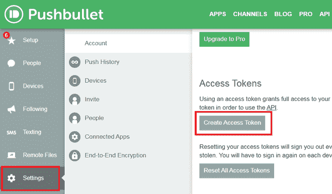**

*   **获取您的访问令牌，并使用**推送工具**方法通过在**推送工具**功能中提供访问令牌来创建**实例**。**

****语法:****

> **访问令牌**

*   **使用 **push_note** 功能发送功能内部的数据和文本。**推 _ 注**将取两个自变量即数据和文本。第一个参数将作为通知中的标题，而第二个参数是文本。**

****语法:****

> **pb.push_note(数据、文本)**

**下面是完整的实现。**

## **蟒蛇 3**

```py
# Import the following modules
from pushbullet import PushBullet
from pywebio.input import *
from pywebio.output import *
from pywebio.session import *
import time

# Get the access token from Pushbullet.com
access_token = "Your Access Token"

# Taking input from the user
data = input('Title')

# Taking large text input from the user
text = textarea(
  "Text", rows=3, placeholder="Write something...",
  required=True)

# Get the instance using access token
pb = PushBullet(access_token)

# Send the data by passing the main title
# and text to be send
push = pb.push_note(data, text)

# Put a success message after sending
# the notification
put_success("Message sent successfully...")

# Sleep for 3 seconds
time.sleep(3)

# Clear the screen
clear()

# Give the pop at last
toast("Thanks for using it :)")

# hold the session until the whole work finishes
hold()
```

**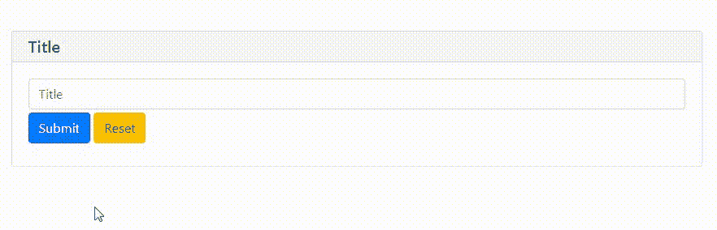 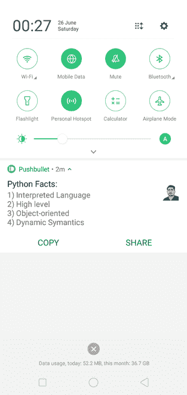**

**还有一种方法可以做到这一点，如下所述。在这种方法中，预定义的消息作为通知发送。**

**为此，首先导入所需模块并获取您的**访问令牌。****

****语法:****

```py
TOKEN = 'Your Access Token'
```

**然后制作一个字典，里面有你希望发送到体内的所有信息。**

****语法:****

> **msg = {"type": "note "，" title": title，" body": body}**

**现在，要发送**帖子**请求，请使用请求模块中指定的帖子方法。沿着整个路径推动推杆。现在使用 **json.dumps** 将所有数据转储到一个数据变量中。**

**现在将字典传递给头变量，它包括发送者的授权、您的访问令牌和内容类型，在这种情况下是 application/json。**

****语法:****

> **requests.post('url '，data=json.dumps(msg)，header = { ' Authorization ':' Bearer '+TOKEN，Content-Type ':' application/JSON ' })**

**现在看看响应状态代码；如果是 200，我们有一个错误；否则，我们的信息将被正确发送。**

**下面给出了完整的实现。**

****程序:****

## **蟒蛇 3**

```py
# Import the following modules
import requests
import json

# Function to send Push Notification

def pushbullet_noti(title, body):

    TOKEN = 'Your Access Token'  # Pass your Access Token here
    # Make a dictionary that includes, title and body
    msg = {"type": "note", "title": title, "body": body}
    # Sent a posts request
    resp = requests.post('https://api.pushbullet.com/v2/pushes',
                         data=json.dumps(msg),
                         headers={'Authorization': 'Bearer ' + TOKEN,
                                  'Content-Type': 'application/json'})
    if resp.status_code != 200:  # Check if fort message send with the help of status code
        raise Exception('Error', resp.status_code)
    else:
        print('Message sent')

pushbullet_noti("Hey", "How you doing?")
```

****输出:****

****

## **松弛的**

**在这一部分中，我们将处理来自 python 脚本的消息，这些消息将出现在 slack 中。为此，我们需要利用**网络钩子**。您可以使用 webhooks 将自动消息从一个应用程序传递到另一个应用程序。当您创建一个传入的网络钩子时，您会得到一个唯一的网址，您可以向它发送一个包含消息文本和一些参数的 JSON 负载。**

### **设置**

**在这里 和创建一个你自己的应用。**

*   **转到浏览时差**

**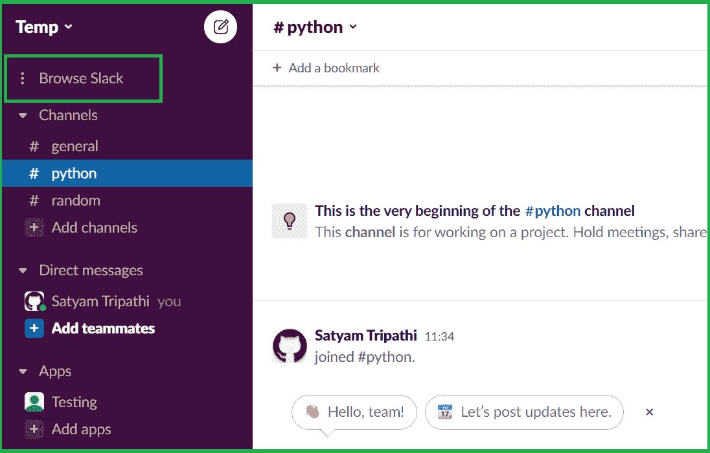**

*   **选择应用程序**

**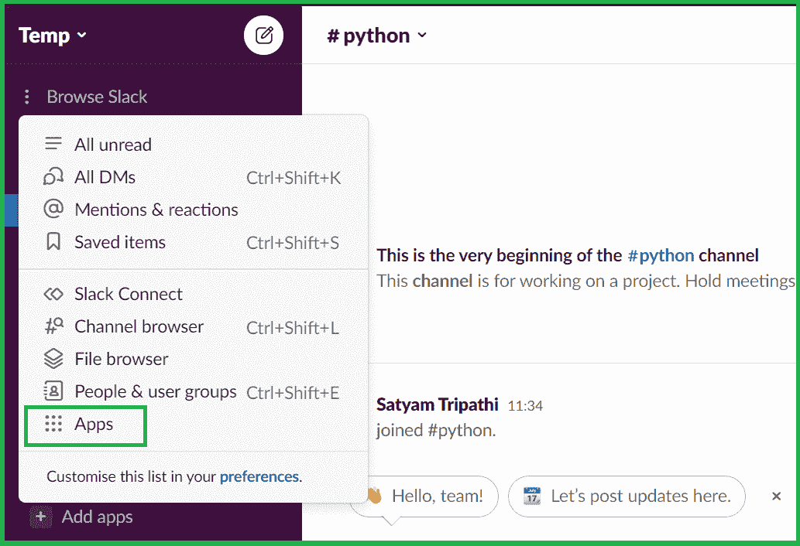**

*   **将出现一个新窗口。从那里选择应用程序目录**

**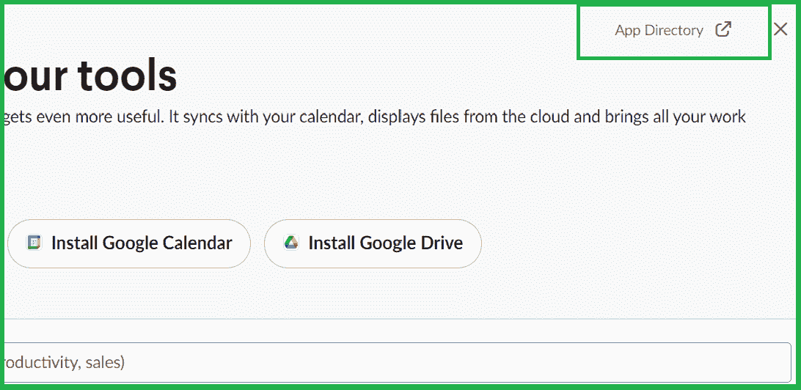**

*   **现在选择构建**

****

*   **将再次打开一个新窗口，选择创建应用程序**

****

*   **从头开始选择**

**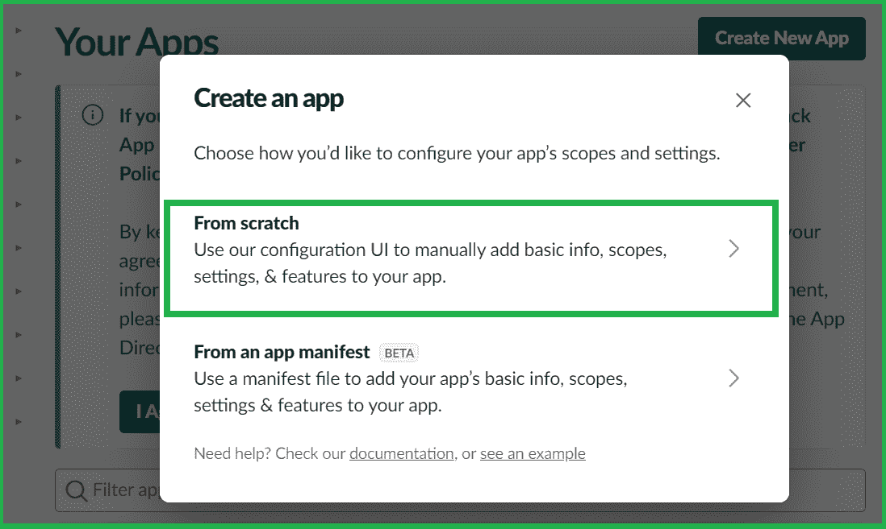**

*   **设置应用名称和工作区**
*   **然后创建应用程序**

**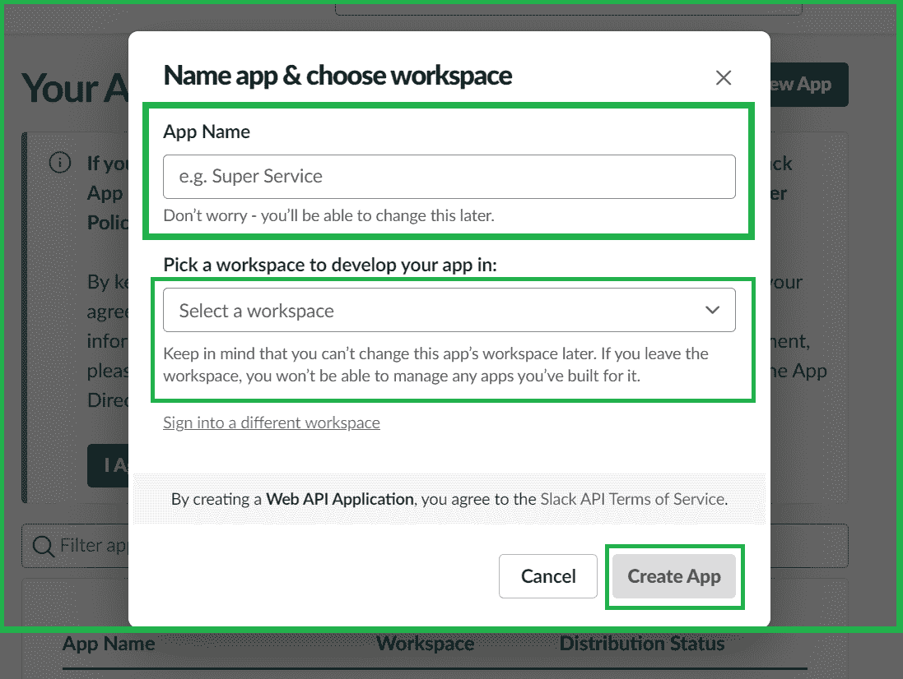**

*   **选择传入网络挂钩**

****

*   **打开激活传入的网络挂钩，并向工作区添加新的网络挂钩**

**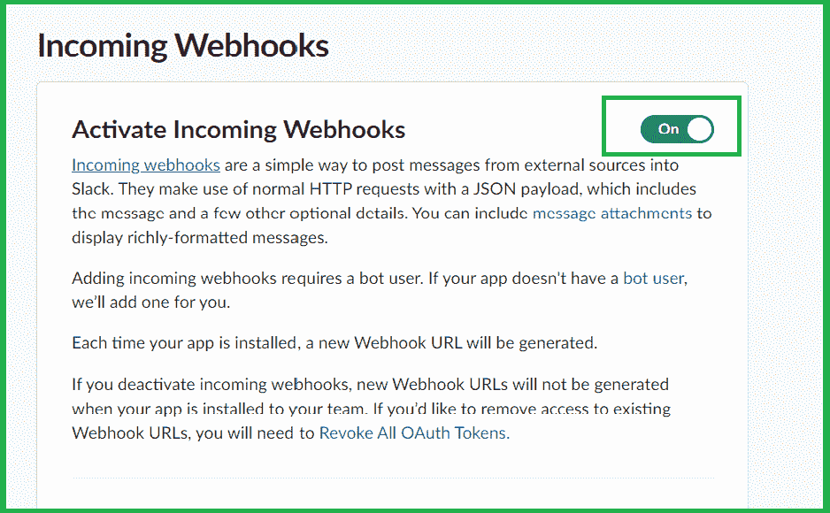 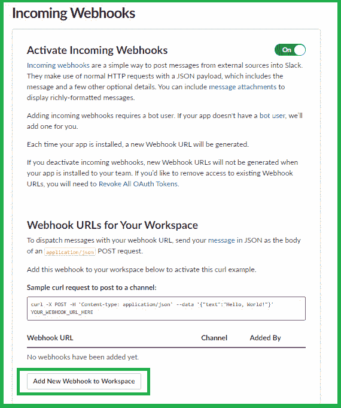**

*   **选择一个机器人并允许其访问**

****

*   **复制网页挂钩网址，因为这将在以后使用**

**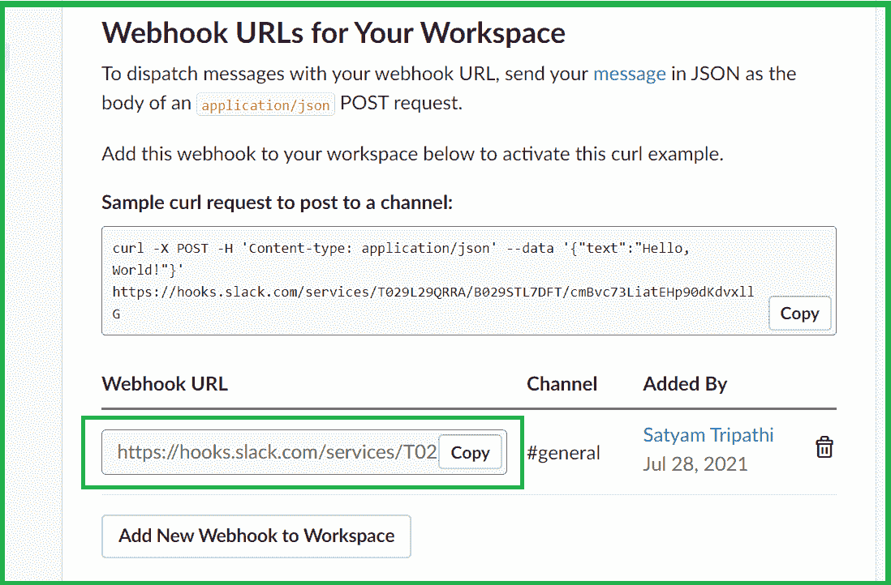**

**现在，我们已经创建了应用程序并获得了网络挂钩网址，是时候开始编码了。**

**我们首先要导入所有需要的模块。现在，获取您的网络挂钩网址并将其保存到变量中。在变量中，保存要发送的消息和标题。**

**现在是制作我们想要发送的所有松弛数据的时候了。它由您的用户名组成，在**附件**部分，我们有:**

*   **你想要选择的颜色。**
*   ****字段**由以下内容组成:

    *   我们信息的标题。
    *   我们想要传递的信息。
    *   短意味着，显示消息应该是排序类型或长类型。** 

**现在使用 **sys** 模块，我们将获得**松弛数据**的大小，并将其存储在变量中。现在对于**标题**，我们将定义**内容类型**和**内容长度**。使用**的 **post** 方法请求**模块将所有的、转储后的数据使用 **json** 模块的**转储**功能进行转储。最后，使用状态码检查响应是否有效。**

****程序:**通过时差发送通知**

## **蟒蛇 3**

```py
# Import the following modules
import json
import sys
import requests
import base64

if __name__ == '__main__':
    # Webhooks URL
    url = "https://hooks.slack.com/services/xxxyyyzzz"

    # Message you wanna send
    message = (
        "Hi there!, GeeksforGeeks is the Best Learning Platform\
        for Computer Science Students")

    # Title
    title = (f"GeeksforGeeks Bot :satellite:")

    # All slack data
    slack_data = {

        "username": "Testing",
        "attachments": [
            {
                "color": "#FF0000",
                "fields": [
                    {
                        "title": title,
                        "value": message,
                        "short": "false",

                    }
                ]
            }
        ]
    }

    # Size of the slack data
    byte_length = str(sys.getsizeof(slack_data))
    headers = {'Content-Type': "application/json",
               'Content-Length': byte_length}

    # Posting requests after dumping the slack data
    response = requests.post(url, data=json.dumps(slack_data), headers=headers)

    # Post request is valid or not!
    if response.status_code != 200:
        raise Exception(response.status_code, response.text)
```

****输出:****

****