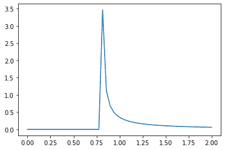
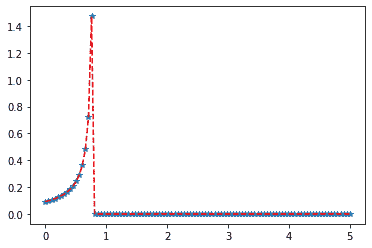

# Python–统计中的威布尔最大分布

> 原文:[https://www . geesforgeks . org/python-Weibull-统计中的最大分布/](https://www.geeksforgeeks.org/python-weibull-maximum-distribution-in-statistics/)

**scipy . stats . weibull _ max()**是 Weibull 最大连续随机变量。它继承自泛型方法的，作为 **rv_continuous 类**的实例。它用特定于这个特定分布的细节来完成这些方法。

**参数:**

> **q :** 上下尾概率
> T3】x:分位数
> **loc :** 【可选】位置参数。默认= 0
> **比例:**【可选】比例参数。默认值= 1
> **大小:**【整数元组，可选】形状或随机变量。
> **时刻:**【可选】由字母['mvsk']组成；m’=均值，‘v’=方差，‘s’= Fisher 偏斜度，‘k’= Fisher 峰度。(默认值= 'mv ')。
> 
> **结果:**威布尔最大连续随机变量

**代码#1:创建威布尔最大连续随机变量**

```py
# importing library

from scipy.stats import weibull_max 

numargs = weibull_max .numargs 
a, b = 0.2, 0.8
rv = weibull_max (a, b) 

print ("RV : \n", rv)  
```

**输出:**

```py
RV : 
 scipy.stats._distn_infrastructure.rv_frozen object at 0x000002A9DA07FDC8

```

**代码#2:威布尔最大连续变量和概率分布**

```py
import numpy as np 
quantile = np.arange (0.01, 1, 0.1) 

# Random Variates 
R = weibull_max .rvs(a, b, size = 10) 
print ("Random Variates : \n", R) 

# PDF 
x = np.linspace(weibull_max.ppf(0.01, a, b),
                weibull_max.ppf(0.99, a, b), 10)
R = weibull_max.pdf(x, 1, 3)
print ("\nProbability Distribution : \n", R) 
```

**输出:**

```py
Random Variates : 
 [ 7.99998841e-01  7.96362853e-01 -1.36808367e+00 -5.04876338e-01
 -8.07612996e+03  2.47694796e-01  7.80624490e-01  7.99996977e-01
  7.95962734e-01  6.94775447e-01]

Probability Distribution : 
 [0.00000000e+000 0.00000000e+000 0.00000000e+000 0.00000000e+000
 0.00000000e+000 0.00000000e+000 1.59673931e-301 1.41364401e-201
 1.25154393e-101 1.10803158e-001]

```

**代码#3:图形表示。**

```py
import numpy as np 
import matplotlib.pyplot as plt 

distribution = np.linspace(0, np.minimum(rv.dist.b, 2)) 
print("Distribution : \n", distribution) 
```

**输出:**

```py
Distribution : 
 [0\. 0\. 0\. 0\. 0\. 0\. 0\. 0\. 0\. 0\. 0\. 0\. 0\. 0\. 0\. 0\. 0\. 0\. 0\. 0\. 0\. 0\. 0\. 0.
 0\. 0\. 0\. 0\. 0\. 0\. 0\. 0\. 0\. 0\. 0\. 0\. 0\. 0\. 0\. 0\. 0\. 0\. 0\. 0\. 0\. 0\. 0\. 0.
 0\. 0.]

```



**代码#4:变化的位置参数**

```py
import matplotlib.pyplot as plt 
import numpy as np 

x = np.linspace(0, 5, 100) 

# Varying positional arguments 
y1 = weibull_max.pdf(x, a, b) 
y2 = weibull_max.pdf(x, a, b) 
plt.plot(x, y1, "*", x, y2, "r--") 
```

**输出:**
