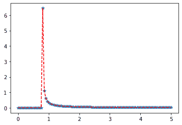

# Python–统计中的威布尔最小分布

> 原文:[https://www . geesforgeks . org/python-Weibull-统计中的最小分布/](https://www.geeksforgeeks.org/python-weibull-minimum-distribution-in-statistics/)

**scipy . stats . weibull _ min()**是 Weibull 最小连续随机变量。它继承自泛型方法的，作为 **rv_continuous 类**的实例。它用特定于这个特定分布的细节来完成这些方法。

**参数:**

> **q :** 上下尾概率
> T3】x:分位数
> **loc :** 【可选】位置参数。默认= 0
> **比例:**【可选】比例参数。默认值= 1
> **大小:**【整数元组，可选】形状或随机变量。
> **时刻:**【可选】由字母['mvsk']组成；m’=均值，‘v’=方差，‘s’= Fisher 偏斜度，‘k’= Fisher 峰度。(默认值= 'mv ')。
> 
> **结果:**威布尔最小连续随机变量

**代码#1:创建威布尔最小连续随机变量**

```
# importing library

from scipy.stats import weibull_min 

numargs = weibull_min .numargs 
a, b = 0.2, 0.8
rv = weibull_min (a, b) 

print ("RV : \n", rv)  
```

**输出:**

```
RV : 
 scipy.stats._distn_infrastructure.rv_frozen object at 0x000002A9DA00E108

```

**代码#2:威布尔最小连续变量和概率分布**

```
import numpy as np 
quantile = np.arange (0.01, 1, 0.1) 

# Random Variates 
R = weibull_min .rvs(a, b, size = 10) 
print ("Random Variates : \n", R) 

# PDF 
x = np.linspace(weibull_min.ppf(0.01, a, b),
                weibull_min.ppf(0.99, a, b), 10)
R = weibull_min.pdf(x, 1, 3)
print ("\nProbability Distribution : \n", R) 
```

**输出:**

```
Random Variates : 
 [12.76832063  0.80471316  0.80000281  0.80001071  0.80000427  2.1282417
  1.9774416  27.87159473  0.80431529  0.80000885]

Probability Distribution : 
 [0.00000000e+000 1.01939341e-099 1.15142533e-199 1.30055804e-299
 0.00000000e+000 0.00000000e+000 0.00000000e+000 0.00000000e+000
 0.00000000e+000 0.00000000e+000]

```

**代码#3:图形表示。**

```
import numpy as np 
import matplotlib.pyplot as plt 

distribution = np.linspace(0, np.minimum(rv.dist.b, 3)) 
print("Distribution : \n", distribution) 

plot = plt.plot(distribution, rv.pdf(distribution)) 
```

**输出:**

```
Distribution : 
 [0\.         0.04081633 0.08163265 0.12244898 0.16326531 0.20408163
 0.24489796 0.28571429 0.32653061 0.36734694 0.40816327 0.44897959
 0.48979592 0.53061224 0.57142857 0.6122449  0.65306122 0.69387755
 0.73469388 0.7755102  0.81632653 0.85714286 0.89795918 0.93877551
 0.97959184 1.02040816 1.06122449 1.10204082 1.14285714 1.18367347
 1.2244898  1.26530612 1.30612245 1.34693878 1.3877551  1.42857143
 1.46938776 1.51020408 1.55102041 1.59183673 1.63265306 1.67346939
 1.71428571 1.75510204 1.79591837 1.83673469 1.87755102 1.91836735
 1.95918367 2\.        ]

```


**代码#4:变化的位置参数**

```
import matplotlib.pyplot as plt 
import numpy as np 

x = np.linspace(0, 5, 100) 

# Varying positional arguments 
y1 = weibull_min.pdf(x, a, b) 
y2 = weibull_min.pdf(x, a, b) 
plt.plot(x, y1, "*", x, y2, "r--") 
```

**输出:**
