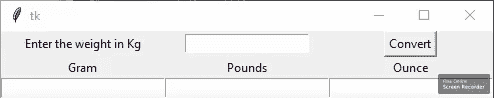

# Python:使用 Tkinter 的权重转换 GUI

> 原文:[https://www . geesforgeks . org/python-weight-conversion-GUI-using-tkinter/](https://www.geeksforgeeks.org/python-weight-conversion-gui-using-tkinter/)

**先决条件:** [Python 图形用户界面–tkinter](https://www.geeksforgeeks.org/python-gui-tkinter/)
Python 为开发图形用户界面提供了多个选项。在所有的 GUI 方法中，Tkinter 是最常用的方法。它是 Python 附带的 Tk 图形用户界面工具包的标准 Python 接口。Python 搭配 Tkinter 输出了创建 GUI 应用程序最快最简单的方法。使用 Tkinter 创建图形用户界面是一项简单的任务。

**创建 Tkinter 的步骤:**

*   导入模块–tkinter
*   创建主窗口(容器)
*   向主窗口添加任意数量的小部件
*   在小部件上应用事件触发器。

以下是图形用户界面的外观:



让我们创建一个基于图形用户界面的重量转换器，它接受千克输入值，并在用户单击转换按钮时将该值转换为克、磅和盎司。

下面是实现。

## 蟒蛇 3

```py
# Python program to  create a simple GUI 
# weight converter using Tkinter

from tkinter import *

# Create a GUI window
window = Tk()

# Function to convert weight
# given in kg to grams, pounds
# and ounces
def from_kg():

    # convert kg to gram
    gram = float(e2_value.get())*1000

    # convert kg to pound
    pound = float(e2_value.get())*2.20462

    # convert kg to ounce
    ounce = float(e2_value.get())*35.274

    # Enters the converted weight to
    # the text widget
    t1.delete("1.0", END)
    t1.insert(END,gram)

    t2.delete("1.0", END)
    t2.insert(END,pound)

    t3.delete("1.0", END)
    t3.insert(END,ounce)

# Create the Label widgets
e1 = Label(window, text = "Enter the weight in Kg")
e2_value = StringVar()
e2 = Entry(window, textvariable = e2_value)
e3 = Label(window, text = 'Gram')
e4 = Label(window, text = 'Pounds')
e5 = Label(window, text = 'Ounce')

# Create the Text Widgets
t1 = Text(window, height = 1, width = 20)
t2 = Text(window, height = 1, width = 20)
t3 = Text(window, height = 1, width = 20)

# Create the Button Widget
b1 = Button(window, text = "Convert", command = from_kg)

# grid method is used for placing
# the widgets at respective positions
# in table like structure
e1.grid(row = 0, column = 0)
e2.grid(row = 0, column = 1)
e3.grid(row = 1, column = 0)
e4.grid(row = 1, column = 1)
e5.grid(row = 1, column = 2)
t1.grid(row = 2, column = 0)
t2.grid(row = 2, column = 1)
t3.grid(row = 2, column = 2)
b1.grid(row = 0, column = 2)

# Start the GUI
window.mainloop()
```

**输出:**

<video class="wp-video-shortcode" id="video-372730-1" width="640" height="360" preload="metadata" controls=""><source type="video/mp4" src="https://media.geeksforgeeks.org/wp-content/uploads/20210114100939/FreeOnlineScreenRecorderProject6.mp4?_=1">[https://media.geeksforgeeks.org/wp-content/uploads/20210114100939/FreeOnlineScreenRecorderProject6.mp4](https://media.geeksforgeeks.org/wp-content/uploads/20210114100939/FreeOnlineScreenRecorderProject6.mp4)</video>