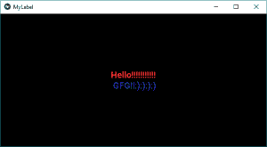
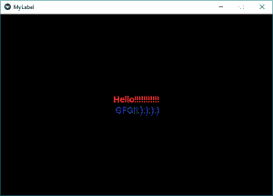
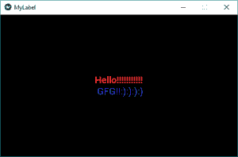
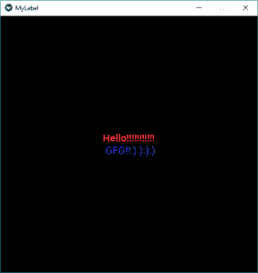

# Python | Kivy 中的窗口大小调整

> 原文:[https://www . geesforgeks . org/python-window-size-adjustment-in-kivy/](https://www.geeksforgeeks.org/python-window-size-adjustment-in-kivy/)

Kivy 是 Python 中独立于平台的 GUI 工具。因为它可以在安卓、IOS、linux 和 Windows 等平台上运行。Kivy 为您提供了一次性编写代码并在不同平台上运行的功能。它基本上是用来开发安卓应用程序的，但并不意味着它不能在桌面应用程序上使用。
[Kivy](https://www.geeksforgeeks.org/kivy-tutorial/) 是一个平台，在这个平台上，尺寸并不重要，因为它会相应地自我调整，但是如果我们想在某种程度上固定尺寸，无论是高度方向还是宽度方向，或者没有边界，这取决于用户的需求。

> ？？？？？？？？ [Kivy 教程–通过示例学习 Kivy](https://www.geeksforgeeks.org/kivy-tutorial/)。

在本文中，我们将看到 kivy 中调整窗口大小的三种格式。
**注意:**只需注意窗口输出中的大小，当窗口可见或不可见时，勾选窗口上的最小化和最大化按钮。
为了调整窗口大小，我们有:

```
from kivy.config import Config
```

Kivy 有一个决定默认设置的配置文件。为了更改这些设置，您可以手动更改该文件或使用 Config 对象。
配置选项控制 App 的初始化。为了避免在窗口创建之前配置设置不起作用或没有应用的情况(如设置初始窗口大小)，在导入任何其他 Kivy 模块之前，应该使用**配置设置**。理想情况下，这意味着在你的 main.py 脚本的开始就设置它们。
**当没有固定窗口大小时，即根据用户完全调整大小:**

## 蟒蛇 3

```
# To change the kivy default settings
# we use this module config
from kivy.config import Config

# 0 being off 1 being on as in true / false
# you can use 0 or 1 && True or False
Config.set('graphics', 'resizable', True)

# import kivy module
import kivy

# this restrict the kivy version i.e
# below this kivy version you cannot use the app
kivy.require("1.9.1")

# base Class of your App inherits from the App class.
# app:always refers to the instance of your application
from kivy.app import App

# if you not import label and use it through error
from kivy.uix.label import Label

# defining the App class
class MyLabelApp(App):
    def build(self):
        # label display the text on screen
        # markup text with different colour
        l2 = Label(text ="[color = ff3333][b]Hello !!!!!!!!!!![/b]
                   [/color]\n [color = 3333ff]GFG !!:):):):)[/color]",
                   font_size ='20sp', markup = True)    
        return l2

# creating the object
label = MyLabelApp()

# run the window
label.run()
```

**输出:**



<video class="wp-video-shortcode" id="video-299730-1" width="640" height="360" preload="metadata" controls=""><source type="video/mp4" src="https://media.geeksforgeeks.org/wp-content/uploads/20190502230022/resize.mp4?_=1">[https://media.geeksforgeeks.org/wp-content/uploads/20190502230022/resize.mp4](https://media.geeksforgeeks.org/wp-content/uploads/20190502230022/resize.mp4)</video>

**不调整大小，固定大小同宽度:**

## 蟒蛇 3

```
# To change the kivy default settings
# we use this module config
from kivy.config import Config

# 0 being off 1 being on as in true / false
# you can use 0 or 1 && True or False
Config.set('graphics', 'resizable', '0')

# fix the width of the window
Config.set('graphics', 'width', '500')
```

**输出:**



**固定窗户的高度:**

## 蟒蛇 3

```
# to change the kivy default settings
# we use this module config
from kivy.config import Config

# 0 being off 1 being on as in true / false
# you can use 0 or 1 && True or False
Config.set('graphics', 'resizable', '0')

# fix the height of the window
Config.set('graphics', 'height', '400')
```

**输出:**



**我们可以同时使用高度和宽度限制:**

## 蟒蛇 3

```
# to change the kivy default settings
# we use this module config
from kivy.config import Config

# 0 being off 1 being on as in true / false
# you can use 0 or 1 && True or False
Config.set('graphics', 'resizable', '0')

# fix the width of the window
Config.set('graphics', 'width', '500')

# fix the height of the window
Config.set('graphics', 'height', '500')
```

**输出:**

