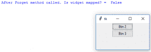
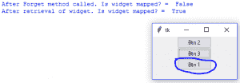
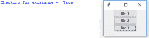
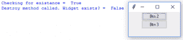
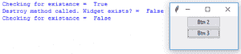

# Python | winfo_ismapped()和 winfo_exists()在 Tkinter

中

> 原文:[https://www . geesforgeks . org/python-winfo _ ismap-and-winfo _ exist-in-tkinter/](https://www.geeksforgeeks.org/python-winfo_ismapped-and-winfo_exist-in-tkinter/)

Tkinter 提供了许多通用的小部件方法或基本的小部件方法，这些方法几乎适用于所有可用的小部件。

### winfo_ismapped()方法–

此方法用于检查指定的小部件是否可见。

> **语法:**widget . winfo _ ismapped()
> **返回值:**如果 widget 可见(或映射)，则返回 True，否则返回 False。
> **异常:**如果小部件被破坏，则抛出错误。

## 大蟒

```
# Imports tkinter and ttk module
from tkinter import * 
from tkinter.ttk import * 
import time

# toplevel window
root = Tk()

def forget(widget):
    widget.forget()
    print("After Forget method called. Is widget mapped? = ",
                               bool(widget.winfo_ismapped()))

def retrieve(widget):
    widget.pack()
    print("After retrieval of widget. Is widget mapped? = ",
                                bool(widget.winfo_exists()))

# Button widgets
b1 = Button(root, text = "Btn 1")
b1.pack()

# This is used to make widget invisible
b2 = Button(root, text = "Btn 2", command = lambda : forget(b1))
b2.pack()

# This will retrieve widget
b3 = Button(root, text = "Btn 3", command = lambda : retrieve(b1))
b3.pack()

# infinite loop, interrupted by keyboard or mouse
mainloop()
```

**输出:**





### winfo_exists()方法–

此方法用于检查指定的小部件是否存在，即小部件是否被破坏。

> **语法:**widget . winfo _ exists()
> **返回值:**如果 widget 存在则返回 True，否则返回 False。

## 计算机编程语言

```
# Imports tkinter and ttk module
from tkinter import * 
from tkinter.ttk import *

# toplevel window
root = Tk()

def dest(widget):
    widget.destroy()
    print("Destroy method called. Widget exists? = ",
                          bool(widget.winfo_exists()))

def exist(widget):
    print("Checking for existence = ", bool(widget.winfo_exists()))

# Button widgets
b1 = Button(root, text = "Btn 1")
b1.pack()

# This is used to destroy widget
b2 = Button(root, text = "Btn 2", command = lambda : dest(b1))
b2.pack()

# This is used to check existence of the widget
b3 = Button(root, text = "Btn 3", command = lambda : exist(b1))
b3.pack()

# infinite loop, interrupted by keyboard or mouse
mainloop()
```

**输出:**







**注意:**如果小部件被破坏，则不能再次检索。