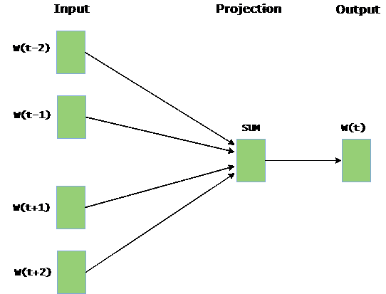

# Python |使用 Word2Vec 嵌入单词

> 原文:[https://www . geesforgeks . org/python-word-embedding-using-word 2 vec/](https://www.geeksforgeeks.org/python-word-embedding-using-word2vec/)

**单词嵌入**是一种语言建模技术，用于将单词映射到实数向量。它用几个维度表示向量空间中的单词或短语。可以使用各种方法生成单词嵌入，如神经网络、共现矩阵、概率模型等。

**Word2Vec** 由生成单词嵌入的模型组成。这些模型是浅的两层神经网络，具有一个输入层、一个隐藏层和一个输出层。Word2Vec 采用两种架构:

1.  **CBOW (Continuous Bag of Words) :** CBOW model predicts the current word given context words within specific window. The input layer contains the context words and the output layer contains the current word. The hidden layer contains the number of dimensions in which we want to represent current word present at the output layer.
    

2.  **Skip Gram :** Skip gram 预测给定当前单词的特定窗口内的周围上下文单词。输入层包含当前单词，输出层包含上下文单词。隐藏层包含我们想要表示输入层当前单词的维数。
    T3】

单词嵌入的基本思想是在相似上下文中出现的单词在向量空间中倾向于彼此更接近。在 Python 中生成词向量，需要的模块是`**nltk**` 和`**gensim**`。

在终端运行这些命令安装`**nltk**`和`**gensim**`:

```
pip install nltk
pip install gensim
```

从[这里](http://www.gutenberg.org/files/11/11-0.txt)下载用于生成词向量的文本文件。

下面是实现:

```
# Python program to generate word vectors using Word2Vec

# importing all necessary modules
from nltk.tokenize import sent_tokenize, word_tokenize
import warnings

warnings.filterwarnings(action = 'ignore')

import gensim
from gensim.models import Word2Vec

#  Reads ‘alice.txt’ file
sample = open("C:\\Users\\Admin\\Desktop\\alice.txt", "r")
s = sample.read()

# Replaces escape character with space
f = s.replace("\n", " ")

data = []

# iterate through each sentence in the file
for i in sent_tokenize(f):
    temp = []

    # tokenize the sentence into words
    for j in word_tokenize(i):
        temp.append(j.lower())

    data.append(temp)

# Create CBOW model
model1 = gensim.models.Word2Vec(data, min_count = 1, 
                              size = 100, window = 5)

# Print results
print("Cosine similarity between 'alice' " + 
               "and 'wonderland' - CBOW : ",
    model1.similarity('alice', 'wonderland'))

print("Cosine similarity between 'alice' " +
                 "and 'machines' - CBOW : ",
      model1.similarity('alice', 'machines'))

# Create Skip Gram model
model2 = gensim.models.Word2Vec(data, min_count = 1, size = 100,
                                             window = 5, sg = 1)

# Print results
print("Cosine similarity between 'alice' " +
          "and 'wonderland' - Skip Gram : ",
    model2.similarity('alice', 'wonderland'))

print("Cosine similarity between 'alice' " +
            "and 'machines' - Skip Gram : ",
      model2.similarity('alice', 'machines'))
```

**输出:**

```
Cosine similarity between 'alice' and 'wonderland' - CBOW :  0.999249298413
Cosine similarity between 'alice' and 'machines' - CBOW :  0.974911910445
Cosine similarity between 'alice' and 'wonderland' - Skip Gram :  0.885471373104
Cosine similarity between 'alice' and 'machines' - Skip Gram :  0.856892599521

```

输出表示不同模型的单词向量“alice”、“仙境”和“machines”之间的余弦相似性。一个有趣的任务可能是改变“大小”和“窗口”的参数值，以观察余弦相似性的变化。

```
Applications of Word Embedding :

>> Sentiment Analysis
>> Speech Recognition
>> Information Retrieval
>> Question Answering

```

参考文献:

*   [https://en.wikipedia.org/wiki/Word_embedding](https://en.wikipedia.org/wiki/Word_embedding)
*   [https://en . Wikipedia . org/wiki/word 2 vec](https://en.wikipedia.org/wiki/Word2vec)