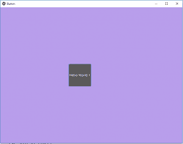

# Python |使用 Kivy 中的按钮。kv 文件

> 原文:[https://www . geesforgeks . org/python-with-kitvy-with-kv-file/](https://www.geeksforgeeks.org/python-working-with-buttons-in-kivy-with-kv-file/)

Kivy 是 Python 中独立于平台的 GUI 工具。因为它可以在安卓、IOS、linux 和 Windows 等平台上运行。它基本上是用来开发安卓应用程序的，但并不意味着它不能在桌面应用程序上使用。

## 按钮:

按钮是一个标签，具有相关的动作，当按钮被按下(或在点击/触摸后释放)时触发。我们可以在按钮后面添加功能，并为按钮设置样式。

在本文中，我们将讨论如何使用`.kv` 文件创建按钮。我们还做了一点按钮样式，我们还定义了如何将按钮绑定到回调。

要使用按钮，您必须导入:

```py
import kivy.uix.button as Button
```

```py
Basic Approach:

1) import kivy
2) import kivyApp
3) import Widget
4) import Button
5) Set minimum version(optional)
6) Create widget class:
          1) Arrange a callback
          2) Define Callback function
7) create App class
8) create .kv file (name same as the app class):
        1) create Widget
        2) Create Button
        3) Specify requirements
9) return Layout/widget/Class(according to requirement)
10) Run an instance of the class
```

常见的问题之一是如何给按钮添加功能。所以为了增加功能，我们使用`bind()`函数，它将函数绑定到按钮上。`bind()`创建发送到`callback()`的事件。

对于新的 Kivy 用户来说，最常见的问题之一是误解了 bind 方法是如何工作的，尤其是在那些还没有完全形成对函数调用的直觉的新 Python 用户中。
事情是这样的，bind 方法并不知道一个函数或者它的参数的存在，它只接收这个函数调用的结果。在给定的代码中，当按钮被按下时，它会在函数回调中打印“按钮被按下”的 def。

**通过按钮动作和样式实现上述方法的代码。**

```py
# import kivy module 
import kivy 

# this restrict the kivy version i.e 
# below this kivy version you cannot 
# use the app or software 
kivy.require("1.9.1") 

# base Class of your App inherits from the App class. 
# app:always refers to the instance of your application 
from kivy.app import App 

# creates the button in kivy 
# if not imported shows the error 
from kivy.uix.button import Button

# Widgets are elements of a graphical user 
# interface that form part of the User Experience. 
from kivy.uix.widget import Widget

# Creating a widget class 
# through this we add button 
# the commands of the class is in .kv file 
class Button_Widget(Widget):

    def __init__(self, **kwargs):

        # Python super() function allows us to
        # refer to the parent class explicitly.

        super(Button_Widget, self).__init__(**kwargs)

        # creating Button    
        btn1 = Button(text ='Hello World 1', font_size ="15sp",
                   background_color =(1, 1, 1, 1), 
                   color =(1, 1, 1, 1), 
                   # size =(32, 32), 
                   # size_hint =(.2, .2), 
                   pos =(300, 250)) 

        # Arranging a callback to a button using
        # bind() function in kivy.
        btn1.bind(on_press = self.callback)
        self.add_widget(btn1)

    # callback function tells when button pressed
    # It tells the state and instance of button.
    def callback(self, instance):
        print("Button is pressed")
        print('The button % s state is <%s>' % (instance, instance.state))

# create App class 
class ButtonApp(App):

    def build(self):
        # return the widget 
        return Button_Widget()

# run the App
if __name__ == "__main__":
    ButtonApp().run()
```

**。千伏文件实施办法**

```py
# .kv file of the main.py code 
# Adding Button widget

<Button_Widget>:

    # defining Button size
    size: 100, 100

    # creating Canvas 
    canvas.before:
        Color:
            rgba: 0.72, 0.62, 0.92, 1
        Rectangle:
            pos: self.pos
            size: self.size
```

**输出:**


**显示按钮动作画面:即点击按钮你会得到这个输出**
