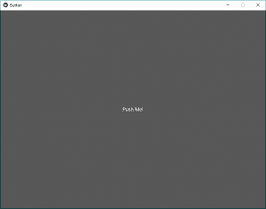
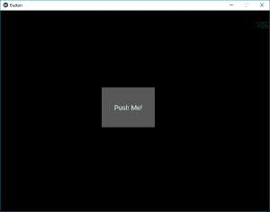
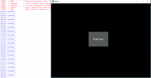
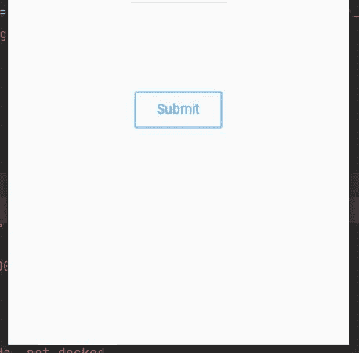

# Python |在 Kivy 中使用按钮

> 原文:[https://www . geesforgeks . org/python-使用按钮-in-kivy/](https://www.geeksforgeeks.org/python-working-with-buttons-in-kivy/)

Kivy 是 Python 中独立于平台的 GUI 工具。因为它可以在安卓、IOS、linux 和 Windows 等平台上运行。Kivy 为您提供了一次性编写代码并在不同平台上运行的功能。它基本上是用来开发安卓应用程序的，但并不意味着它不能在桌面应用程序上使用。

> [Kivy 教程–通过示例学习 Kivy](https://www.geeksforgeeks.org/kivy-tutorial/)。

现在在这篇文章中，我们将学习如何在 kivy 中构建一个按钮，就像我们在计算器和许多其他地方使用的按钮一样，为按钮添加功能，设计按钮的样式。
***按钮*** 是一个标签，当按钮被按下(或点击/触摸后释放)时会触发相关动作。我们可以在按钮后面添加功能，并为按钮设置样式。

**创建按钮时要遵循的基本方法:**

```py
-> import kivy
-> import kivy App
-> import button
-> set minimum version(optional)
-> Extend the class
-> Add and return a button
-> Run an instance of the class
```

**代码#1:** 如何在 kivy 中创建按钮。

## 蟒蛇 3

```py
# import kivy module
import kivy

# this restrict the kivy version i.e
# below this kivy version you cannot
# use the app or software
kivy.require("1.9.1")

# base Class of your App inherits from the App class.
# app:always refers to the instance of your application
from kivy.app import App

# creates the button in kivy
# if not imported shows the error
from kivy.uix.button import Button

# class in which we are creating the button
class ButtonApp(App):

    def build(self):

        btn = Button(text ="Push Me !")
        return btn

# creating the object root for ButtonApp() class
root = ButtonApp()

# run function runs the whole program
# i.e run() method which calls the
# target function passed to the constructor.
root.run()
```

**输出:**



在上面的输出中，按钮将覆盖整个窗口，因为我们没有给出任何特定的大小，也没有在按钮中做任何样式，所以默认情况下，它显示的按钮大小等于窗口大小。

**代码#2:** 设计按钮

## 蟒蛇 3

```py
def build(self):
        # use a (r, g, b, a) tuple
        btn = Button(text ="Push Me !",
                   font_size ="20sp",
                   background_color =(1, 1, 1, 1),
                   color =(1, 1, 1, 1),
                   size =(32, 32),
                   size_hint =(.2, .2),
                   pos =(300, 250))

        return btn
```

**输出:**



这些只是类似于 HTML，CSS 的效果。通过这种方式，我们可以确定窗口中心的按钮位置、文本大小、颜色以及您想要的任何内容。

**代码#3** 在按钮后面添加功能。

常见的问题之一是如何给按钮添加功能。所以要添加功能，我们使用
**bind()** 函数，它将功能绑定到按钮上。bind()创建一个发送到回调()的事件。
对于新 Kivy 用户来说，最常见的问题之一就是误解了 bind 方法是如何工作的，尤其是对于那些还没有完全形成对函数调用的直觉的新 Python 用户来说。
问题是 bind 方法不知道函数或其参数的存在，它只接收这个函数调用的结果。在给定的代码中，当按钮被按下时，它会在函数回调中打印“按钮被按下”的 def。
在 bind()内部的给定代码中，我们使用 *on_press* ，因为当按钮按下时，它告诉函数按钮被按下，然后 bind 使用它的功能。

## 蟒蛇 3

```py
# import kivy module
import kivy

# this restrict the kivy version i.e
# below this kivy version you cannot
# use the app or software
kivy.require("1.9.1")

# base Class of your App inherits from the App class.
# app:always refers to the instance of your application
from kivy.app import App

# creates the button in kivy
# if not imported shows the error
from kivy.uix.button import Button

# class in which we are creating the button
class ButtonApp(App):

    def build(self):
        # use a (r, g, b, a) tuple
        btn = Button(text ="Push Me !",
                   font_size ="20sp",
                   background_color =(1, 1, 1, 1),
                   color =(1, 1, 1, 1),
                   size =(32, 32),
                   size_hint =(.2, .2),
                   pos =(300, 250))

        # bind() use to bind the button to function callback
        btn.bind(on_press = self.callback)
        return btn

    # callback function tells when button pressed
    def callback(self, event):
        print("button pressed")
        print('Yoooo !!!!!!!!!!!')

# creating the object root for ButtonApp() class
root = ButtonApp()

# run function runs the whole program
# i.e run() method which calls the target
# function passed to the constructor.
root.run()
```

**输出:**



**视频输出:**

<video class="wp-video-shortcode" id="video-294457-1" width="640" height="360" preload="metadata" controls=""><source type="video/mp4" src="https://media.geeksforgeeks.org/wp-content/uploads/20190417153626/video_20190417_1529191.mp4?_=1">[https://media.geeksforgeeks.org/wp-content/uploads/20190417153626/video_20190417_1529191.mp4](https://media.geeksforgeeks.org/wp-content/uploads/20190417153626/video_20190417_1529191.mp4)</video>

### 使用 KivyMD 的按钮:

KivyMD 是 Kivy 框架的扩展。KivyMD 是一个材料设计小部件的集合，用于制作移动应用程序的图形用户界面框架 Kivy。

下面是*T1T3 的例子*

MDRectangleFlatButton 有以下参数:

*   文本-我们想要放在按钮上的文本
*   pos_hint-具有相对于 x 轴和 y 轴的位置的字典
*   on_release-它是一个函数，具有我们想要在单击按钮时调用的属性

## 蟒蛇 3

```py
from kivymd.app import MDApp
from kivymd.uix.screen import Screen
from kivymd.uix.button import MDRectangleFlatButton

class Demo(MDApp):

    def build(self):
        screen = Screen()

        btn= MDRectangleFlatButton(text="Submit",pos_hint={'center_x':0.5,'center_y':0.3},on_release=self.btnfunc)
           screen.add_widget(btn)
        # adding widgets to screen

        return screen
    def btnfunc(self,obj):
        print("button is pressed!!")

if __name__=="__main__":
    Demo().run()
```

**输出:**



当按钮被按下时，它显示以下输出

