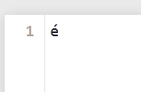
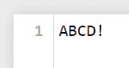

# Python–将字节写入文件

> 原文:[https://www.geeksforgeeks.org/python-write-bytes-to-file/](https://www.geeksforgeeks.org/python-write-bytes-to-file/)

文件用于永久存储数据。文件处理是执行各种操作(读、写、删除、更新等)。)在这些文件上。在 Python 中，[文件处理](https://www.geeksforgeeks.org/file-handling-python/)过程发生在以下步骤中:

1.  开文件
2.  执行操作
3.  关闭文件

有四种基本模式可以打开文件――读、写、追加和独占创建。此外，Python 允许您指定处理文件的两种模式――二进制和文本。二进制模式用于处理各种非文本数据，如图像文件和可执行文件。

Python 在磁盘上以字节的形式存储文件。因此，当一个文件以文本模式打开时，这些文件从字节中被解码以返回字符串对象。而以二进制模式打开的文件以字节对象(单字节序列)的形式返回内容，无需任何解码。让我们看看如何用 Python 向文件中写入字节。

首先，以二进制写入模式打开一个文件，然后以字节的形式指定要写入的内容。接下来，使用 write 函数将字节内容写入二进制文件。

## 蟒蛇 3

```
some_bytes = b'\xC3\xA9'

# Open in "wb" mode to
# write a new file, or 
# "ab" mode to append
with open("my_file.txt", "wb") as binary_file:

    # Write bytes to file
    binary_file.write(some_bytes)
```

**输出:**



my_file.txt

在上面的例子中，我们以二进制写模式打开了一个文件，然后将一些字节内容作为字节写入二进制文件。

或者，可以如下所示显式调用 open()和 close()。但是，此方法要求您自己执行错误处理，即确保文件始终关闭，即使在写入过程中出现错误。因此，在这方面使用“with”语句更好，因为当块结束时，它会自动关闭文件。

## 蟒蛇 3

```
some_bytes = b'\x21'

# Open file in binary write mode
binary_file = open("my_file.txt", "wb")

# Write bytes to file
binary_file.write(some_bytes)

# Close file
binary_file.close()
```

**输出:**


my_file.txt

此外，有些字节可以是可变的 bytearray 形式，或者是不可变的 bytes 对象，如下所示。

## 蟒蛇 3

```
# Create bytearray 
# (sequence of values in 
# the range 0-255 in binary form)

# ASCII for A,B,C,D
byte_arr = [65,66,67,68] 
some_bytes = bytearray(byte_arr)

# Bytearray allows modification
# ASCII for exclamation mark
some_bytes.append(33)

# Bytearray can be cast to bytes
immutable_bytes = bytes(some_bytes)

# Write bytes to file
with open("my_file.txt", "wb") as binary_file:
    binary_file.write(immutable_bytes)
```

**输出**:



my_file.txt