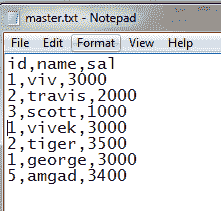

# Python |将多个文件数据写入主文件

> 原文:[https://www . geesforgeks . org/python-write-multi-files-data-to-master-file/](https://www.geeksforgeeks.org/python-write-multiple-files-data-to-master-file/)

给定一个源目录中的多个输入文件，编写一个 Python 程序从所有文件中读取数据，并将其写入一个主文件。

源目录包含 *n* 个文件，所有文件结构相同。这段代码的目标是逐个读取所有文件，然后将输出附加到一个结构与源文件相同的主文件中。

以三个输入文件为例，命名为 *emp_1.txt* 、 *emp_2.txt* 、 *emp_3.txt* ，输出将包含所有输入文件的数据。

```
Input: 

Output: 

```

**方法#1:** 使用`os module`

```
import os
# list the files in directory
lis = os.listdir('D:\\python'
                 '\\data_files\\data_files')
print(lis)
tgt = os.listdir('D:\\python'
                 '\\data_files\\target_file')

file_dir ='D:\\python\\data_files\\data_files'
out_file = r'D:\\python\\data_files\\target_file\\master.txt'
ct = 0

print('target file :', tgt)
try:
    # check for if file exists
    # if yes delete the file 
    # otherwise data will be appended to existing file
    if len(tgt)>0:
        os.remove('D:\\python'
                  '\\data_files\\target_file\\master.txt')

        open(tgt, 'a').close()
    else:
        # create an empty file
        open(tgt, 'a').close()
except:
    head = open('D:\\python'
                '\\data_files\\target_file\\master.txt', 'a+')

    line ='empno, ename, sal'
    # write header to output
    print(head, line)
    head.close()
    # below loop to write data to output file
    for line1 in lis:
        f_dir = file_dir+'\\'+line1
        # open files in read mode
        in_file = open(f_dir, 'r+')

        # open output in append mode
        w = open(out_file, 'a+')
        d = in_file.readline()
        d = in_file.readlines()
        w.write("\n")
        for line2 in d:
            print(line2)
            w.write(line2)

        ct = ct + 1  
    w.close()      
```

**输出:**


**方法 2:** 利用熊猫

```
import pandas as pd
# pd.read_csv creates dataframes
df1 = pd.read_csv('D:\python\data_files\data_files\emp_1.txt')
df2 = pd.read_csv('D:\python\data_files\data_files\emp_2.txt')
df3 = pd.read_csv('D:\python\data_files\data_files\emp_3.txt')

frames = [df1, df2, df3]

# concat function concatenates the frames 
result = pd.concat(frames)
# to_csv function writes output to file
result.to_csv('D:\\python\\data_files'
              '\\target_file\\master.txt', encoding ='utf-8', index = False)
```

**输出:**
