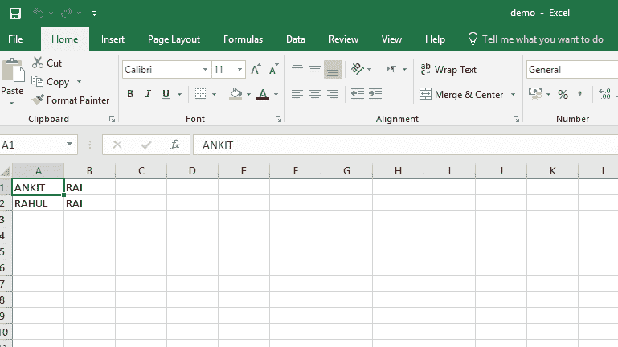
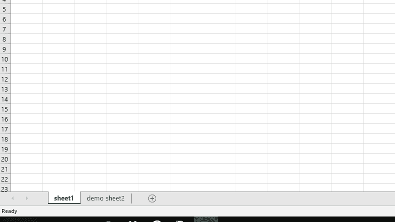

# Python |使用 openpyxl 模块写入 excel 文件

> 原文:[https://www . geesforgeks . org/python-writing-excel-file-use-openpyxl-module/](https://www.geeksforgeeks.org/python-writing-excel-file-using-openpyxl-module/)

先决条件:[使用 openpyxl](https://www.geeksforgeeks.org/python-reading-excel-file-using-openpyxl-module/) 读取 excel 文件

**`Openpyxl`** 是一个用于读写 Excel(扩展名为 xlsx/xlsm/xltx/xltm)文件的 Python 库。openpyxl 模块允许 Python 程序读取和修改 Excel 文件。

例如，用户可能必须遍历数千行，挑选出少量信息，根据某些标准进行小的更改。使用 Openpyxl 模块，这些任务可以非常高效和容易地完成。

让我们看看如何使用 Python 创建和写入 excel 工作表。

**代码#1 :** 打印活动工作表标题名称的程序

```py
# import openpyxl module
import openpyxl

# Call a Workbook() function of openpyxl 
# to create a new blank Workbook object
wb = openpyxl.Workbook()

# Get workbook active sheet  
# from the active attribute. 
sheet = wb.active

# Once have the Worksheet object,
# one can get its name from the
# title attribute.
sheet_title = sheet.title

print("active sheet title: " + sheet_title)
```

**输出:**

```py
active sheet title: Sheet
```

**代码#2 :** 程序更改标题名称

```py
# import openpyxl module
import openpyxl

# Call a Workbook() function of openpyxl 
# to create a new blank Workbook object
wb = openpyxl.Workbook()

# Get workbook active sheet  
# from the active attribute
sheet = wb.active

# One can change the name of the title
sheet.title = "sheet1"

print("sheet name is renamed as: " + sheet.title)
```

**输出:**

```py
sheet name is renamed as: sheet1
```

**代码#3 :** 编写 Excel 表格的程序

```py
# import openpyxl module
import openpyxl

# Call a Workbook() function of openpyxl 
# to create a new blank Workbook object
wb = openpyxl.Workbook()

# Get workbook active sheet  
# from the active attribute
sheet = wb.active

# Cell objects also have row, column
# and coordinate attributes that provide
# location information for the cell.

# Note: The first row or column integer
# is 1, not 0\. Cell object is created by
# using sheet object's cell() method.
c1 = sheet.cell(row = 1, column = 1)

# writing values to cells
c1.value = "ANKIT"

c2 = sheet.cell(row= 1 , column = 2)
c2.value = "RAI"

# Once have a Worksheet object, one can
# access a cell object by its name also.
# A2 means column = 1 & row = 2.
c3 = sheet['A2']
c3.value = "RAHUL"

# B2 means column = 2 & row = 2.
c4 = sheet['B2']
c4.value = "RAI"

# Anytime you modify the Workbook object
# or its sheets and cells, the spreadsheet
# file will not be saved until you call
# the save() workbook method.
wb.save("C:\\Users\\user\\Desktop\\demo.xlsx")
```

**输出:**


**代码#4 :** 在工作簿中添加工作表的程序

```py
# import openpyxl module
import openpyxl

# Call a Workbook() function of openpyxl 
# to create a new blank Workbook object
wb = openpyxl.Workbook()

sheet = wb.active

# Sheets can be added to workbook with the
# workbook object's create_sheet() method. 
wb.create_sheet(index = 1 , title = "demo sheet2")

wb.save("C:\\Users\\user\\Desktop\\demo.xlsx")
```

**输出:**
