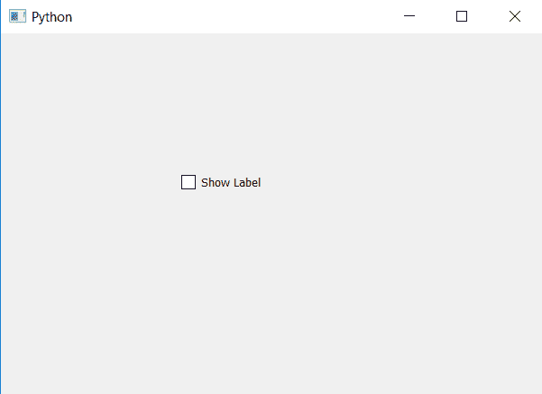
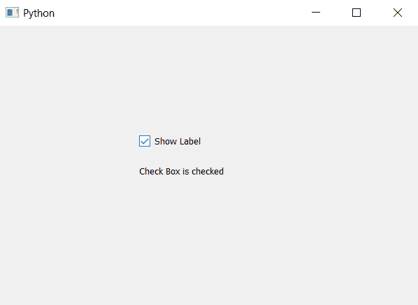

# PytQt5–将动作添加到复选框

> 原文:[https://www . geesforgeks . org/pyt qt5-向复选框添加操作/](https://www.geeksforgeeks.org/pytqt5-adding-action-to-check-box/)

在本文中，我们将看到如何将操作设置为复选框。向复选框添加操作意味着当复选框被选中时，它应该执行一些任务。为了做到这一点，我们将使用`stateChanged.connect`方法，当复选框的状态改变时，它会将其连接到动作。

> **语法:**复选框。状态已更改。连接(方法名)
> 
> **自变量:**以方法名为自变量。
> 
> **执行的动作:**勾选复选框时调用方法

下面是实现。

```
# importing libraries
from PyQt5.QtWidgets import * 
from PyQt5 import QtCore, QtGui
from PyQt5.QtGui import * 
from PyQt5.QtCore import * 
import sys

class Window(QMainWindow):

    def __init__(self):
        super().__init__()

        # setting title
        self.setWindowTitle("Python ")

        # setting geometry
        self.setGeometry(100, 100, 600, 400)

        # calling method
        self.UiComponents()

        # showing all the widgets
        self.show()

    # method for widgets
    def UiComponents(self):

        # creating the check-box
        checkbox = QCheckBox('Show Label', self)

        # setting geometry of check box
        checkbox.setGeometry(200, 150, 100, 30)

        # adding action to check box
        checkbox.stateChanged.connect(self.action)

    # creating action method
    def action(self):

        # creating label
        self.label = QLabel("Check Box is checked", self)

        # moving the label
        self.label.move(200, 200)

        # adjusting the size of label
        self.label.adjustSize()

        # showing the label
        self.label.show()

# create pyqt5 app
App = QApplication(sys.argv)

# create the instance of our Window
window = Window()

# start the app
sys.exit(App.exec())
```

**输出:**


当复选框将被选中时窗口将看起来像这样
