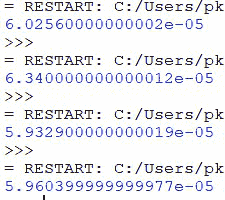
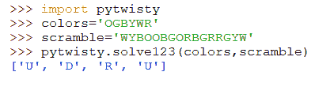

# pytwisty:魔方求解器–Python 项目

> 原文:[https://www . geeksforgeeks . org/pytwisty-rubiks-cube-solver-python-project/](https://www.geeksforgeeks.org/pytwisty-rubiks-cube-solver-python-project/)

**pytwisty** 是 Python 3 中一个极其快速高效的解算器实现，用于许多扭曲拼图，包括 1x2x2、1x2x3 和 2x2x2x 2 魔方拼图。

## **简介**

现代的快速立方体解魔方使用记忆的移动序列，称为算法，他们部署这些算法来逐段解魔方。每个算法对应于立方体上不同的彩色贴纸排列。当一个快速立方体发现一个他认识的排列时，他执行相应的算法，使立方体离求解更近一步。

然而，传统的计算机化求解器只是使用复杂的搜索技术从立方体上所有可能位置的子集寻找最优解。其中最快的是科西姆巴算法，该算法可以识别 200 亿个头寸的子集。这个算法实际上也被用来计算机器人的解，这个机器人保持着目前的吉尼斯世界纪录，是机器人最快的解。为了进行实验，我们将赫伯特·科西姆巴自己在我的机器上开发的 2x2x2 解算器与另外两种科尔夫算法和求解立方体的双向 BFS 方法进行了比较，这两种方法都是目前最快的求解方法。通过测量他们的平均求解时间，科西姆巴的求解器确实是他们中最快的。

相比之下，我们将开发一个求解器，使用“人类方法”来解决这个难题。具体来说，它运行的是逐层(LBL)和 CFOP 方法的稍加修改的版本的组合。当我们在同一组随机扰频上运行 2x2x2x 2 解算器时，它的求解时间平均比上面提到的赫伯特·科西姆巴解算器的求解时间快 350 倍。我们使用 [timeit](https://www.geeksforgeeks.org/timeit-python-examples/) 模块来测量求解器的求解时间，以秒为单位的平均求解时间为 10^-5 秒量级，而在我的 CPython 机器上，Kociemba 的求解器以秒为单位的时间为 10^-2 秒量级。

## **实施**

求解器极高的速度和效率背后的主要原因是，它基于一种我喜欢称之为“最小思考”的技术。用最简单的话来说，这是一种通过识别问题的类型并使用预定的结果直接跳到解决方案来最小化解决任何问题背后的思维过程的技术。在解谜的每一步，解算器识别拼图的各个部分的当前排列和方向，并将这些部分重新排列和定向到最终状态，如果手动执行相应的算法，该最终状态将会产生。这就像 speedcubers 如何在解魔方的每一级，看魔方的排列，执行相应的算法，都是不加思考的。

**样品用途:**

使用解算器解决 1×2×3 魔方随机加扰的示例。这里，“OGBYWR”是用户魔方的配色方案，“WYBOOBGORBGRRGYW”是给定的置乱。关于如何正确输入立方体的颜色对齐和置乱的说明可以在 PyPI 或 GitHub 资源库自述文件中找到。1x2x3 解算器输出一系列步骤:['U '，' D '，' R '，' U']。每一步都是 U、D、R、L 或 M 的形式，每一步分别代表上层、底层、右侧面、左侧面和中间层的 180 度转弯。当用户在他的立方体上执行这些步骤时，他将得到一个已求解的立方体。

## **应用程序**

这个魔方解算器只是极小思维技术在现代人工智能中的几个潜在应用之一。它可以用来简化每个程序的问题解决部分，训练它使用已经由人类或人工智能建立的结果，并直接跳到解决方案，而不必自己解决整个问题。尽管解魔方的“人类方法”有不总是提供最优解的缺点，但程序效率的 350 倍提升实际上超过了任何此类潜在的缺点。对于在 10 毫秒内完成物理魔方上每一步的现代机器人来说，执行一些额外的动作几乎是一项可以忽略不计的任务。在大多数现实问题中，最优解可能并不总是最好的解，尤其是当它是以极其缓慢和过度消耗内存的程序为代价生成的时候。无论现代人工智能如何发展到机器人倾向于自己“思考”的地步，即使是完全自主程序中的一个小小的人类交互也能对其效率产生巨大的影响，这在这个魔方求解器的例子中就很明显。

**github link:**[https://github . com/prakhaglptaphaps/pytwity](https://github.com/prakharguptafaips/pytwisty)

**pypi link:**[https://pypi . org/project/pytwity/](https://pypi.org/project/pytwisty/)