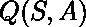
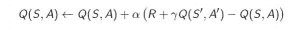
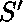
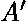
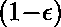
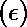
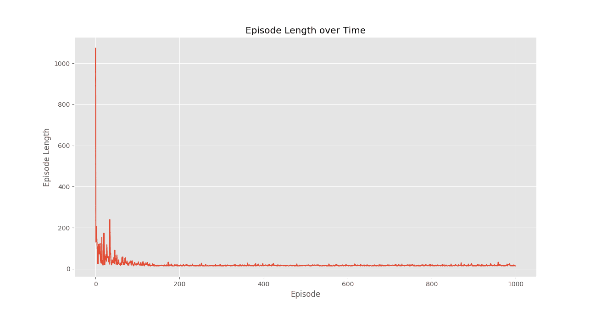
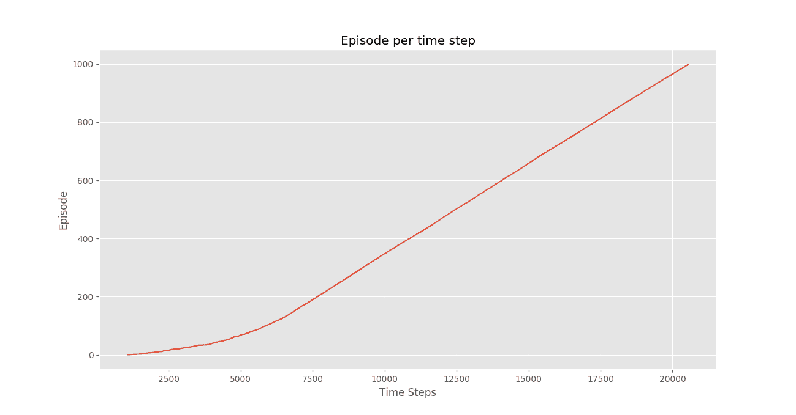
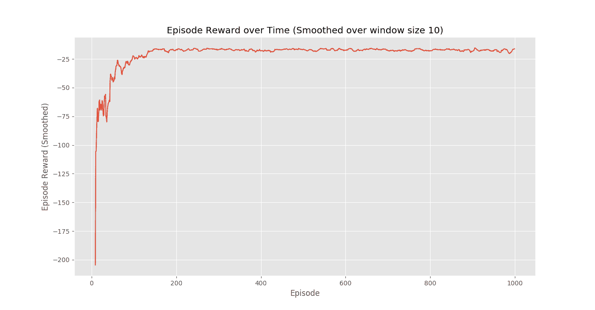

# 问 Python 中的学习

> 原文:[https://www.geeksforgeeks.org/q-learning-in-python/](https://www.geeksforgeeks.org/q-learning-in-python/)

先决条件:[强化学习](https://www.geeksforgeeks.org/?p=195593)

**强化学习**简单来说是一种学习过程的范式，在这种范式中，学习代理通过在环境中持续交互来学习在特定环境中的最佳行为。代理在学习过程中会经历所处环境中的各种不同情况。这些州被称为*州*。处于该状态的代理可以从一组允许的动作中进行选择，这些动作可以获得不同的*奖励*(或处罚)。学习代理加班学习最大化这些奖励，以便在任何给定的状态下表现最佳。

**Q-Learning** 是强化学习的一种基本形式，它使用 Q 值(也称为动作值)来迭代改进学习代理的行为。

1.  **Q 值或动作值:** Q 值是为状态和动作定义的。是对在国家采取行动有多好的估计。将使用 **TD- Update 规则**迭代计算的估计值，我们将在接下来的章节中看到。
2.  **奖励和剧集:**一个代理在其生命周期中从一个开始状态开始，根据其动作的选择以及代理交互的环境，从当前状态到下一个状态进行多次转换。在过渡的每一步，来自一个状态的代理采取行动，观察来自环境的奖励，然后过渡到另一个状态。如果在任何时间点，代理最终处于终止状态之一，这意味着不可能有进一步的转换。据说这是一集的完成。
3.  **Temporal Difference or TD-Update:**

    时间差异或时间更新规则可以表示如下:

    

    这个估计 Q 值的更新规则应用于代理与环境交互的每个时间步骤。使用的术语解释如下。：

    *   :代理的当前状态。
    *   :根据某政策选择的当前动作。
    *   :代理结束的下一个状态。
    *   :利用当前 Q 值估计选取下一个最佳动作，即选取下一状态下 Q 值最大的动作。
    *   :从环境中观察到的当前奖励，作为对当前行动的响应。
    *    ( > 0 和< =1):未来奖励折扣系数。未来的奖励不如当前的奖励有价值，所以必须打折。由于 Q 值是对一个州的预期回报的估计，折扣规则也适用于此。
    *   :更新 Q(S，A)估计值所用的步长。
4.  **Choosing the Action to take using -greedy policy:**

    -的贪婪策略是一个非常简单的策略，使用当前的 Q 值估计来选择动作。内容如下:

    *   用概率选择 Q 值最高的动作。
    *   有概率随机选择任何动作。

    现在有了所有需要的理论，让我们举个例子。我们将使用 OpenAI 的健身房环境来训练我们的 Q-Learning 模型。

    安装命令`**gym**` –

    ```
    pip install gym
    ```

    在开始示例之前，您需要一些帮助代码来可视化算法的工作。在工作目录中将有两个需要下载的助手文件。可以在这里找到文件[。](https://drive.google.com/open?id=1hNRy2nGdFSz6BSRxlmeiL5-UoMR5DBE6)

    **步骤# 1 :** 导入所需的库。

    ```
    import gym
    import itertools
    import matplotlib
    import matplotlib.style
    import numpy as np
    import pandas as pd
    import sys

    from collections import defaultdict
    from windy_gridworld import WindyGridworldEnv
    import plotting

    matplotlib.style.use('ggplot')
    ```

    **第二步:**营造健身房环境。

    ```
    env = WindyGridworldEnv()
    ```

    **第三步:**制定-贪婪政策。

    ```
    def createEpsilonGreedyPolicy(Q, epsilon, num_actions):
        """
        Creates an epsilon-greedy policy based
        on a given Q-function and epsilon.

        Returns a function that takes the state
        as an input and returns the probabilities
        for each action in the form of a numpy array 
        of length of the action space(set of possible actions).
        """
        def policyFunction(state):

            Action_probabilities = np.ones(num_actions,
                    dtype = float) * epsilon / num_actions

            best_action = np.argmax(Q[state])
            Action_probabilities[best_action] += (1.0 - epsilon)
            return Action_probabilities

        return policyFunction
    ```

    **第四步:**构建 Q 学习模型。

    ```
    def qLearning(env, num_episodes, discount_factor = 1.0,
                                alpha = 0.6, epsilon = 0.1):
        """
        Q-Learning algorithm: Off-policy TD control.
        Finds the optimal greedy policy while improving
        following an epsilon-greedy policy"""

        # Action value function
        # A nested dictionary that maps
        # state -> (action -> action-value).
        Q = defaultdict(lambda: np.zeros(env.action_space.n))

        # Keeps track of useful statistics
        stats = plotting.EpisodeStats(
            episode_lengths = np.zeros(num_episodes),
            episode_rewards = np.zeros(num_episodes))    

        # Create an epsilon greedy policy function
        # appropriately for environment action space
        policy = createEpsilonGreedyPolicy(Q, epsilon, env.action_space.n)

        # For every episode
        for ith_episode in range(num_episodes):

            # Reset the environment and pick the first action
            state = env.reset()

            for t in itertools.count():

                # get probabilities of all actions from current state
                action_probabilities = policy(state)

                # choose action according to 
                # the probability distribution
                action = np.random.choice(np.arange(
                          len(action_probabilities)),
                           p = action_probabilities)

                # take action and get reward, transit to next state
                next_state, reward, done, _ = env.step(action)

                # Update statistics
                stats.episode_rewards[ith_episode] += reward
                stats.episode_lengths[ith_episode] = t

                # TD Update
                best_next_action = np.argmax(Q[next_state])    
                td_target = reward + discount_factor * Q[next_state][best_next_action]
                td_delta = td_target - Q[state][action]
                Q[state][action] += alpha * td_delta

                # done is True if episode terminated   
                if done:
                    break

                state = next_state

        return Q, stats
    ```

    **第五步:**训练模型。

    ```
    Q, stats = qLearning(env, 1000)
    ```

    **第六步:**绘制重要统计。

    ```
    plotting.plot_episode_stats(stats)
    ```

    

    

    

    **结论:**
    我们看到在剧集奖励随时间变化的剧情中，剧集奖励*随着时间的推移逐渐增加*，最终*以每集高奖励值水平提升*，这表明代理已经学会通过在每个状态下表现最佳来最大化其在剧集中获得的总奖励。