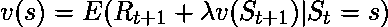
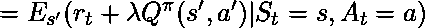
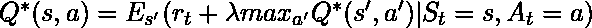
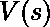
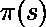
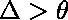
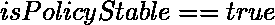
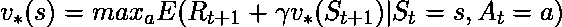

# Q-学习数学背景

> 原文:[https://www . geesforgeks . org/q-learning-数学-background/](https://www.geeksforgeeks.org/q-learning-mathematical-background/)

**先决条件:** [问学](https://www.geeksforgeeks.org/q-learning-in-python/)。

在下面的推导中，将使用先决条件文章中定义的符号。
Q 学习技术基于**贝尔曼方程**。


在哪里，
**E:期望
**t+1** :下一状态
**** :折扣系数**

用 Q 值的形式重新表述上述等式:-




**最佳 Q 值**由下式给出



**策略迭代:**是确定模型最优策略的过程，包括以下两个步骤:-

1.  **策略评估:**此过程使用从上一个策略改进步骤中获得的贪婪策略来估计长期奖励函数的值。
2.  **策略改进:**该过程使用最大化每个状态的 V 的动作来更新策略。重复这个过程，直到实现收敛。

**涉及的步骤:-**

*   **Initialization:**

     =任意实数
     =任意选择的任意 A(s)

*   **政策评估:**

    ```py

    while()
    {
        for each s in S
        {    

        }
    }

    ```

*   **政策改善:**

    ```py

    while(true)
        for each s in S
        {

            if()

            if()
                break from both loops
        }
    return V,

    ```

*   **Value Iteration:** This process updates the function V according to the **Optimal Bellman Equation**.

    

**工作步骤:**

*   **初始化:**用任意随机实数初始化数组 V。
*   **计算最优值:**

    ```py

    while()
    {
        for each s in S
        {

        }
    }

    return 

    ```