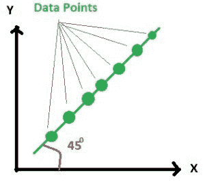
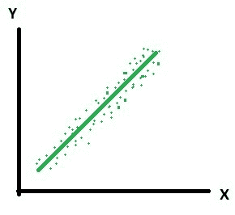
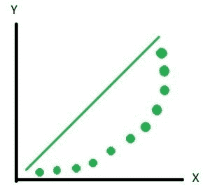
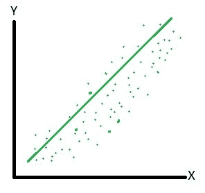
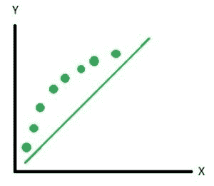
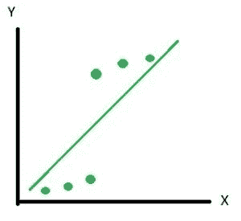
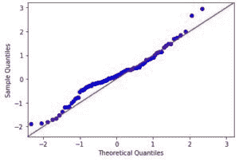

# Python 中的 qqplot(分位数-分位数图)

> 原文:[https://www . geesforgeks . org/QQ plot-分位数-分位数-python 中的 plot/](https://www.geeksforgeeks.org/qqplot-quantile-quantile-plot-in-python/)

当两个变量的[分位数](https://en.wikipedia.org/wiki/Quantile)相对绘制时，得到的图称为分位数-分位数图或 qqplot。该图总结了两个变量的分布相对于位置是否相似。

**解释**

*   分位数的所有点都位于或接近与 x 轴成 45 度角的直线上。这表明两个样本具有相似的分布。
    
    而实际上总是不可能得到这样一条 100%清晰的直线，但图如下。这里的点几乎位于直线上。
    
*   y 分位数低于 x 分位数。它表明 y 值有低于 x 值的趋势。
    
    在实践中并不总是能得到 100%的结果，如上图所示，但图如下图所示。这里你可以看到大部分点位于线下，很少点在线上。因此，我们可以说分布是不一样的。
    
*   x 分位数低于 y 分位数。它表明 x 值有低于 y 值的趋势。
    
*   指示存在一个断点，在该断点之前，y 分位数低于 x 分位数，在该断点之后，y 分位数高于 x 分位数。
    

**分位数–使用 Python 中`statsmodel` 的分位数图–**

```py
import numpy as np
import statsmodels.api as sm
import pylab as py

# np.random generates different random numbers
# whenever the code is executed
# Note: When you execute the same code 
# the graph look different than shown below.

# Random data points generated
data_points = np.random.normal(0, 1, 100)    

sm.qqplot(data_points, line ='45')
py.show()
```

**输出:**
