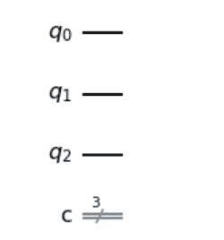

# Python 中的量子隐形传态

> 原文:[https://www . geeksforgeeks . org/python 中的量子隐形传态/](https://www.geeksforgeeks.org/quantum-teleportation-in-python/)

在本文中，我们将看到使用 Python 的量子隐形传态。

里克和莫迪的故事情节有多少次是从里克和莫迪穿过他们的传送门进入某个疯狂的交替维度开始的？如果没有传送门，我们可能不会有大家最喜欢的动画电视节目。但是你有没有想过那个入口是如何工作的？这就是我们今天要讨论的量子隐形传态。

## 量子隐形传态的需求是什么？

除了它会非常棒这一事实之外？嗯，正如我们已经知道的，量子计算机与经典计算机并不真正相似。两者之间的一个区别就是复制数据。如果你需要抄下你朋友的作业，你所要做的就是点击数据并复制一份，对吗？嗯，量子比特的问题是，它们保持在量子状态，直到它们不被观察到。只要我们观察(或点击)它们，它们就会坍缩到已知状态之一。这也叫**不克隆定理**。因此，要在量子计算机上复制数据，我们需要量子隐形传态的过程。然而，随着技术的进步，量子隐形传态已经从这变成了一种完全安全传输的应用。

## 算法背后的理论

为了简单起见，让我们假设有两个朋友，卡提克和沙兰娅。沙拉尼亚想发送某种形式的量子数据，可能是一个量子比特给卡提克。由于不可克隆定理，她无法观察到量子位的状态，于是她借助所谓的“入口”来传输数据。所以传送门主要做的是，它在来自沙拉尼亚的一个量子比特和它自己的一个量子比特之间产生纠缠，并将纠缠的一对发送到卡提克。然后，卡提克必须执行一些动作来消除纠缠并接收输出。

对于那些不太清楚**量子纠缠**是什么的人来说，简而言之，它指出，如果一个量子比特发生了什么，我们可以期待另一个量子比特也有一些影响，即使这两个量子比特离得很远。此外，另一个值得注意的有趣的事情是，为什么这被称为量子隐形传态，沙兰亚不再有她做的完全相同的量子比特，现在是与卡提克。

### 方法:

**第一步:**传送门创造了一对纠缠的量子比特，这是一对被称为贝尔对的特殊量子比特。为了使用量子电路创建贝尔对，我们需要获取一个量子位，并使用哈达玛门将其转换为(|+ >或|- >)状态，然后在另一个量子位上使用 CNOT 门，这将由第一个量子位控制。其中一个量子位给了沙拉尼亚(比如 Q1)，另一个给了卡提克(比如 Q2)。

**第二步:**假设夏兰亚想要发送的量子比特是|ψ>= |∧>+|β>。她需要向 Q1 申请一个 CNOT 门，由|ψ>控制。一个 CNOT 门基本上就是‘T2’如果这个，那么那个‘T3’条件的量子世界。

**第三步**:沙拉尼亚测量她拥有的两个量子位，并将它们存储在两个经典位中。然后，她将此信息发送给卡提克(由于正在发送经典位，因此可以进行传输)。由于量子比特可以处理 2 <sup>n</sup> 个经典比特，我们可以说沙兰娅通过计算得到的输出将永远是包含 00、01、10 和 11(0 和 1 的所有排列)的概率答案。

**第四步**:现在，卡提克所需要做的就是对他所拥有的量子比特 Q2 进行某些变换，它是一个纠缠对的一部分。这部分来自量子力学，你可以只知道是事实，不然文章的复杂程度会增加流形。所以，如果卡提克得了 00 分，他需要申请 I 门。对于 01，需要应用 X 门，对于 10，需要应用 Z 门，对于 11，需要应用 ZX 门。

在那里，我们有它。卡提克现在有一个量子位，其状态与夏兰亚最初的量子位状态相同。

## 需要的模块

**奇奇斯基** : **奇奇斯基**是量子计算的开源框架。它提供了创建和操作量子程序的工具，并在 IBM Q Experience 上的原型量子设备或本地计算机上的模拟器上运行这些程序。让我们看看如何创建一个简单的量子电路，并在真正的量子计算机上测试它，或者在我们的计算机上本地模拟它。

**安装** **:**

```
pip install qiskit
```

## 逐步实施

**第一步:创建量子电路，我们将在其上进行操作。**

QuantumCircuit 接受两个参数，即我们想要取的量子比特数和我们想要取的经典比特数。

## 计算机编程语言

```
from qiskit import *

circuit = QuantumCircuit(3, 3)
%matplotlib inline

# Whenever during any point of the program we
# want to see how our circuit looks like,
# this is what we will be doing.
circuit.draw(output='mpl')
```

**输出:**



这就是我们赛道现在的样子。我们有三个量子位和三个经典位，只要我们愿意，它们将被用来测量这些量子位的值。现在它们没有任何价值。

**第二步:在我们要传送的量子位上应用一个 X 门。我们还将增加一个障碍，只是为了让赛道更加清晰。**

现在，我们到目前为止所做的是，我们有 3 个量子比特。我们将使用 q1 将数据从 q0 传输到 q3。为此，我们将使用一个 X 门将 q0 初始化为 1 状态

## 计算机编程语言

```
circuit.x(0)  # used to apply an X gate.

# This is done to make the circuit look more 
# organized and clear.
circuit.barrier()
circuit.draw(output='mpl')
```