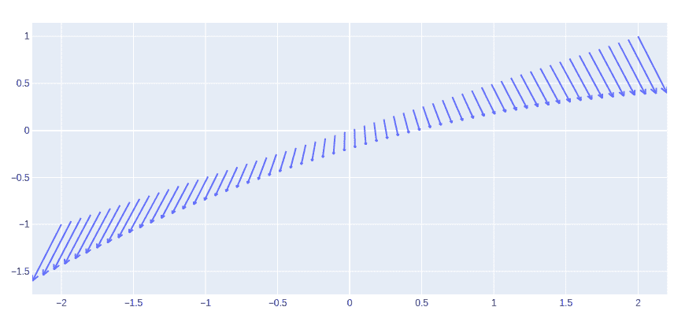
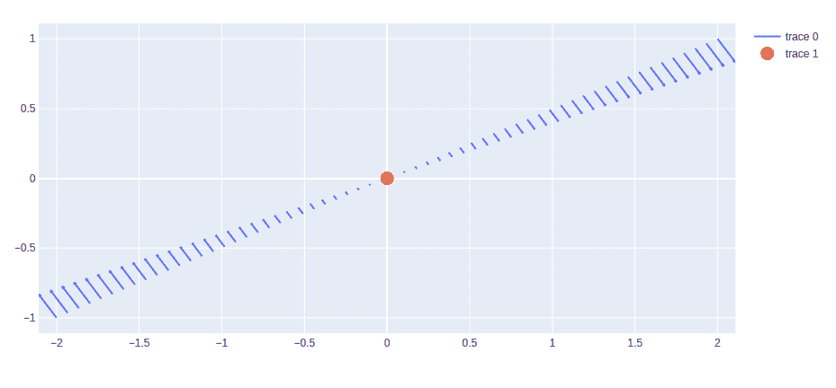

# 使用 Python 中的 Plotly 颤图

> 原文:[https://www . geeksforgeeks . org/颤颤-plots-use-plotly-in-python/](https://www.geeksforgeeks.org/quiver-plots-using-plotly-in-python/)

Plotly 是一个 Python 库，用于设计图形，尤其是交互式图形。它可以绘制各种图形和图表，如直方图、条形图、箱线图、展开图等。它主要用于数据分析以及财务分析。plotly 是一个交互式可视化库。

## 颤动图

颤动图将速度矢量显示为箭头，分量(u，v)位于点(x，y)处。颤图(x，y，u，v)在 x 和 y 中的每对对应元素中指定的坐标处将向量绘制为箭头。使用颤图的主要优点是它可以表示更大范围的幅度，而箭头不会收缩成点或彼此重叠。

> **语法:**create _ 颤颤(x，y，u，v，scale=0.1，arrow_scale=0.3，angle=0.3490658503988659，scaleratio=None)
> 
> **参数:**
> 
> **x:** x 箭头位置坐标
> 
> **y:** 箭头位置的 y 坐标
> 
> **u:** x 箭头向量的分量
> 
> **v:** 箭头向量的 y 分量
> 
> **箭头 _ 刻度:**值乘以倒钩长度得到箭头长度。默认值= .3
> 
> **角度:**箭头角度。默认值= pi/9

**示例:**

## 蟒蛇 3

```py
import plotly.figure_factory as ff
import numpy as np

x = np.linspace(-2, 2, 60)
y = np.linspace(-1, 1, 60)
Y, X = np.meshgrid(x, y)
u = 1 - X**2 + Y
v = -1 + X - Y**2

# Create quiver plot
fig = ff.create_quiver(x, y, u, v, arrow_scale=.1)

fig.show()
```

**输出:**



## 使用颤图绘制点

借助于 graph_objects 类的 **add_trace()** 方法，可以用点显示颤图。散点图的添加方式显示了颤动的起源。

**示例:**

## 蟒蛇 3

```py
import plotly.figure_factory as ff
import plotly.graph_objects as go
import numpy as np

x = np.linspace(-2, 2, 60)
y = np.linspace(-1, 1, 60)
Y, X = np.meshgrid(x, y)
u = np.cos(X)*Y
v = np.sin(X)*Y

# Create quiver plot
fig = ff.create_quiver(x, y, u, v, arrow_scale=.1)

# Adding scatter as the origin
fig.add_trace(go.Scatter(x = [0], y = [0],
                        mode = 'markers',
                         marker_size = 15
                        ))

fig.show()
```

**输出:**

