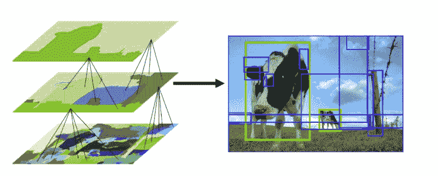
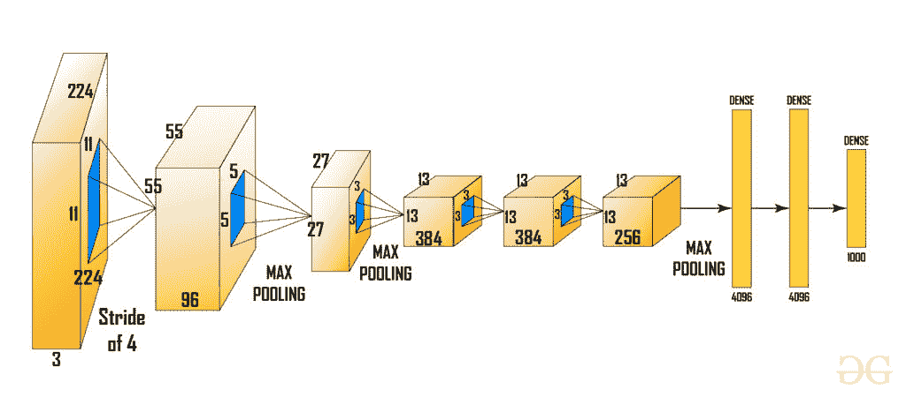
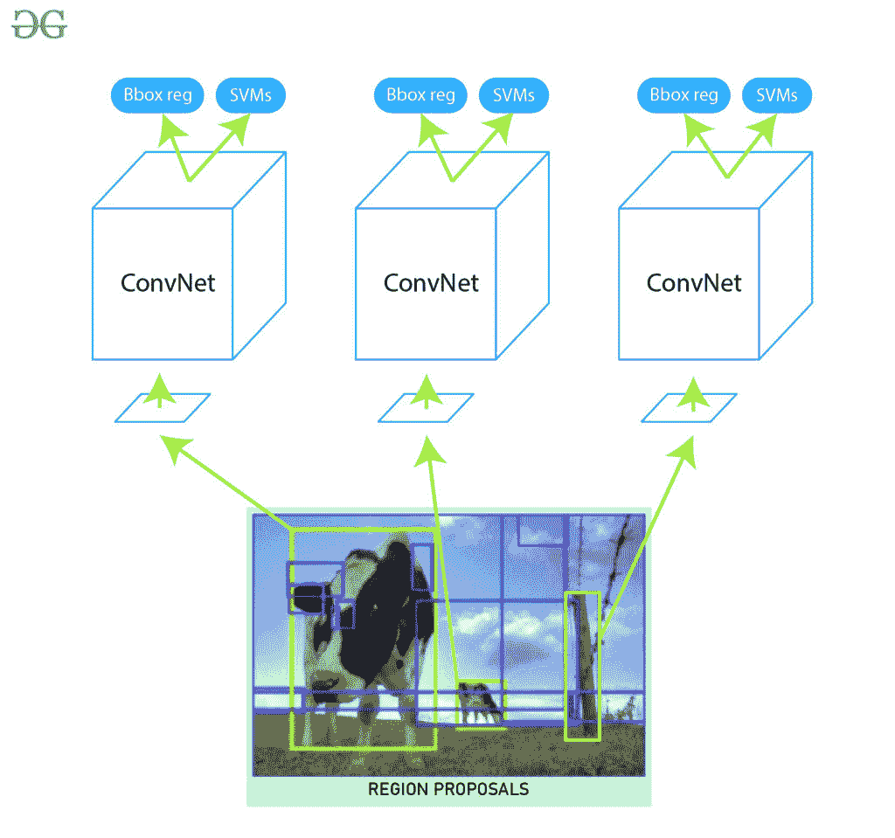

# R-CNN |基于区域的 CNN

> 原文:[https://www.geeksforgeeks.org/r-cnn-region-based-cnns/](https://www.geeksforgeeks.org/r-cnn-region-based-cnns/)

由于具有全连通层的卷积神经网络不能处理出现频率和多目标。因此，一种方法可能是我们使用滑动窗口强力搜索来选择一个区域，并在该区域上应用 CNN 模型，但是这种方法的问题是，同一对象可以在具有不同大小和不同纵横比的图像中表示。考虑到这些因素，我们有很多地区的建议，如果我们在所有这些地区应用深度学习(有线电视新闻网)，计算将非常昂贵。

R-CNN 架构

*Ross Girshick 等人*在 2013 年提出了一种称为 R-CNN(基于区域的 CNN)的架构来应对这种物体检测的挑战。这种有线电视新闻网的架构使用选择性搜索算法，生成大约 *2000* 地区提案。这些 *2000* 地区提案随后被提供给计算 CNN 特征的 CNN 架构。这些特征随后被传递到 SVM 模型中，以对区域建议中存在的对象进行分类。一个额外的步骤是执行边界框回归器，以更精确地定位图像中存在的对象。

**区域建议:**
区域建议只是图像中可能包含我们在输入图像中搜索的对象的较小区域。为了减少区域提议，美国有线电视新闻网使用了一种叫做选择性搜索的贪婪算法。

区域提案生成使用选择性搜索(图片来源:

[<u>链接</u>](https://ivi.fnwi.uva.nl/isis/publications/bibtexbrowser.php?key=vandeSandeICCV2011&bib=all.bib) )

**选择性搜索:**
选择性搜索是一种贪婪算法，结合较小的分割区域生成区域建议。该算法以图像为输入输出，在图像上生成区域建议。该算法相对于随机建议生成的优势在于，它将建议的数量限制在大约 *2000* 并且这些区域建议具有高召回率。

**算法:**

1.  生成输入图像的初始子分割。
2.  递归地将相似的边界框组合成更大的边界框
3.  使用这些较大的框来生成用于对象检测的区域建议。

在步骤 2 中，基于颜色相似性、纹理相似性、区域大小等考虑相似性。我们已经在[这篇文章](https://www.geeksforgeeks.org/selective-search-for-object-detection-r-cnn/)中详细讨论了选择性搜索算法。

**R-CNN 的 CNN 架构:**
之后这些区域按照 CNN 模型的要求被扭曲成维度区域的单个正方形。我们这里使用的 CNN 模型是一个预先训练好的 AlexNet 模型，这是当时用于图像分类的最先进的 CNN 模型，我们在这里看看 AlexNet 的架构。

这里 AlexNet 的输入是 *(227，227，3)* 。因此，如果区域提议是小的和大的，那么我们需要将该区域提议调整到给定的维度。

从上面的架构中，我们去掉最后一个 softmax 层，得到 *(1，4096)* 特征向量。我们将这个特征向量传递给 SVM 回归器和包围盒回归器。

**SVM(支持向量机):**
由 CNN 生成的特征向量然后被在每个类上独立训练的二进制 SVM 消耗。这个 SVM 模型采用在以前的有线电视新闻网体系结构中生成的特征向量，并输出该区域中物体存在的置信度得分。然而，与 SVM 一起训练的一个问题是，我们需要 AlexNet 特征向量来训练 SVM 类。所以，我们不能以平行的方式独立训练阿列克谢网和 SVM。这个挑战在未来版本的美国有线电视新闻网(快速美国有线电视新闻网，快速美国有线电视新闻网等)中得到解决。).

**包围盒回归器:**
为了在图像中精确定位包围盒。，我们使用了一个称为包围盒回归器的尺度不变线性回归模型。为了训练这个模型，我们将本地化的四个维度作为预测和基础事实对。这些尺寸是 *(x，y，w，h)* ，其中 *x* 和 *y* 分别是包围盒中心的像素坐标。w 和 h 代表边界框的宽度和高度。该方法将结果的平均精度提高了 *3-4%* 。

**输出:**
现在我们有了针对每个类标签进行分类的区域建议。为了将上述模型生成的额外包围盒处理到图像中，我们使用了一种称为**非最大值抑制的算法。**
分三步走:

*   丢弃那些置信度小于某个阈值*(比如 0.5)* 的对象。
*   选择对象的候选区域中概率最高的区域作为预测区域。
*   在最后一步中，我们丢弃那些与预测区域在 *0.5 以上有 IoU(交集在并集上)的区域。*

 
之后，我们可以通过在输入图像上绘制这些边界框并标记边界框中存在的对象来获得输出。
**结果:**
美国有线电视新闻网给出了 2010 年挥发性有机化合物数据集中 *53.7%* 的平均精度。在 *200 级 ILSVRC 2013* 目标检测数据集上给出了 *31.4%* 的 mAP，较之前的最佳 *24.3%* 有较大提升。但是这种架构训练非常慢，需要 *~ 49 秒*才能在 VOC 2007 数据集的单个图像上生成测试结果。

**R-CNN 的挑战:**

*   选择性搜索算法非常严格，没有学习发生。这有时会导致产生用于对象检测的不良区域建议。
*   因为大约有 *2000* 个候选方案。训练网络需要很多时间。我们还需要分别训练多个步骤(CNN 架构、SVM 模型、包围盒回归器)。所以，这使得实现起来非常慢。
*   不能实时使用 R-CNN，因为用包围盒回归器测试图像大约需要 *50 秒*。
*   因为我们需要保存所有地区提案的特征地图。它还会增加训练期间所需的磁盘内存量。

**参考文献:**

*   [R-CNN 论文](https://arxiv.org/abs/1311.2524)
*   [选择性搜索纸](http://www.huppelen.nl/publications/selectiveSearchDraft.pdf)